# Introduction to ArkTS

#  Key Features 
## Getting Started: Light Sample
ArkTS extends TypeScript syntax to enhance capabilities for declarative UI development. Declarative UI is a programming paradigm for designing user interfaces. For learning purposes, let's consider an example where we want to implement an interface for toggling a light. 

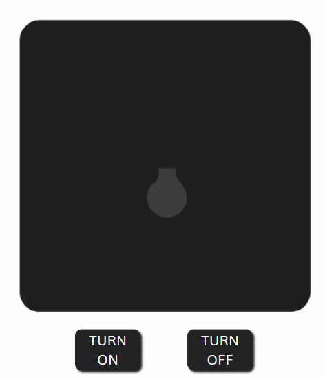


### Defining Interface States

Under the declarative UI paradigm, we first define the various states of the page. For our example, the interface has two states: light on and light off. We use a boolean variable to represent these states: `true` for light on and `false` for light off. Here's how we declare it:


```typescript
@State 
isOn: boolean = false; // false indicates the light is off
```

### Describing the Display
After analyzing the interface states, the next step is to describe how the interface looks in each state. In our case:

When `isOn` is true, the interface displays the light on.
When `isOn` is false, the interface shows the light off.

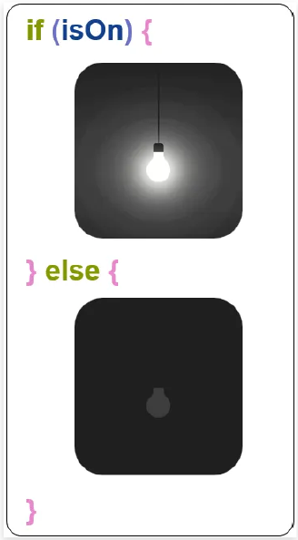

### Changing States
To update the interface, we just simply change the value of `isOn`. Toggling the light is achieved by binding click events to a button:

```typescript
// Event bindings to toggle light state
button.onclick = () => { isOn = !isOn; }
```


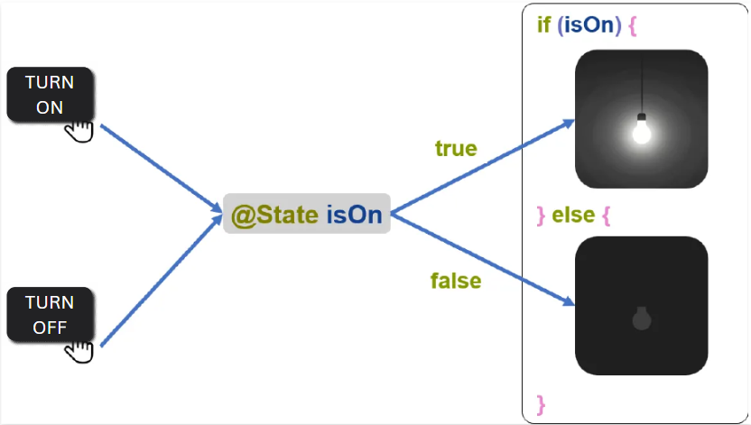

The sample codes can be found in the directory `/sample codes/Light_Example.zip`
To use the sample code, you should unzip the code and open it from DevEco Studio. Then you will find the `Light.ets` under path: entry>src>pages>solution. Run Previewer to see how it works.
### Summary

The core idea of declarative UI is that developers only need to describe the desired state of the UI without managing the transition processes. The UI updates automatically when the state variables change, driven by data.
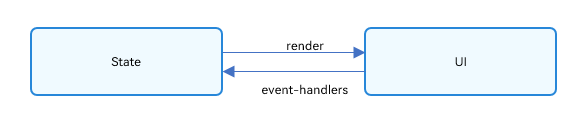

## Componentization

 Components are the smallest units that make up the user interface. Every interface you see is a combination of many components. Writing a user interface is essentially the process of assembling these components. ArkTS offers a variety of built-in components, such as `Text`, `Button`, and `Image`. Additionally, ArkTS supports custom components, allowing developers to tailor component content to specific needs.

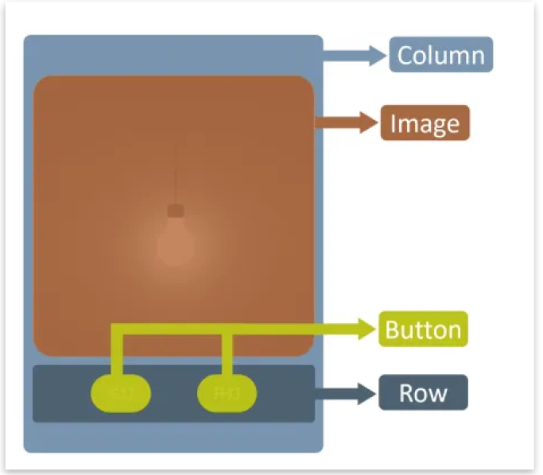

# Core Concepts
After gaining a basic understanding of the ArkTS features, let's explore its core concepts through a simple example. 
## Getting Started: A Simple Example

In this example, when the developer clicks a button, the text changes from "Hello World" to "Hello ArkUI". Follow these steps to create the project:

### Open DevEvo Studio 
Launch the development tool and create a new project.

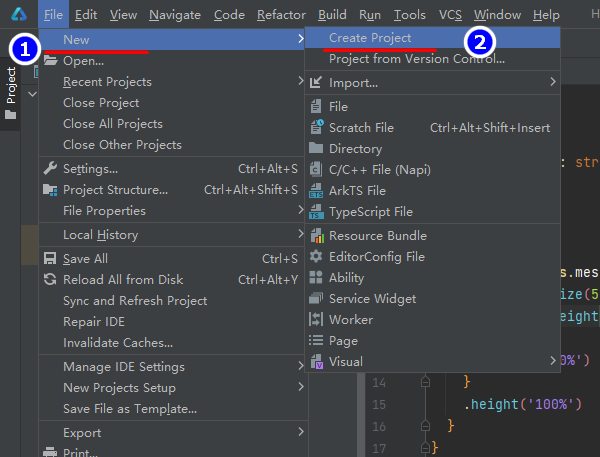
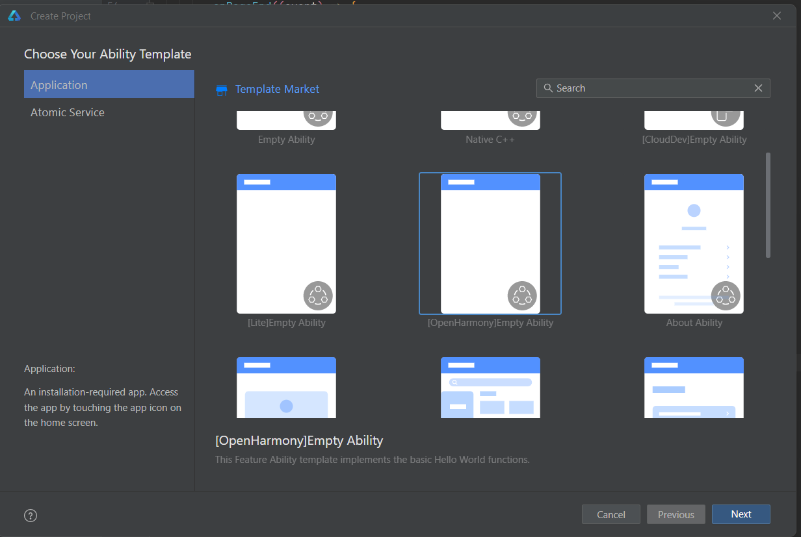
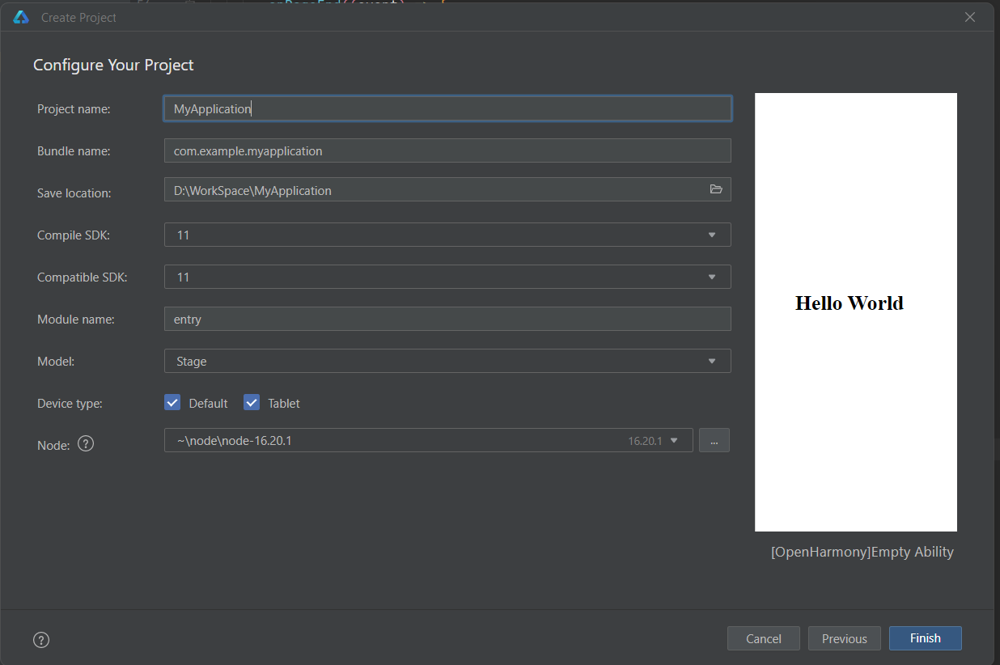

Once the project is created, wait for it to initialize completely.
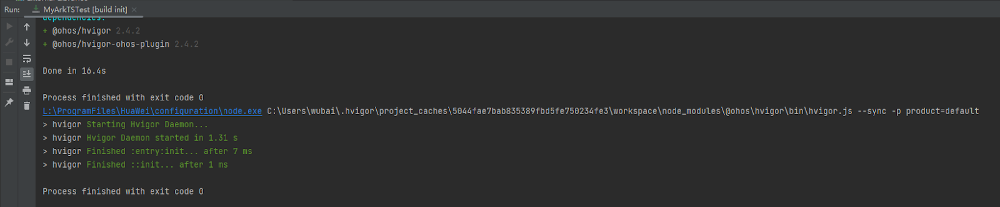


### Write the Code in `Index.ets`  
Enter the following code to set up the basic structure.

```typescript
@Entry
@Component
struct Hello {
  @State myText: string = 'World'

  build() {
    Column() {
      Text(`Hello ${this.myText}`)
        .fontSize(50)
      Divider()
      Button('Click me')
        .onClick(() => {
          this.myText = 'ArkUI' // Update the text when the button is clicked
        })
        .height(50)
        .width(100)
        .margin({ top: 20 })
    }
  }
}

```

### Interact with the button  
Open the preview in DevEvo Studio to verify the functionality. Click the "Click me" button will change the display from "Hello World" to "Hello ArkUI".  


## Basic Syntax Overview
In the example above, the basic components of ArkTS are as follows:  

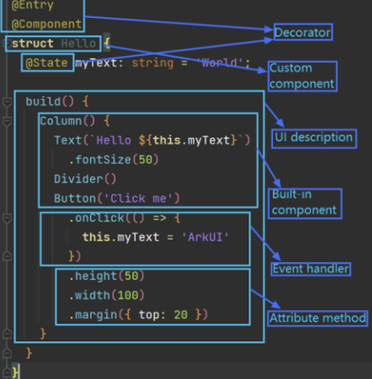  

**Explanation**:

**Decorator**: `@Entry`, `@Component`, and `@State` are decorators in above sample. It's a design pattern used to decorate classes, structs, methods, and variables to assign special meaning to them. 
- `@Component` indicates a custom component.
- `@Entry` indicates that the custom component is an entry component.
- `@State` indicates a state variable in the component, whose change will trigger the UI to re-render. `@State myText` holds the current text and is initially set to 'World'.

**Custom Component**: Reusable UI element and can be placed in other components like `struct Hello` decorated by @Component.

**UI description**: Declarative description of the UI structure like `build()` method on above code.
  
**Built-in Component**: Pre-defined UI elements provided by ArkTS like `Text`, `Button` in our case.  

**Attribute Method**: Methods used to set component attributes like `height()`, `width()`, `margin()` and etc.  

**Event Handler**: Methods used to add component logic like `onClick()` is the `Event Handler` of `Button` Component in our case.
>**Note:**
>The name of a custom variable cannot be the same as that of any universal attribute or event.

# Declarative UI Description
ArkTS declaratively combines and extends components to describe the UI of an application. In the meanwhile, it also provides basic methods of configuring attributes, event and child components to help us implementing the application interaction logic.

## Create Component
According to the `builder`, you can build component with or without parameters.
>**Note**: We don't need `new` operator when building components.

 ### Build Component Without Parameters
 If a struct don't have mandatory parameters, no parameters needs to be passed to this type of component like `Divider` component as follows.
 ```typescript
Column(){
Text('Item 1')
Divider()
Text('Item 2')
}
```

### Build Component With Parameters
If a struct have any mandatory parameters, we need to configure corresponding parameters.
- Set the mandatory parameter `src` of the `<image>` component as follows:
```typescript
Image('https//xyz/test.png')
```
- Set optional parameter `content` of the `<Text>` component.
```typescript
//Parameter of the string type
Text('test')
//Add application resources in $r format, which can be used in multi-language scenarios.
Text($r('app.string.title_value'))
//No mandatory parameters
Text()
```
- We can also use variable and expressions to configure values to parameters. The return type of the expression must meet required parameter type. For example, to set a variable or expression to construct the `<Image>` and `<Text>` components:
```typescript
Image(this.ImagePath)
Image('https://' + this.ImageUrl)
Text(`count: ${this.count}`)
```

## Configuring Attributes
Attribute method using chainable calls start with "." to configure the style and other attributes. It is recommended to use a seperate line of each attribute method.
- Configuring the `fontSize` attribute for the `<Text>` component
```typescript
Text('text')
  .fontSize(12)
```

- Configuring multiple attributes of `<Image>` component
```typescript
Image('test.png')
  .alt('error.png')
  .width(100)
  .height(100)
```

- Expect constant parameters, attribute methods accept expressions and variables as well
```typescript
Text('Hello')
  .fontSize(this.size)
Image('text.png')
  .width(this.count % 2 === 0 ? 100 : 200)
  .height(this.offset + 100)
```

- For built-in components, ArkUI also prefined some enumeration types with can be passed as parameters as long as they meet the parameter type requirements.
```typescript
Text('hello')
  .fontSize(20)
  .fontColor(Color.Red)
  .fontWeight(FontWeight.Bold)
```

## Configuring Events
Event method using chainable calls start with "." to configure the events supported by built-in components. It is recommended to use a seperate line of each attribute method.
- Configuring event method of a component by arrow function expression.
```typescript
Button('Click me')
  .onClick(()=>{
    this.myText = 'ArkUI';
  })
```

- Example of using an anonymous function expression to configure the event method of a component `()=>{...}` must be used to ensure that the function is bound to the component and compiles with the ArkTS syntax specifications:
```typescript
Button('Add counter')
  .onClick(()=>{
    this.count += 2;
  })
```

- Example of using component's member function to configure the event method of the component, where binding `this` is required.
```typescript
myClickHandler():void{
  .onClick(()=>{
    this.counter += 2;
  }

Button('Add counter')
  .onClick(this.myClickHandler.bind(this))
```

- Example of using an arrow function expression for a declaration, where binding `this` is not required.
```typescript
fn = ()=>{
console.info(`count: ${this.counter}`)
this.counter++
}

Button('add counter')
  .onClick(this.fn)
```
>**Note**:
>In arrow function expression, `this` inherits its value from context scope, which means in anonymous functions `this` may present an unclear reference. Therefore, it is not allowed in ArkTS.

## Configuring Child Components
If a component supports child component configuration(like container component), we need to add UI descriptions of the child components inside parentheses.  
- Simple example of configuring child components for the `<Column>` component:
```typescript
Column(){
Text('Hello')
  .fontSize(100)
Divider()
Text(this.myText)
  .fontSize(100)
  .fontColor(Color.Red)
```

- Example of nested child components in the `<Column>` component:
```typescript
Column(){
  Row(){
    Image('test1.png')
      .width(100)
      .height(100)
  Button('click + 1')
      .onClick(()=>{
        console.info('+1 clicked!');
      })
  }
}
``` 
# Components

# Basic Components
In ArkUI, basic components are also built-in components which directly provided by the ArkUI framework.

## Text
The Text component is used to display a segment of text. This component is supported from API Version 7 onwards. 

Usage: `Text(content?: string | Resource)`

 When the Span subcomponent is included, it overrides the text content, displaying the content of Span instead, and at such times the styling of the text component does not apply.
| Property     | Type            | Description |
|--------------|-----------------|-------------|
| **textAlign**| `TextAlign`     |  Sets the horizontal alignment of the text paragraph to fill the width of the Text component. |
| **textOverflow**| `TextOverflow` | Defines how text is displayed when it exceeds the available space.
| **maxLines** | `number`        | Sets the maximum number of lines for the text.|
**lineHeight** |`string \| number \| Resource`|Sets the line height of the text. When set to a value not greater than 0, the line height adjusts to the font size. |
**baselineOffset**|`number \| string`| Sets the offset for the text baseline. |

### Example Usage
The following code defines a component named `TextExample1`, which demonstrates various text styles, including alignment, overflow handling, and line height settings.

```typescript
@Entry
@Component
struct TextExample1 { // Define a component named TextExample1

  build() { // Build the UI
    Flex({ // Create a flex layout container
      direction: FlexDirection.Column, // Set vertical layout direction
      alignItems: ItemAlign.Start, // Align items to the start
      justifyContent: FlexAlign.SpaceBetween // Distribute space evenly
    }) {

      // Text alignment settings for single-line text
      Text('textAlign').fontSize(9).fontColor(0xCCCCCC) // Label for text alignment settings

      Text('TextAlign set to Center.') // Center-aligned text
        .textAlign(TextAlign.Center)
        .fontSize(12)
        .border({ width: 1 })
        .padding(10)
        .width('100%')

      Text('TextAlign set to Start.') // Start-aligned text
        .textAlign(TextAlign.Start)
        .fontSize(12)
        .border({ width: 1 })
        .padding(10)
        .width('100%')

      Text('TextAlign set to End.') // End-aligned text
        .textAlign(TextAlign.End)
        .fontSize(12)
        .border({ width: 1 })
        .padding(10)
        .width('100%')

      // Multi-line text alignment
      Text('This is the text content with textAlign set to Center.') // Center-aligned multi-line text
        .textAlign(TextAlign.Center)
        .fontSize(12)
        .border({ width: 1 })
        .padding(10)
        .width('100%')

      Text('This is the text content with textAlign set to Start.') // Start-aligned multi-line text
        .textAlign(TextAlign.Start)
        .fontSize(12)
        .border({ width: 1 })
        .padding(10)
        .width('100%')

      Text('This is the text content with textAlign set to End.') // End-aligned multi-line text
        .textAlign(TextAlign.End)
        .fontSize(12)
        .border({ width: 1 })
        .padding(10)
        .width('100%')

      // Handling text overflow
      Text('TextOverflow+maxLines').fontSize(9).fontColor(0xCCCCCC) // Label for text overflow settings

      Text('This is the setting of textOverflow to Clip text content...')
        .textOverflow({ overflow: TextOverflow.Clip }) // Clip overflow
        .maxLines(1)
        .fontSize(12)
        .border({ width: 1 })
        .padding(10)

      Text('This is set textOverflow to Ellipsis text content...'.split('').join('\u200B'))
        .textOverflow({ overflow: TextOverflow.Ellipsis }) // Ellipsis overflow
        .maxLines(1)
        .fontSize(12)
        .border({ width: 1 })
        .padding(10)

      Text('lineHeight').fontSize(9).fontColor(0xCCCCCC) // Label for line height settings

      // Setting line height for text
      Text('This is the text with the line height set. This is the text...')
        .fontSize(12)
        .border({ width: 1 })
        .padding(10)

      Text('This is the text with the line height set. This is the text...')
        .fontSize(12)
        .border({ width: 1 })
        .padding(10)
        .lineHeight(20) // Set line height

    }.height(600).width(350).padding({ left: 35, right: 35, top: 35 }) // Container dimensions and padding
  }
}
```
The preview of the above code is as follows:

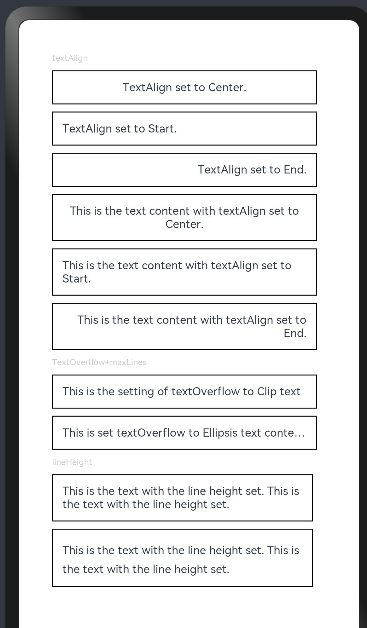


## Column 
The `Column` container component is used for vertical layout. This component has been supported since API Version 7.

Usage:`Column(value?: {space?: string | number})`

| Property     | Type            | Description |
|--------------|-----------------|-------------|
|**alignItems**|HorizontalAlign|Set the horizontal alignment of child components.Default: `HorizontalAlign.Center`|
|**justifyContent**|FlexAlign|Set the vertical alignment of child components.Default: `FlexAlign.Start`|

### Example Usage
The following code defines a component named `ColumnExample`, demonstrating various features of the `Column` layout, including spacing between child elements, alignment, and background color settings.

```typescript
@Entry
@Component
struct ColumnExample { // Define a component named ColumnExample

  build() {
    Column({ space: 5 }) { // Column with vertical spacing
      Text('space').width('90%') // Label for space attribute

      Column({ space: 5 }) { // Nested Column with spacing
        Column().width('100%').height(30).backgroundColor(0xAFEEEE) // Light blue
        Column().width('100%').height(30).backgroundColor(0x00FFFF) // Cyan
      }.width('90%').height(100).border({ width: 1 })

      // Horizontal alignment
      Text('alignItems(Start)').width('90%') // Start alignment
      Column() {
        Column().width('50%').height(30).backgroundColor(0xAFEEEE)
        Column().width('50%').height(30).backgroundColor(0x00FFFF)
      }.alignItems(HorizontalAlign.Start).width('90%').border({ width: 1 })

      Text('alignItems(End)').width('90%') // End alignment
      Column() {
        Column().width('50%').height(30).backgroundColor(0xAFEEEE)
        Column().width('50%').height(30).backgroundColor(0x00FFFF)
      }.alignItems(HorizontalAlign.End).width('90%').border({ width: 1 })

      Text('alignItems(Center)').width('90%') // Center alignment
      Column() {
        Column().width('50%').height(30).backgroundColor(0xAFEEEE)
        Column().width('50%').height(30).backgroundColor(0x00FFFF)
      }.alignItems(HorizontalAlign.Center).width('90%').border({ width: 1 })

      // Vertical alignment
      Text('justifyContent(Center)').width('90%') // Center justify
      Column() {
        Column().width('90%').height(30).backgroundColor(0xAFEEEE)
        Column().width('90%').height(30).backgroundColor(0x00FFFF)
      }.height(100).border({ width: 1 }).justifyContent(FlexAlign.Center)

      Text('justifyContent(End)').width('90%') // End justify
      Column() {
        Column().width('90%').height(30).backgroundColor(0xAFEEEE)
        Column().width('90%').height(30).backgroundColor(0x00FFFF)
      }.height(100).border({ width: 1 }).justifyContent(FlexAlign.End)
    }.width('100%').padding({ top: 5 })
  }
}

```

The preview of the above code is as follows:

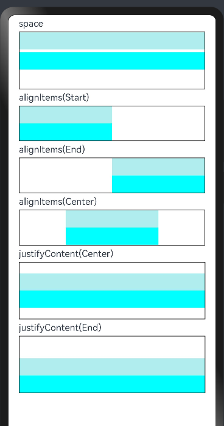

## Row
The `Column` container component is used for horizontal layout. This component has been supported since API Version 7.

Usage:`Row(value?:{space?: number | string })`


### Example Usage

The following code defines a component named `RowExample`, demonstrating features of the `Row` layout, including spacing, vertical alignment, and horizontal alignment.

```typescript
@Entry
@Component
struct RowExample { // Define a component named RowExample

  build() {
    Column({ space: 5 }) { // Column with vertical spacing
      Text('space').width('90%') // Label for space attribute

      Row({ space: 5 }) { // Row with horizontal spacing
        Row().width('30%').height(50).backgroundColor(0xAFEEEE) // Light blue
        Row().width('30%').height(50).backgroundColor(0x00FFFF) // Cyan
      }.width('90%').height(107).border({ width: 1 })

      // Vertical alignment
      Text('alignItems(Bottom)').width('90%') // Bottom alignment
      Row() {
        Row().width('30%').height(50).backgroundColor(0xAFEEEE)
        Row().width('30%').height(50).backgroundColor(0x00FFFF)
      }.width('90%').alignItems(VerticalAlign.Bottom).height('15%').border({ width: 1 })

      Text('alignItems(Center)').width('90%') // Center alignment
      Row() {
        Row().width('30%').height(50).backgroundColor(0xAFEEEE)
        Row().width('30%').height(50).backgroundColor(0x00FFFF)
      }.width('90%').alignItems(VerticalAlign.Center).height('15%').border({ width: 1 })

      // Horizontal alignment
      Text('justifyContent(End)').width('90%') // End justify
      Row() {
        Row().width('30%').height(50).backgroundColor(0xAFEEEE)
        Row().width('30%').height(50).backgroundColor(0x00FFFF)
      }.width('90%').border({ width: 1 }).justifyContent(FlexAlign.End)

      Text('justifyContent(Center)').width('90%') // Center justify
      Row() {
        Row().width('30%').height(50).backgroundColor(0xAFEEEE)
        Row().width('30%').height(50).backgroundColor(0x00FFFF)
      }.width('90%').border({ width: 1 }).justifyContent(FlexAlign.Center)
    }.width('100%') // Set outer column width
  }
}
```

The preview of the above code is as follows:

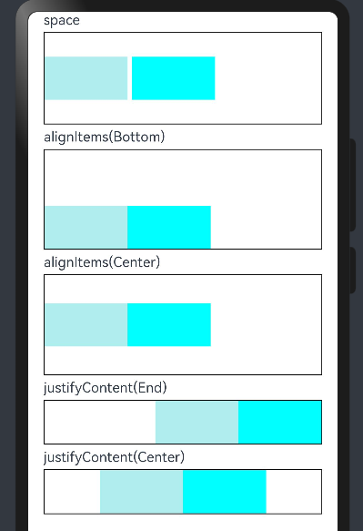

# Custom Component
Components defined by developers are  custom components. In UI development, it's important to consider code reusability, separation of business logic and UI, and future evolution, rather than simply combining system components. Therefore, encapsulating UI and some business logic into custom components is essential.

Custom components have the following features:

- **Composable**: Allow developers to combine built-in components and other components with their attributes and methods.
- **Reusable**: Custom components can be reused by other components and instantiated in different parent components or containers.
- **Data-Driven UI Updates**: Changes in state variables drive UI refreshes.

## Basic Usage
The following example demonstrates the basic usage of custom components in ArkTS.

```typescript
@Component
struct HelloComponent {
  @State message: string = 'Hello, World!';

  build() {
    // Custom component combining system components Row and Text
    Row() {
      Text(this.message)
        .height(50)
        .width(200)
        .fontSize(30)
        .onClick(() => {
          // Changing the message state variable updates the UI from 'Hello, World!' to 'Hello, ArkUI!'
          this.message = 'Hello, ArkUI!';
        })
    }
  }
}
```

>**Attention:**
>If we want to use the custom component in another file, use the keyword `export` to export the component and then use `import` to import it to the target file.

**Reusing the Custom Component**

The HelloComponent can be reused multiple times within the build() function of other custom components.
```typescript
@Entry
@Component
struct ParentComponent {
  build() {
    Column() {
      Text('ArkUI message')
        .height(100)
        .fontSize(50)
        .fontWeight(FontWeight.Bold)
      HelloComponent({ message: 'Hello, World!' });
      Divider()
      HelloComponent({ message: '你好!' });
    }
  }
}
```
In the preview, clicking on "Hello, World!" or "你好" will change the text to "Hello, ArkUI!", demonstrating the reuse and interactivity of custom components.

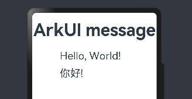


## The Architecture 


- **Struct**
  - Custom components are implemented using `struct`.
  - The structure is defined as `struct` + custom component name + `{...}`.
  - No inheritance is allowed.
  - Instantiation of a `struct` can omit the `new` keyword.

- **@Component**
  - The `@Component` decorator can only be applied to data structures declared with the `struct` keyword.
  - A `struct` decorated with `@Component` gains the capability to act as a component.
  - The component must implement a `build` method to describe the UI.
  - Each `struct` can have only one `@Component` decorator.
  - `@Component` can accept an optional parameter of the `Boolean` type (Since API version 11).
```typescript
@Component
struct MyComponent{
}
```

>**Note:**
>If the `bool` is set to `true` means current `@Component` is necessary, the framework ensures that the component is created and maintained when needed.
If set to `false` means current `@Component` is optional, The framework may skip creating the component when resources are limited or not needed.

- **build() Function**
  - The `build()` function defines the declarative UI description of a custom component.
  - Every custom component must define a `build()` function.
```typescript
@Component
struct MyComponent{
  build(){
  }
}
```

- **@Entry**
  - Components decorated with `@Entry` serve as the entry point for the UI page.
  - Only one custom component per UI page can be decorated with `@Entry`.
  - `@Entry` can accept an optional `LocalStorage` parameter (Since API version 10).
```typescript
@Entry
@Component
struct MyComponent{
}
```

### Rules in build() function
Whatever defined in `build()` function called UI description. They must comply with the following rules:

- `@Entry` decorated custom component, exactly one root component is required under the `build()` function. This root component must be a container component. `ForEach` is not allowed at the top level.
```typescript
@Entry
@Component
struct MyComponent {
  build() {
    // Exactly one root component is required, and it must be a container component.
    Row() {
      ChildComponent() 
    }
  }
}

@Component
struct ChildComponent {
  build() {
    // Exactly one root component is required, and it is not necessarily a container component.
    Image('test.jpg')
  }
}
```

- Local variable declaration is not allowed. The following example should be avioded:
```typescript
build() {
  // Avoid: declaring a local variable.
  let a: number = 1;
}
```

- `Console.info` is allowed to use only under method or function. The following example should be avoided:
```typescript
build() {
  // Avoid: using console.info directly in UI description.
  console.info('print debug log');
}
```

- Creation of local scope is not allowed. The following example should be avoided:
```typescript
build() {
  // Avoid: creating a local scope.
  {
    ...
  }
}
```
- Only methods decorated by `@Builder` can be called. The parameters of built-in components can be the return values of TS methods
```typescript
@Component
struct ParentComponent {
  doSomeCalculations() {
  }

  calcTextValue(): string {
    return 'Hello World';
  }

  @Builder doSomeRender() {
    Text(`Hello World`)
  }

  build() {
    Column() {
      // Avoid: calling a method not decorated by @Builder.
      this.doSomeCalculations();
      // Prefer: Call an @Builder decorated method.
      this.doSomeRender();
      // Prefer: Pass the return value of a TS method as the parameter.
      Text(this.calcTextValue())
    }
  }
}
```

- The `switch` syntax is not allowed. Use `if` instead. The following is an example:
```typescript
build() {
  Column() {
    // Avoid: using the switch syntax.
    switch (expression) {
      case 1:
        Text('...')
        break;
      case 2:
        Image('...')
        break;
      default:
        Text('...')
        break;
    }
    // Correct usage: Use if.
    if(expression == 1) {
      Text('...')
    } else if(expression == 2) {
      Image('...')
    } else() {
      Text('...')
    }
  }
}
```

- Expressions are not allowed. The following example should be avoided:
```typescript
build() {
  Column() {
    // Avoid: expressions.
    (this.aVar > 10) ? Text('...') : Image('...')
  }
}
```

- Directly changing a state variable is not allowed. The following example should be avoided:
```typescript
@Component
struct CompA {
  @State col1: Color = Color.Yellow;
  @State col2: Color = Color.Green;
  @State count: number = 1;
  build() {
    Column() {
      // Avoid: directly changing the value of count in the <Text> component.
      Text(`${this.count++}`)
        .width(50)
        .height(50)
        .fontColor(this.col1)
        .onClick(() => {
          this.col2 = Color.Red;
        })
      Button("change col1").onClick(() =>{
        this.col1 = Color.Pink;
      })
    }
    .backgroundColor(this.col2)
  }
}
```

## Page and Custom Component Lifecycle

### Understanding the Relationship

- **Custom Components**: UI units decorated with `@Component`, which can combine multiple system components for UI reuse.

- **Pages**: The UI pages of an application. A page can consist of one or more custom components. The component decorated with `@Entry` is the entry component of the page, serving as the root node. Each page must have exactly one `@Entry`. Only components with `@Entry` can invoke page lifecycle methods.

### Page Lifecycle

The lifecycle of components decorated with `@Entry` includes the following methods:

- **onPageShow**: Triggered every time the page is displayed.
- **onPageHide**: Triggered once each time the page is hidden.
- **onBackPress**: Triggered when the user clicks the back button.

### Component Lifecycle

The lifecycle of custom components generally decorated with `@Component` includes:

- **aboutToAppear**: Called when the component is about to appear, specifically after a new instance is created and before the `build()` function is executed.
- **aboutToDisappear**: Executed when the custom component is about to be destroyed.

### Lifecycle Flow

The lifecycle flow for components decorated with `@Entry` (such as the homepage) is illustrated in the diagram below.

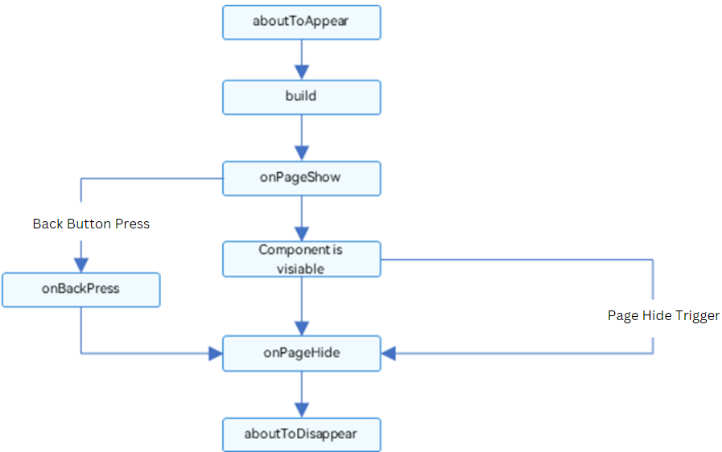

> **Note**: Certain lifecycle callbacks only apply to custom components with `@Entry`: `onPageShow`, `onPageHide`, and `onBackPress`. Based on the flowchart, we will explain in detail the initial creation, re-rendering, and deletion of custom components.
>

```typescript
@Component
export struct HelloComponent {
  @State message: string = 'Hello, World!';
  private num:number=1
  @Builder
  gentxt(txt:string){
  }
  //build function
  build() {
    // Custom component combining system components Row and Text
    Row() {
      Text(this.message)
        .height(50)
        .width(200)
        .fontSize(30)
    }
  }
  aboutToAppear(): void {
    console.info("Custom Component is ready to appear")
  }
  aboutToDisappear(): void {
    console.info("Custom Component is ready to disappear")
  }
}
```
```typescript
import {HelloComponent} from '../component/Hellocomponent'
@Entry
@Component
struct Index {
  @State message: string = 'hello world'
  build(){
    Row(){
      Column(){
        HelloComponent({
          message:'hello Arkui', num:2
        })
          .onClick(()=>{
            console.info('gxx')
          })
      }
      .width('100%')
    }
    .height('100%')
  }
  aboutToAppear(): void {
  console.info('Entry component about to appear')
  }
  aboutToDisappear(): void {
    console.info('Entry component about to disappear')
  }
  onPageShow(): void {
    console.info('Page start showing')
  }
  onPageHide(): void {
    console.info('Page disappear')
  }
  onBackPress(): void {
    console.info('Clicked back button on Page')
  }
}
```
We can check the console information in log section.


# State Management
Previously, we discussed building static interfaces. To create dynamic, interactive interfaces, the concept of "state" is essential. Let's examine a scenario where user interaction with a light switch triggers a change from dark to light, demonstrating state-driven UI rendering.

## Key Concepts

**State Variables**: Decorated with the @State decorator, these variables trigger UI re-rendering upon value changes. For example:

```typescript
@State num: number = 1;  // 'num' is the state variable, '@State' is the decorator.
```
**Regular Variables**: Not decorated with the @State decorator and used for auxiliary calculations. Changes in these variables do not refresh the UI:

```typescript
private increaseBy: number = 1;  // 'increaseBy' is a regular variable.
```

**Data Sources/Synchronization Sources**: The original sources of state variables, often meaning data passed from a parent component to a child component. For example:

```typescript
count: 1;  // 'count' is the data source.
```

**Named Argument Mechanism**: This mechanism involves parents passing state variables to children via specified parameters, primarily facilitating data synchronization:

```typescript
CompA: ({ aProp: this.aProp });
```

**Initialization from Parent Component**: The parent component uses the named parameter mechanism to pass specific parameters to the child component. If the parent provides values, these will override the default values set during the child component's initialization.

```typescript
@Component
struct MyComponent {
  @State count: number = 0;       // State variable
  private increaseBy: number = 1; // Regular variable

  build() { }
}

@Component
struct Parent {
  build() {
    Column() {
      // Initialize from parent, overriding local default values
      MyComponent({ count: 1, increaseBy: 2 })  
    }
  }
}
```

Initialize Child Nodes: State variables from the parent component can be passed to the child component to initialize the corresponding state variables in the child. (See example above.)

Local Initialization: Assign a value when declaring a variable to set its default value.
Example: `@State count: number = 0;`

## Decorators in State Management

### @State Decorator - Internal Component State

There are two main methods for initializing state:

- **Default Local Value**: Declared directly within the component.
- **Parameter Value**: Overrides the local default value during initialization.

A variable decorated with `@State`, known as a state variable, is tied to the rendering of custom components. When the state changes, the UI updates accordingly.

#### Overview

- **@State Decorator**: The most fundamental state decorator that allows a variable to have state properties, serving as the data source for most state variables. From API version 9, this decorator can be used in ArkTS cards.
- **Characteristics**:
  - Variables decorated with `@State` are private and can only be accessed from within the component. They must specify their type and local initialization upon declaration. Alternatively, they can be initialized using the named parameter mechanism from the parent component.
  - `@State` variables can establish one-way or two-way data synchronization with `@Prop`, `@Link`, or `@ObjectLink` decorated variables in child components.
  - The lifecycle of `@State` variables matches the lifecycle of their custom component.

### Usage Scenarios

### Decorating Simple Type Variables

The following example demonstrates `@State` decorating a simple type. The `count` variable is a state variable decorated with `@State`. Changes to `count` trigger a refresh of the `Button` component:

- When `count` changes, the framework identifies the `Button` component associated with it.
- The `Button` component's update method is executed to refresh the UI.

```typescript
@Entry
@Component
struct MyComponent {
  @State count: number = 0; // State variable

  build() {
    Button(`click times: ${this.count}`)
      .width(200)
      .height(80)
      .fontSize(20)
      .margin(60)
      .onClick(() => {
        this.count += 1; // Increment count on button click
      })
  }
}
```
In the preview of the above code, clicking the button increments the count by 1 automatically.
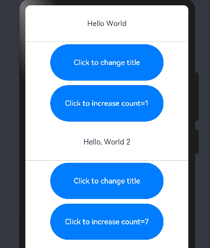

### Decorating Class Object Type Variables
The custom component MyComponent defines state variables count and title using @State. Here, title is of type Model, a custom class. If count or title changes, the framework identifies and re-renders the UI components using these state variables.

In EntryComponent, there are multiple instances of MyComponent. State changes within one instance do not affect the other.

```typescript
class Model {
  public value: string;

  constructor(value: string) {
    this.value = value;
  }
}

@Entry
@Component
struct EntryComponent {
  build() {
    Column() {
      // Parameters specified here override the default values during initial rendering
      MyComponent({ count: 1, increaseBy: 2 })
      MyComponent({ title: new Model('Hello, World 2'), count: 7 })
    }
  }
}

@Component
struct MyComponent {
  @State title: Model = new Model('Hello World'); // Complex state variable storing a Model object
  @State count: number = 0; // Simple numeric state variable
  private increaseBy: number = 1; // Private variable for increment step

  build() {
    Column() {
      Text(`${this.title.value}`)
        .height(80)
      Divider()
      Button(`Click to change title`).onClick(() => {
        // Update state variable to trigger Text component update
        this.title.value = this.title.value === 'Hello ArkUI' ? 'Hello World' : 'Hello ArkUI';
      })
        .height(80)
        .width(250)
        .margin(5)

      Button(`Click to increase count=${this.count}`).onClick(() => {
        // Update state variable to trigger Button component update
        this.count += this.increaseBy;
      })
        .height(80)
        .width(250)
        .margin(5)
    }
  }
}
```
In this example, clicking the "Click to change title" buttons toggles the title between "Hello World" and "Hello ArkUI". In the first MyComponent, clicking the second button increases the count by 2; in the second MyComponent, it increases by 1.


This example illustrates the initialization process for @State variables during the first render:

**Local Initialization**: Uses default local initialization for state variables:


```typescript
@State title: Model = new Model('Hello World');
@State count: number = 0;
```

**Named Parameter Mechanism**: The values passed through named parameters are optional for @State. If no parameters are provided, local default values are used:

```typescript
MyComponent({ count: 1, increaseBy: 2 })
```
---
### @Prop Decorator - Between Parent and Child Components


- **Overview**: Establishes a one-way synchronization relationship with the parent component. `@Prop` variables are mutable, but changes are not synced back to the parent. From API version 9, this decorator can be used in ArkTS cards.
- **Characteristics**:
  - `@Prop` variables allow local modifications but do not sync changes back to the parent.
  - When the data source in the parent component changes, related `@Prop` variables are automatically updated. If the child component has already modified `@Prop` variables locally, and the corresponding `@State` variables in the parent are changed, the local modifications to `@Prop` variables will be overridden.
- **Limitations**:
  - Complex types decorated with `@Prop` undergo a deep copy, losing types except for basic types, Map, Set, Date, and Array.
  - The `@Prop` decorator cannot be used in custom components decorated with `@Entry`.

### Usage Scenario: 
### Synchronizing Parent @State to Child @Prop

This example demonstrates how simple data synchronization occurs from a parent component's `@State` to a child component's `@Prop`. In the parent component, `ParentComponent`, the state variable `countDownStartValue` initializes the `count` variable in the child `CountDownComponent`, which is decorated with `@Prop`. Clicking "Try again" modifies `count` within `CountDownComponent` but does not sync back to `ParentComponent`.

#### Code Example

```typescript
@Component
struct CountDownComponent {
  @Prop count: number; // The name doesn't have to match the parent's variable
  costOfOneAttempt: number = 1; // Private variable in the child component

  build() {
    Column() {
      if (this.count > 0) {
        Text(`You have ${this.count} Nuggets left`).height(80)
      } else {
        Text('Game over!').height(80)
      }
      // Changes to @Prop variables don't sync back to the parent
      Button(`Try again`).onClick(() => {
        this.count -= this.costOfOneAttempt;
      }).height(80)
        .width(250)
        .margin(5)
    }
  }
}

@Entry
@Component
struct ParentComponent { // Parent component
  @State countDownStartValue: number = 10;

  build() {
    Column() {
      Text(`Grant ${this.countDownStartValue} nuggets to play.`)
        .height(80)

      // Changes to the parent's data source sync to the child component
      Button(`+1 - Nuggets in New Game`).onClick(() => {
        this.countDownStartValue += 1;
      }).height(80)
        .width(250)
        .margin(5)

      Button(`-1 - Nuggets in New Game`).onClick(() => {
        this.countDownStartValue -= 1;
      }).height(80)
        .width(250)
        .margin(5)

      CountDownComponent({ count: this.countDownStartValue, costOfOneAttempt: 2 })
      Divider()
    }
  }
}
```

The display is previewed as the following:  


#### Explanation

1. When `CountDownComponent` is first created, its `@Prop` variable `count` is initialized from the parent's `@State` variable `countDownStartValue`.

2. Pressing the "+1" or "-1" buttons changes the `countDownStartValue` in the parent, triggering a re-render of the parent and a one-way update of the `count` value in `CountDownComponent`.

3. Updates to the `count` state variable also trigger re-rendering of `CountDownComponent`. During re-rendering, the `if` statement condition (`this.count > 0`) is evaluated, and the true branch updates the `Text` component's display.

4. Pressing "Try again" in `CountDownComponent` changes its `@Prop` variable `count`, but this change does not affect the parent's `countDownStartValue`.

5. If the parent's `countDownStartValue` changes, it overrides any local changes to `count` in `CountDownComponent`.


### Synchronizing Parent @State Array Items to Child @Prop

@Prop accepts only basic data types like: string, number, boolean, enum. If a parent's `@State` is an array, its items can initialize a child's `@Prop`. In the following example, the array `arr` in the parent component `Index` is used to initialize the `value` in the child component `Child`.

#### Code Example

```typescript
@Component
struct Child {
  @Prop value: number; // @Prop variable initialized from parent's @State array

  build() {
    Text(`${this.value}`)
      .fontSize(50)
      .onClick(() => { this.value++ }) // Increment value on click
  }
}

@Entry
@Component
struct Index {
  @State arr: number[] = [1, 2, 3]; // @State array

  build() {
    Row() {
      Column() {
        Child({ value: this.arr[0] }) // Initialize Child with array items
        Child({ value: this.arr[1] })
        Child({ value: this.arr[2] })

        Divider().height(5)

        ForEach(this.arr,
          item => {
            Child({ value: item }) // Initialize Child using ForEach
          },
          item => item.toString()
        )
        Text('replace entire arr')
          .fontSize(50)
          .onClick(() => {
            // Replace array based on first element's value
            this.arr = this.arr[0] == 1 ? [3, 4, 5] : [1, 2, 3];
          })
      }
    }
  }
}
```

The display is previewed as the following:  
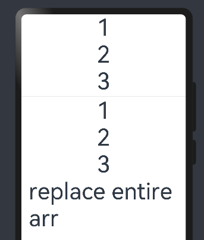

##### Explanation

1. Clicking "replace entire arr" checks if the first element of `arr` is 1.
2. The array `arr` is reassigned in the parent component, triggering a re-render.
3. During re-rendering, the `ForEach` loop reassigns values to the `value` property in child components.
4. The parent's values are passed to the child's `@Prop` value.
5. Clicking "replace entire arr" shows updated values in the preview.
   
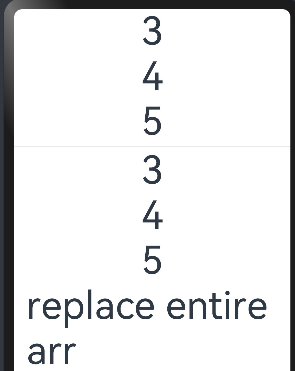


### Synchronizing @State Class Object Properties to @Prop Simple Types

In a library with one book and two users, each user can mark the book as read. This action does not affect other users. From a coding perspective, local changes to a `@Prop` book object do not sync back to the `@State` book object in the library component.

#### Code Example

```typescript
class Book {
  public title: string;
  public pages: number;
  public readIt: boolean = false; // Default is false

  constructor(title: string, pages: number) {
    this.title = title;
    this.pages = pages;
  }
}

@Component
struct ReaderComp {
  @Prop title: string;
  @Prop readIt: boolean;

  build() {
    Row() {
      Text(this.title).margin(20)
      Text(`... ${this.readIt ? 'I have read' : 'I have not read it'}`)
        .margin(20)
        .onClick(() => this.readIt = !this.readIt) // Toggle read status on click
    }
  }
}

@Entry
@Component
struct Library {
  @State book: Book = new Book('100 secrets of C++', 765);

  build() {
    Column() {
      ReaderComp({ title: this.book.title, readIt: this.book.readIt })
      ReaderComp({ title: this.book.title, readIt: this.book.readIt })
    }
  }
}
```

The display is previewed as the following:  
<image src="images/com-11.png">

When "I have not read it" is clicked, it automatically changes to "I have read", demonstrating the simple data type synchronization between the parent and child components, while ensuring each child component operates independently.

### @Prop Local Initialization Without Parent Synchronization

To support the reuse of components decorated with `@Component`, `@Prop` allows local initialization, making the synchronization relationship with the parent component optional. Only when a `@Prop` has local initialization is the data source from the parent component optional for the child component.


In the example below, the child component contains two `@Prop` variables:

- `@Prop customCounter`: No local initialization, requiring a data source from the parent component for initialization. The `@Prop` is updated when the parent's data source changes.
- `@Prop customCounter2`: Has local initialization, allowing but not requiring synchronization from the parent component.

```typescript
@Component
struct MyComponent {
  @Prop customCounter: number;
  @Prop customCounter2: number = 5; // Local initialization

  build() {
    Column() {
      Row() {
        Text(`From Main: ${this.customCounter}`).width(90).height(40).fontColor('#FF0010')
      }

      Row() {
        Button('Click to change locally!').width(180).height(60).margin({ top: 10 })
          .onClick(() => {
            this.customCounter2++;
          })
      }.height(100).width(180)

      Row() {
        Text(`Custom Local: ${this.customCounter2}`).width(90).height(40).fontColor('#FF0010')
      }
    }
  }
}

@Entry
@Component
struct MainProgram {
  @State mainCounter: number = 10;

  build() {
    Column() {
      Row() {
        Column() {
          Button('Click to change number').width(480).height(60).margin({ top: 10, bottom: 10 })
            .onClick(() => {
              this.mainCounter++;
            })
        }
      }

      Row() {
        // customCounter must be initialized by the parent since it lacks local initialization
        MyComponent({ customCounter: this.mainCounter })
        // customCounter2 can also be initialized by the parent, overriding local initialization
        MyComponent({ customCounter: this.mainCounter, customCounter2: this.mainCounter })
      }
    }
  }
}
```
The display is previewed as the following:

<image src="images/com-12.png">

Clicking either "Click to change locally!" button in the second row increments "Custom Local: x" by 1.
Clicking "Click to change number" in MainProgram increases "From Main" and the second "Custom Local" in the second row by 1, the first "Custom Local" remains unchanged, not synchronized with the parent component.


## @Link Decorator - Bidirectional Synchronization Between Parent and Child

- **Overview**: Variables decorated with `@Link` establish a two-way data binding with their parent component's data source. From API version 9, this decorator can be used in ArkTS cards.

   Note that `@Link` variables share the same value with their parent component's data source. The `@Link` decorator cannot be used in custom components decorated with `@Entry`.


### Usage Scenario: 
### @Link with Simple and Class Object Types

In the following example, clicking "Parent View: Set YellowButton" and "Parent View: Set GreenButton" in the parent component `ShufflingContainer` synchronizes changes to the child components. Changes in the child components `GreenButton` and `YellowButton`, decorated with `@Link`, are also synchronized back to the parent component. Parent component uses `$` sign to pass parameters to child components.

 

```typescript
class GreenButtonState {
  width: number = 0;

  // Constructor
  constructor(width: number) {
    this.width = width;
  }
}

@Component
struct GreenButton {
  @Link greenButtonState: GreenButtonState;

  build() {
    Button('Green Button')
      .width(this.greenButtonState.width)
      .height(150.0)
      .backgroundColor('#00ff00')
      .onClick(() => {
        if (this.greenButtonState.width < 700) {
          // Update class property, synchronized back to the parent component
          this.greenButtonState.width += 125;
        } else {
          // Update class, synchronized back to the parent component
          this.greenButtonState = new GreenButtonState(100);
        }
      })
  }
}

@Component
struct YellowButton {
  @Link yellowButtonState: number;

  build() {
    Button('Yellow Button')
      .width(this.yellowButtonState)
      .height(150.0)
      .backgroundColor('#ffff00')
      .onClick(() => {
        // Simple type changes are synchronized back to the parent component
        this.yellowButtonState += 50.0;
      })
  }
}

@Entry
@Component
struct ShufflingContainer {
  @State greenButtonState: GreenButtonState = new GreenButtonState(300);
  @State yellowButtonProp: number = 100;

  build() {
    Column() {
      // Synchronize simple type from parent @State to child @Link
      Button('Parent View: Set YellowButton')
        .onClick(() => {
          this.yellowButtonProp = (this.yellowButtonProp < 700) ? this.yellowButtonProp + 100 : 100;
        })

      // Synchronize class type from parent @State to child @Link
      Button('Parent View: Set GreenButton')
        .onClick(() => {
          this.greenButtonState.width = (this.greenButtonState.width < 700) ? this.greenButtonState.width + 100 : 100;
        })

      // Initialize @Link with class type
      GreenButton({ greenButtonState: $greenButtonState })

      // Initialize @Link with simple type
      YellowButton({ yellowButtonState: $yellowButtonProp })
    }
  }
}

```
<image src="images/com-13.png">

The preview of the above code shows that clicking any of the four buttons results in the expected changes, demonstrating bidirectional data synchronization between parent and child components.

### Array Type @Link

The following example demonstrates how the `@Link` decorator is used with arrays in ArkTS, allowing for bidirectional data synchronization between parent and child components.
 
```typescript
@Component
struct Child {
  @Link items: number[]; // Link array for bidirectional synchronization

  build() {
    Column() {
      Button(`Button1: push`).onClick(() => {
        // Add a new element to the array, synchronized back to the parent
        this.items.push(this.items.length + 1);
      })
      Button(`Button2: replace whole item`).onClick(() => {
        // Replace the entire array, synchronized back to the parent
        this.items = [100, 200, 300];
      })
    }
  }
}

@Entry
@Component
struct Parent {
  @State arr: number[] = [1, 2, 3]; // State array for synchronization

  build() {
    Column() {
      Child({ items: $arr }) // Initialize Child with @Link to parent state array
      ForEach(this.arr,
        item => {
          Text(`${item}`) // Display each item in the array
        },
        item => item.toString()
      )
    }
  }
}

```


When the code runs, the ArkUI framework can detect the addition, deletion, and replacement of array elements. In this example, both `@State` and `@Link` have the same type, `number[]`. It is not permitted to define `@Link` as a single number type (e.g., `@Link item: number`) and then use each element of a `@State` array in the parent component to create child components.


<image src="images/com-14.png">

Each time the "push" button is clicked, the array length increases, and clicking the second button initializes the array.


# Rendering Control 
## Overview
ArkTS uses the `build()` function of custom components and declarative UI description statements in the `@builder decorator` to build corresponding UI. In declaration UI description statements, besides system components we can also use rendering control statements to support UI construction. The following are key statements that implement rendering control in the ArkTS language:
- **Conditional statements**
- **Loop statements**

## Conditional Rendering

ArkTS provides the capability for rendering control. Conditional rendering allows the UI to display different content based on the application's state, using `if`, `else`, and `else if` statements. Starting from API version 9, this feature can be used in ArkTS cards.

### Usage Rules

- Supports `if`, `else`, and `else if` statements.
- Conditions following `if` and `else if` can utilize state variables.
- Conditional rendering can be used within container components to construct different child components based on conditions.
- Conditional rendering statements are "transparent" regarding parent-child component relationships. If one or more `if` statements exist between parent and child components, the parent's rules for using child components must be followed.
- Each branch must follow the rules of the build function and create one or more components. An empty build function that creates no components will result in a syntax error.
- Some container components restrict the type or number of child components. These restrictions apply to components created within conditional rendering statements. For example, the `Grid` container component only supports `GridItem` components, so only `GridItem` components are allowed within conditional rendering statements in a `Grid`.

### Update Mechanism

When the state variables used in the conditions following `if` and `else if` change, the conditional rendering statement updates as follows:

1. Evaluate the conditions of `if` and `else if` statements. If there is no change in branches, the following steps are unnecessary. If a change occurs, proceed to steps 2 and 3:
2. Remove all previously constructed child components.
3. Execute the constructor function for the new branch and add the resulting components to the parent container of `if`. If there is no applicable `else` branch, no content is constructed.

- Conditions can include TypeScript expressions. In constructor expressions, such expressions must not change the application's state.

### Usage Scenarios

#### Conditional Rendering with `if`

Each branch of an `if` statement includes a build function. These build functions must create one or more child components. During the initial rendering, the `if` statement executes the build function and adds the generated child components to its parent component.

Whenever the state variables used in the `if` or `else if` conditions change, the conditional statement updates and re-evaluates the new condition values. If the evaluation results in a different branch being selected, the ArkUI framework will:

1. Remove all previously rendered components from earlier branches.
2. Execute the constructor function for the new branch and add the generated child components to the parent component.

Here is an example:
```typescript
@Entry
@Component
struct ViewA {
  @State count: number = 0;

  build() {
    Column() {
      Text(`count=${this.count}`)
      .width(200)
      .height(200)
      .fontSize(50)

      if (this.count > 0) {
        Text(`count is positive`)
          .width(300)
          .height(100)
          .fontSize(30)
          .fontColor(Color.Green)
      }

      Button('increase count')
        .width(300)
        .height(60)
        .fontSize(30)
        .onClick(() => {
          this.count++;
        })

      Divider()

      Button('decrease count')
        .width(300)
        .height(60)
        .fontSize(30)
        .margin(10)
        .onClick(() => {
          this.count--;
        })
    }
  }
}
```
In the example above, if `count` increases from 0 to 1, the `if` statement updates and the condition `count > 0` is re-evaluated. The evaluation result changes from `false` to `true`. Consequently, the constructor function for the true branch executes, creating a `Text` component and adding it to the parent `Column` component. If `count` later changes back to 0, the `Text` component is removed from the `Column`. Since there is no `else` branch, no new constructor function is executed.

Here is a preview of the example:

<image src="images/com-15.png">


#### `if...else...` Statements and Child Component State

The following example includes `if...else...` statements and child components with variables decorated by `@State`.

```typescript
@Component
struct CounterView {
  @State counter: number = 0;
  label: string = 'unknown';

  build() {
    Row() {
      Text(`${this.label}`)
        .width(100)
        .height(100)
        .fontSize(20)

      Button(`counter ${this.counter} +1`)
        .width(200)
        .height(60)
        .fontSize(20)
        .onClick(() => {
          this.counter += 1;
        })
    }
  }
}

@Entry
@Component
struct MainView {
  @State toggle: boolean = true;

  build() {
    Column() {
      if (this.toggle) {
        CounterView({ label: 'CounterView #positive' })
      } else {
        CounterView({ label: 'CounterView #negative' })
      }
      Divider()
      Button(`toggle ${this.toggle}`)
        .width(300)
        .height(60)
        .fontSize(30)
        .margin(100)
        .onClick(() => {
          this.toggle = !this.toggle;
        })
    }
  }
}
```

The `CounterView` (with label `'CounterView #positive'`) child component is created during the initial rendering. This child component contains a state variable named `counter`. When the `CounterView.counter` state variable is modified, the `CounterView` (with label `'CounterView #positive'`) child component is re-rendered and retains the value of the state variable. When the `MainView.toggle` state variable changes to `false`, the `if` statement within the `MainView` parent component updates, and the `CounterView` (with label `'CounterView #positive'`) child component is removed. Simultaneously, a new instance of `CounterView` (with label `'CounterView #negative'`) is created, and its `counter` state variable is set to the initial value of 0.

The display is previewed as:  
<image src="images/com-16.png">

`CounterView` (with label `'CounterView #positive'`) and `CounterView` (with label `'CounterView #negative'`) are two different instances of the same custom component. A change in the `if` branch does not update existing child components or preserve their state.

The following example demonstrates how to preserve the `counter` value when conditions change:

```typescript
@Component
struct CounterView {
  @Link counter: number;
  label: string = 'unknown';

  build() {
    Row() {
      Text(`${this.label}`)
        .width(100)
        .height(100)
        .fontSize(20)

      Button(`counter ${this.counter} +1`)
        .width(200)
        .height(60)
        .fontSize(20)
        .onClick(() => {
          this.counter += 1;
        })
    }
  }
}

@Entry
@Component
struct MainView {
  @State toggle: boolean = true;
  @State counter: number = 0;

  build() {
    Column() {
      if (this.toggle) {
        CounterView({ counter: $counter, label: 'CounterView #positive' })
      } else {
        CounterView({ counter: $counter, label: 'CounterView #negative' })
      }
      Button(`toggle ${this.toggle}`)
        .width(300)
        .height(60)
        .fontSize(30)
        .margin(100)
        .onClick(() => {
          this.toggle = !this.toggle;
        })
    }
  }
}


```

In this case, the `@State counter` variable belongs to the parent component. Therefore, when an instance of the `CounterView` component is removed, the variable is not destroyed. The `CounterView` component references the state using the `@Link` decorator. The state must be moved from the child to its parent (or the parent's parent) to avoid losing the state when conditional or repeated content is destroyed.


## Iterative Rendering

The `ForEach` interface is used for iterative rendering based on array-type data. It must be used in conjunction with container components, and the components returned by the interface should be permissible as children of the `ForEach` parent container component. For example, when using `ListItem` components, the `ForEach` parent container must be a `List` component.

**Interface Description**

```typescript
ForEach(
  arr: Array,
  itemGenerator: (item: Array, index?: number) => void,
  keyGenerator?: (item: Array, index?: number) => string
)
```

| Parameter     | Type                                     | Required | Description |
|---------------|------------------------------------------|----------|-------------|
| `arr`         | `Array`                                  | Yes      | Data source, an array of type `Array`. <br>**Notes:**<br>- Can be set to an empty array, in which case no child components are created.<br>- Can be set to a function returning an array type, such as `arr.slice(1, 3)`, but the function should not change any state variables including the array itself, e.g., should not use `Array.splice()`, `Array.sort()`, or `Array.reverse()` which modify the original array. |
| `itemGenerator` | `(item: any, index?: number) => void`  | Yes      | Component generation function. <br>- Creates corresponding components for each element in the array.<br>- `item` parameter: data item in the `arr`.<br>- `index` parameter (optional): index of the data item in the `arr`.<br>**Notes:**<br>- The type of component must be allowed by the parent container of `ForEach`. For example, `ListItem` components require the parent container component of `ForEach` to be a `List` component. |
| `keyGenerator` | `(item: any, index?: number) => string` | No       | Key generation function. <br>- Generates a unique and persistent key for each array item in the data source `arr`. The function returns a key value as defined by the developer.<br>- `item` parameter: data item in the `arr`.<br>- `index` parameter (optional): index of the data item in the `arr`.<br>**Notes:**<br>- If the function is omitted, the framework's default key generation function is `(item: T, index: number) => { return index + '__' + JSON.stringify(item); }`<br>- The key generation function should not change any component state. |


- The `itemGenerator` function of `ForEach` can include `if/else` conditional rendering logic.
- `ForEach` components can be used within `if/else` conditional rendering statements.
- During the initial rendering, `ForEach` loads all data from the data source, creates corresponding components for each data item, and then mounts them onto the render tree.
- If the data source is very large or has specific performance requirements, it is recommended to use the `LazyForEach` component.


### Key Generation Rules

- During the `ForEach` loop rendering process, the system generates a unique and persistent key for each array element to identify the corresponding component. If this key changes, the ArkUI framework considers the array element to have been replaced or modified, and will create a new component based on the new key.
  
- `ForEach` provides a parameter named `keyGenerator`, which is a function. Developers can customize the key generation rules through this function. If the developer does not define a `keyGenerator` function, the ArkUI framework uses the default key generation function: `(item: any, index: number) => { return index + '__' + JSON.stringify(item); }`.

- The ArkUI framework has specific rules for generating keys for `ForEach`, mainly related to the second parameter `index` of the `itemGenerator` function and the return value of the `keyGenerator` function. Generally, only if the developer has declared the `index` parameter in the `itemGenerator` function and the return value of the custom `keyGenerator` function does not include the `index` parameter, will the ArkUI framework prepend the `index` to the custom `keyGenerator` function's return value to form the final key. In other cases, the system directly uses the return value of the developer-customized `keyGenerator` function as the final key. If the `keyGenerator` function is undefined, the system uses the aforementioned default key generation function.

- Note: The ArkUI framework issues warnings for duplicate keys. In UI update scenarios, if duplicate keys occur, the framework may not function correctly.


### Creation of the Component 

#### Initial Rendering

During the initial rendering of `ForEach`, unique keys are generated for each item in the data source according to the previously mentioned key generation rules, and corresponding components are created.

```typescript
@Entry
@Component
struct Parent {
  @State simpleList: Array<string> = ['one', 'two', 'three']; // State array of strings

  build() {
    Row() {
      Column() {
        ForEach(this.simpleList, (item: string) => {
          ChildItem({ item: item }) // Pass each item to the ChildItem component
        }, (item: string) => item) // Use the item itself as the key
      }
      .width('100%')
      .height('100%')
    }
    .height('100%')
    .backgroundColor(0xF1F3F5)
  }
}

@Component
struct ChildItem {
 item: string;

 build() {
   Text(this.item)
     .fontSize(50)
 }
}
```

The display is previewed as:  

<image src="images/com-17.png">

In the code mentioned, the key generation rule is the return value of the `keyGenerator` function, item. In the `ForEach` rendering loop, keys one, two, and three are generated sequentially for the data source array items, and the corresponding `ChildItem` components are rendered on the interface.

When different array items generate the same key using the key generation rules, the framework's behavior is undefined. For example, in the code below, when `ForEach` renders the same data item two, only one `ChildItem` component is created instead of multiple components with the same key.

 ```typescript
 @Entry
@Component
struct Parent {
  @State simpleList: Array<string> = ['one', 'two', 'three','two'];

  build() {
    Row() {
      Column() {
        ForEach(this.simpleList, (item: string) => {
          ChildItem({ item: item })
        }, (item: string) => item)   //keyGenerator
      }
      .width('100%')
      .height('100%')
    }
    .height('100%')
    .backgroundColor(0xF1F3F5)
  }
}

@Component
struct ChildItem {
  item: string;

  build() {
    Text(this.item)
      .fontSize(50)
  }
}
```

The display is as following. This illustration displays the initial rendering result of the `ForEach` when the data source contains identical values.

<image src="images/com-17.png">

In this example, the final key generation rule is item. When `ForEach` iterates over the data source simpleList and reaches the item two at index 1, it generates a component marked with the key two according to the final key generation rule. When it reaches the item two at index 3, the current item's key also being two, no new component is created.

### Non-Initial Rendering

During the non-initial rendering phase of the `ForEach` component, it checks whether the newly generated keys were previously established during the last render. If a key does not exist, a new component is created; if a key already exists, no new component is created, and the component associated with that key is directly rendered. For example, in the code snippet below, modifying the third item in the array to "new three" via a click event triggers a non-initial render of the `ForEach` component.

## Example: Dynamic Array Update in ArkTS

This example demonstrates how a `Parent` component can dynamically update its array state and trigger re-renders of its child components using ArkTS's reactive state management system.

### Parent Component Code

```typescript
@Entry
@Component
struct Parent {
  @State simpleList: Array<string> = ['one', 'two', 'three'];  // Initial state of the array

  build() {
    Row() {
      Column() {
        Text('Edit the 3rd Element in Array') // Button text
          .fontSize(24)
          .fontColor(Color.Red) // Make the text red to indicate action
          .onClick(() => {
            this.simpleList[2] = 'new three'; // Update the third item in the array on click
          })

        ForEach(this.simpleList, (item: string) => {
          ChildItem({ item: item }) // Render a ChildItem for each item in the array
            .margin({ top: 20 }) // Add top margin to each ChildItem
        }, (item: string) => item) // Use the item itself as the key
      }
      .justifyContent(FlexAlign.Center) // Center the children vertically
      .width('100%')
      .height('100%')
    }
    .height('100%')
    .backgroundColor(0xF1F3F5) // Set the background color
  }
}

@Component
struct ChildItem {
  item!: string;

  build() {
    Text(this.item)
      .fontSize(50)
  }
}
```
<div>
    <figure >
        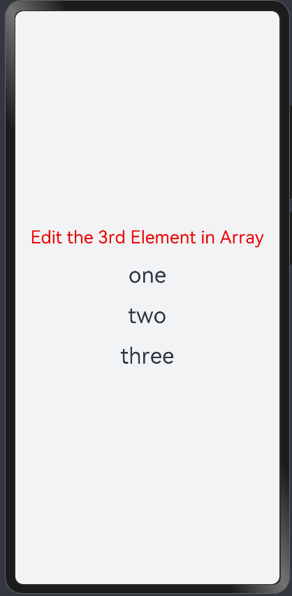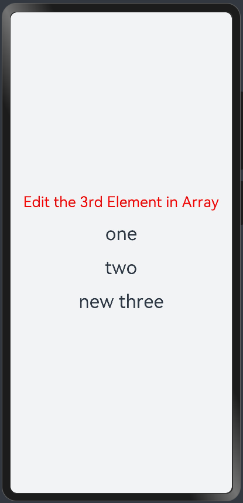
    </figure>
</div>

From this example, it is evident that `@State` can detect changes in the simple data type array data source `simpleList`.

When items in the `simpleList` array change, it triggers a re-render of the `ForEach`.

`ForEach` iterates over the new data source `['one', 'two', 'new three']` and generates corresponding keys: `one`, `two`, and `new three`. 

The keys `one` and `two` already existed in the previous render, so `ForEach` reuses the corresponding components and renders them. For the third array item `"new three"`, since its key `new three` generated by the key generation rule `item` did not exist in the previous render, `ForEach` creates a new component for this array item.


## Usage Scenario


The `ForEach` component is primarily used in the following scenarios during development:

- **Unchanged Data Source**: The data source remains constant without any modifications.
- **Changes in Data Source Array Items**: This includes scenarios such as insertion, deletion, or rearrangement of array items.
- **Changes in Sub-properties of Data Source Array Items**: Modifications in the properties of objects within the array.

### Changes in Data Source Array Items

When changes occur in the data source array items, such as inserting or deleting items or swapping their indices, the data source should be an array of objects, using each object's unique ID as the final key. For instance, when scrolling up on a page to load the next page of data, new data items are appended to the end of the data source array, thus increasing the array's length.


```typescript
@Entry
@Component
struct ArticleListView {
  @State isListReachEnd: boolean = false;
  @State articleList: Array<Article> = [
    new Article('001', 'Article 1', 'Brief description of the article'),
    new Article('002', 'Article 2', 'Brief description of the article'),
    new Article('003', 'Article 3', 'Brief description of the article'),
    new Article('004', 'Article 4', 'Brief description of the article'),
    new Article('005', 'Article 5', 'Brief description of the article'),
    new Article('006', 'Article 6', 'Brief description of the article')
  ]

  loadMoreArticles() {
    this.articleList.push(new Article('007', 'Newly loaded article', 'Brief description of the article'));
  }

  build() {
    Column({ space: 5 }) {
      List() {
        ForEach(this.articleList, (item: Article) => {
          ListItem() {
            ArticleCard({ article: item })
              .margin({ top: 20 })
          }
        }, (item: Article) => item.id) // Use the item's id as the key
      }
      .onReachEnd(() => {
        this.isListReachEnd = true;
      })
      .parallelGesture(
        PanGesture({ direction: PanDirection.Up, distance: 80 })
          .onActionStart(() => {
            if (this.isListReachEnd) {
              this.loadMoreArticles();
              this.isListReachEnd = false;
            }
          })
      )
      .padding(20)
      .scrollBar(BarState.Off)
    }
    .width('100%')
    .height('100%')
    .backgroundColor(0xF1F3F5)
  }
}
```

`ArticleCard` Component Code:

```typescript
@Component
struct ArticleCard {
  article: Article;

  build() {
    Row() {
      Image($r('app.media.icon'))
        .width(80)
        .height(80)
        .margin({ right: 20 })

      Column() {
        Text(this.article.title)
          .fontSize(20)
          .margin({ bottom: 8 })
        Text(this.article.brief)
          .fontSize(16)
          .fontColor(Color.Gray)
          .margin({ bottom: 8 })
      }
      .alignItems(HorizontalAlign.Start)
      .width('80%')
      .height('100%')
    }
    .padding(20)
    .borderRadius(12)
    .backgroundColor('#FFECECEC')
    .height(120)
    .width('100%')
    .justifyContent(FlexAlign.SpaceBetween)
  }
}

```

Custom `Article` Class:

```typescript
class Article {
  public id: string;
  public title: string;
  public brief: string;

  constructor(id: string, title: string, brief: string) {
    this.id = id;
    this.title = title;
    this.brief = brief;
  }
}

```
The initial rendering effect is shown in the following diagram. Users can swipe up to load new items.

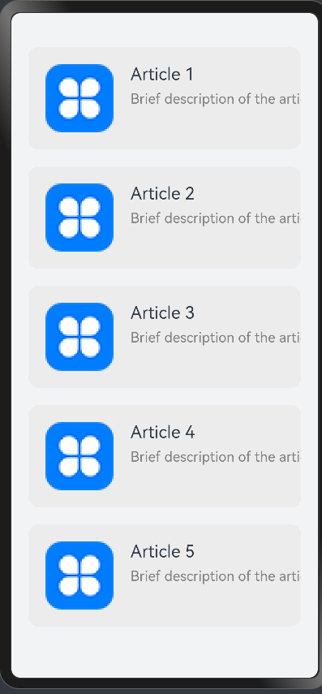


## Usage Recommendations

- Avoid including the data item index `index` in the final key generation rules to prevent unexpected rendering results and reduced rendering performance. If the use case specifically requires using `index`, such as for conditional rendering in a list, developers must be prepared to accept the performance costs associated with recreating components when the data source changes.

- To ensure the uniqueness of keys, for object data types, it is recommended to use a unique identifier from the object data as the key.

- Basic data types do not have a unique ID attribute. If using the basic data type itself as a key, ensure that there are no duplicate array items. Therefore, for scenarios where the data source is likely to change, it is advised to transform an array of basic data types into an array of object data types that have a unique ID attribute, and then use the ID attribute for key generation.


 
