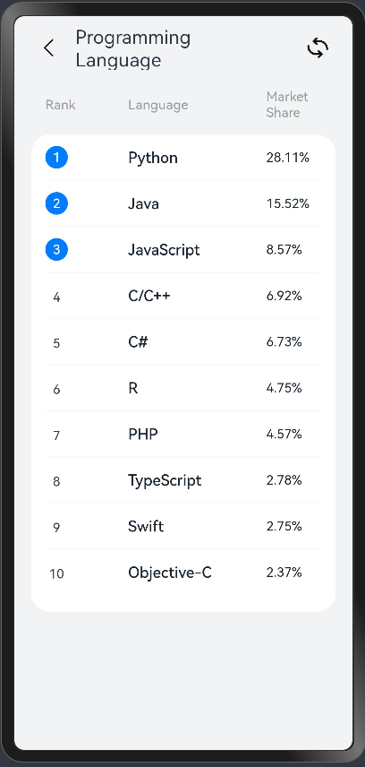

# Quick Starter Guide: Dynamic Ranking Page

This guide provides step-by-step instructions on building a dynamic ranking page using ArkTS. It showcases the top 10 programming languages of 2024, employing declarative syntax, state management, and componentization to create an interactive and refreshable interface with modular and maintainable code structure.

The following picture shows the UI display of this app.




This example features loop rendering to display list data, the `@Builder` decorator for layout creation, and `@State`, `@Prop`, and `@Link` decorators for managing component states. We'll also explore component lifecycle functions by interacting with the system back button. The final output is a ranking of the top programming languages for 2024.

<div style="margin-top: 50px;"></div> <!-- 调整间距大小 -->

# Requirements

- ArkTS setup in your development environment.
- Basic knowledge of TypeScript

 
<div style="margin-top: 50px;"></div> <!-- 调整间距大小 -->

# Prepare Assets

Create an images directory in your project's ets directory and add the images [back.png](images/back.png) and [refresh.png](images/refresh.png). These will be used for the navigation and loading icons, respectively.

<div style="margin-top: 50px;"></div> <!-- 调整间距大小 -->

# RankData Class

Define `RankData` class to represent programming languages in the ranking.
```tsx
// RankData class - Language object
export class RankData {
  name: string; // Language name
  marketShare: string; // Market share percentage
  id: string; // Unique identifier

  constructor(id: string, name: string, marketShare: string) {
    this.id = id;
    this.name = name;
    this.marketShare = marketShare;
  }
}
```

<div style="margin-top: 50px;"></div> <!-- 调整间距大小 -->

# Custom Component: TitleComponent
Create a `TitleComponent` file for the UI with a title and interactive elements (back and refresh icons).

```tsx
import AppContext from '@ohos.app.ability.common';

@Component
export struct TitleComponent {
  @Link isRefreshData: boolean; // Controls whether data should refresh
  @State title: string = ""; // Title of the page

  build() {
    Row() {
      Row() {
        Image('images/back.png')
          .height(21)
          .width(21)
          .margin({ right: 18 })
          .onClick(() => {
            let handler = getContext(this) as AppContext.UIAbilityContext;
            handler.terminateSelf(); // Ends the current page
          });

        Text(this.title)
          .fontSize(20);
      }
      .width('50%')
      .height('100%')
      .justifyContent(FlexAlign.Start);

      Row() {
        Image('images/refresh.png')
          .height(22)
          .width(22)
          .onClick(() => {
            this.isRefreshData = !this.isRefreshData; // Toggles data refresh
          });
      }
      .width('50%')
      .height('100%')
      .justifyContent(FlexAlign.End);
    }
    .width('100%')
    .padding({ left: 26, right: 26 })
    .margin({ top: 10 })
    .height(47)
    .justifyContent(FlexAlign.SpaceAround);
  }
}
```

<div style="margin-top: 50px;"></div> <!-- 调整间距大小 -->

# Custom Component: ListHeaderComponent
Create a `ListHeaderComponent` to display the column headers.
```tsx
@Component
export struct ListHeaderComponent {
  paddingValue: Padding | Length = 0;
  widthValue: Length = 0;

  build() {
    Row() {
      Text('Rank')
        .fontSize(14)
        .width('30%')
        .fontWeight(400)
        .fontColor('#989A9C');

      Text('Language')
        .fontSize(14)
        .width('50%')
        .fontWeight(400)
        .fontColor('#989A9C');

      Text('Market Share')
        .fontSize(14)
        .width('20%')
        .fontWeight(400)
        .fontColor('#989A9C');
    }
    .width(this.widthValue)
    .padding(this.paddingValue);
  }
}

```
 
 
<div style="margin-top: 50px;"></div> <!-- 调整间距大小 -->

# Custom Component: ListItemComponent
 Create a `ListItemComponent` to display each language and its market share, with interactive effects.

 ```tsx
 @Component
export struct ListItemComponent {
  index?: number; // Item index
  private name?: string; // Language name
  marketShare: string = ''; // Market share percentage
  isSwitchDataSource: boolean = false; // Toggle data source flag

  @State isChange: boolean = false; // Triggers UI refresh on change

  build() {
    Row() {
      Column() {
        if (this.isRenderCircleText()) {
          if (this.index !== undefined) {
            this.CircleText(this.index); // Renders circle text for top 3
          }
        } else {
          Text(this.index?.toString())
            .lineHeight(24)
            .textAlign(TextAlign.Center)
            .width(24)
            .fontWeight('400')
            .fontSize(14);
        }
      }
      .width('30%')
      .alignItems(HorizontalAlign.Start);

      Text(this.name)
        .width('50%')
        .fontWeight('500')
        .fontSize(16)
        .fontColor(this.isChange ? "#007DFF" : "#182431");

      Text(this.marketShare)
        .width('20%')
        .fontWeight('400')
        .fontSize(14)
        .fontColor(this.isChange ? "#007DFF" : "#182431");
    }
    .height(48)
    .width('100%')
    .onClick(() => {
      this.isSwitchDataSource = !this.isSwitchDataSource;
      this.isChange = !this.isChange;
    });
  }

  @Builder CircleText(index: number) {
    Row() {
      Text(this.index?.toString())
        .fontWeight('400')
        .fontSize(14)
        .fontColor(Color.White);
    }
    .justifyContent(FlexAlign.Center)
    .borderRadius(24)
    .size({ width: 24, height: 24 })
    .backgroundColor("#007dff");
  }

  isRenderCircleText(): boolean {
    return this.index === 1 || this.index === 2 || this.index === 3;
  }
}

 ```

 <div style="margin-top: 50px;"></div>  

 # Entry Component: RankPage

Define the RankPage component to display the entire ranking page with a title, header, and list items.

```tsx
import { ListHeaderComponent } from './ListHeaderComponent';
import { ListItemComponent } from './ListItemComponent';
import { RankData } from './RankData';
import { TitleComponent } from './TitleComponent';

@Entry
@Component
struct RankPage {
  @State dataSource1: RankData[] = [
    new RankData('1', 'Python', '28.11%'),
    new RankData('2', 'Java', '15.52%'),
    new RankData('3', 'JavaScript', '8.57%'),
    new RankData('4', 'C/C++', '6.92%'),
    new RankData('5', 'C#', '6.73%'),
    new RankData('6', 'R', '4.75%'),
    new RankData('7', 'PHP', '4.57%'),
    new RankData('8', 'TypeScript', '2.78%'),
    new RankData('9', 'Swift', '2.75%'),
    new RankData('10', 'Objective-C', '2.37%')
  ];

  @State dataSource2: RankData[] = [ /* Additional data source */ ];
  @State isSwitchDataSource: boolean = true;

  build() {
    Column() {
      TitleComponent({ isRefreshData: $isSwitchDataSource, title: "Programming Language Rankings" });

      ListHeaderComponent({
        paddingValue: { left: 15, right: 15 },
        widthValue: '90%'
      })
      .margin({ top: 20, bottom: 15 });

      this.RankList('90%');
    }
    .backgroundColor("#F1F3F5")
    .height('100%')
    .width('100%');
  }

  @Builder RankList(widthValue: Length) {
    Column() {
      List() {
        ForEach(this.isSwitchDataSource ? this.dataSource1 : this.dataSource2, (item: RankData, index?: number) => {
          ListItem() {
            ListItemComponent({
              index: (Number(index) + 1),
              name: item.name,
              marketShare: item.marketShare,
              isSwitchDataSource: this.isSwitchDataSource
            });
          }
        }, (item: RankData) => JSON.stringify(item));
      }
      .width('100%')
      .height('65%')
      .divider({ strokeWidth: 1 });
    }
    .padding({ left: 15, right: 15 })
    .borderRadius(20)
    .width(widthValue)
    .alignItems(HorizontalAlign.Center)
    .backgroundColor(Color.White);
  }
}

```
 <div style="margin-top: 50px;"></div>  
 
# Key Features

- **Declarative Syntax**: Defines UI with states that trigger updates.
- **Componentization**: Modular components for clean, maintainable code.
- **State Management**: `@State` keeps UI responsive to changes.
- **Interactive Elements**: UI updates in response to user actions.
