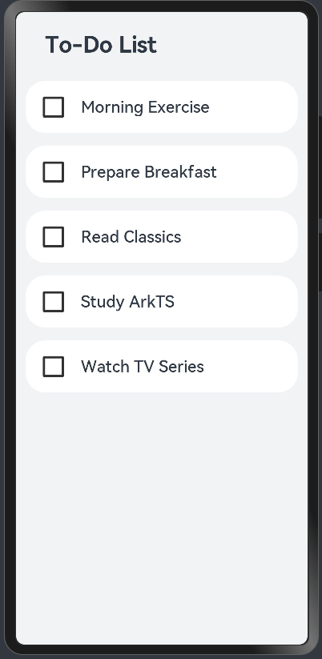
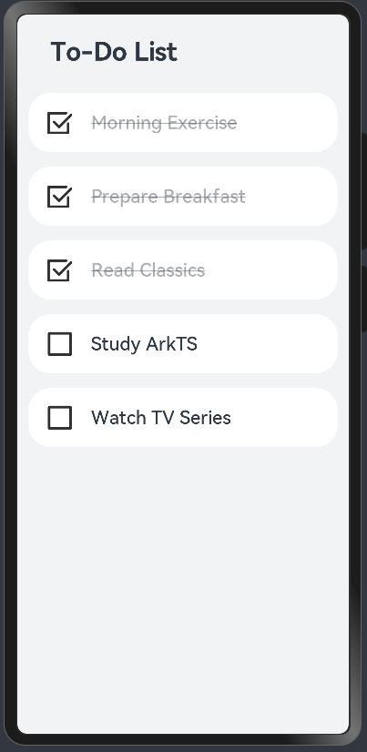
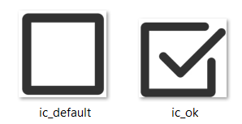

# Quick Starter Guide:To-Do List App

****

# Introduction

This guide provides step-by-step instructions on setting up a simple To-Do List application using ArkTS. It is designed to help developers understand the some basic concepts of ArkTS. 

<div>
    <figure >
        
    </figure>
</div>

The above application interface is composed of individual pages, which can be built using the declarative UI of the ArkUI framework. Constructing pages with declarative UI involves composing components. The declarative UI philosophy is primarily reflected in two aspects:

1. Describing the UI's final appearance without concerning itself with the process.
2. Using state to drive view updates.

ArkUI serves as the UI development framework for Openharmony applications. It employs the ArkTS language to build custom components, and these components are combined to construct pages. 

# Requirements

- ArkTS setup in your development environment.
- Basic knowledge of TypeScript

# Implementation

## Preparation of static files

First, we need to prepare the static files (in this case the icons representing marked and unmarked states for each item of the to-do list. Create an `images` directory under the `ets` directory of your project and place the [ic_default.png](images/ic_default.png) and [ic_ok.png](images/ic_ok.png) images in it. These images will be used to indicate the incomplete and complete states of a task, respectively.



## Entry Component: ToDoListPage

The `ToDoListPage` component is responsible for building the entire To-Do list page. In ArkTS, component are declared using `struct`, and they are transformed into custom components using the `@Component` and `@Entry` decorators. Components decorated with `@Entry` and `@Component` serve as entry points for the page and are rendered first when the page loads. 

```tsx
import DataModel from './DataModel'; // Import DataModel class
import ToDoItem from './ToDoItem'; // Import ToDoItem class

@Entry // Mark this as an entry component
@Component // Mark this as a component
struct ToDoListPage { // Define a struct named ToDoListPage representing the to-do list page
  private totalTasks: Array<string> = []; // Define an array to store tasks

  aboutToAppear() { // Method called when the page is about to appear
    this.totalTasks = DataModel.getData(); // Load data from DataModel into totalTasks
  }

  build() { // Method to build the UI
    Column({ space: 16 }) { // Create a column layout with 16 spacing between items
      Text("To-Do List") // Display the text "To-Do List"
        .fontSize("28fp") // Set font size to 28fp
        .fontWeight(FontWeight.Bold) // Set font weight to bold
        .lineHeight("33vp") // Set line height to 33vp
        .width('80%') // Set width to 80% of the parent container
        .margin({ // Set margins
          top: "24vp", // Top margin 24vp
          bottom: "12vp" // Bottom margin 12vp
        })
        .textAlign(TextAlign.Start) // Align text to the start

      ForEach(this.totalTasks, (item: string) => { // Iterate over totalTasks array
        ToDoItem({ content: item }) // Create a ToDoItem component for each task
      }, (item: string) => JSON.stringify(item)) // Use JSON.stringify for keys
    }
    .width('100%') // Set width to 100%
    .height('100%') // Set height to 100%
    .backgroundColor("#F1F3F5") // Set background color to #F1F3F5
  }
}
```

When the page initially loads, the `aboutToAppear` method is automatically called. In this method, we load the data for the to-do items using the `DataModel` class, details of which will be provided later.

The `build` method starts by displaying the "To-Do" text and then sequentially loads each to-do item using the `ForEach` function. This function utilizes the `ToDoItem` component to display each task, with further implementation details on this component to follow.

**More Explanation**

- **aboutToAppear() Function**: This function is defined within the `ToDoListPage` component and is used to load the data before the component is rendered. In this example, `aboutToAppear()` fetches the task data from `DataModel` and assigns it to the `totalTasks` array.
- **build() Function**: The `build()` function then constructs the UI based on the data loaded in `aboutToAppear()`. It ensures the UI is up-to-date with the latest state just before the component is displayed.
- The `build()` function is where you define how your UI looks. Everything inside the `build()` function is called the "UI description". The UI description must follow these rules:
  1. **@Entry Decorated Components**:
     - The `build()` function must have a unique and necessary root node.
     - This root node must be a container component (like `Column`, `Row`, etc.).
     - `ForEach` cannot be used as the root node.
  2. **@Component Decorated Components**:
     - The `build()` function must also have a unique and necessary root node.
     - The root node can be any component, including non-container components (like `Text`, `Image`, etc.).
     - `ForEach` cannot be used as the root node.

## DataModel Class

The `DataModel` class is responsible for providing the data for the To-Do list. Create the `DataModel.ets` file in the same directory of `index.ets`.
Here is the implementation of the `DataModel` class:

```tsx
export class DataModel { // Define and export a class named DataModel
  private tasks: Array<string> = [ // Define an array to store tasks
    "Morning Exercise",
    "Prepare Breakfast",
    "Read Literature",
    "Study ArkTS",
    "Watch TV"
  ];

  getData(): Array<string> { // Define a method to get the tasks
    return this.tasks; // Return the tasks array
  }
}

export default new DataModel(); // Export a new instance of the DataModel class
```

## Custom Component: ToDoItem

The `ToDoItem` component displays each task and changes its appearance when the task is marked as completed. Create the `ToDoItem.ets` file in the same directory of `index.ets`.

```tsx
@Component // Marks this as a component
export default struct ToDoItem { // Define and export a struct named ToDoItem
  private content?: string; // Define a private optional string property 'content'
  @State isComplete: boolean = false; // Declare a state variable 'isComplete', initial value is false

  @Builder labelIcon(icon: string) { // Define a method named 'labelIcon' to build label icons
    Image(icon) // Create an Image component with the icon parameter as the source
      .objectFit(ImageFit.Contain) // Set the image object fit to 'Contain'
      .width("28vp") // Set image width to 28vp
      .height("28vp") // Set image height to 28vp
      .margin("20vp") // Set margin to 20vp
  }

  //create a folder (here 'images') under the 'ets' path to store the pictures
  // use the Image component and the local path to import the picture
  // Example : Image('images/view.jpg')
  build() {
    Row() { // Create a row layout
      if (this.isComplete) { // If the task is complete
        this.labelIcon('images/ic_ok.png'); // Display the completed icon
      } else { // Otherwise
        this.labelIcon('images/ic_default.png'); // Display the default icon

      }

      Text(this.content) // Display the text content
        .fontSize("20fp") // Set font size to 20fp
        .fontWeight(500) // Set font weight to 500
        .opacity(this.isComplete ? 0.4 : 1) // Adjust opacity based on completion status
        .decoration({ type: this.isComplete ? TextDecorationType.LineThrough : TextDecorationType.None }) // Add strikethrough if complete
    }
    .borderRadius(24) // Set border radius to 24
    .backgroundColor("#FFFFFF") // Set background color to white
    .width('93.3%') // Set width to 93.3%
    .height("64vp") // Set height to 64vp
    .onClick(() => { // Set click event
      this.isComplete = !this.isComplete; // Toggle the 'isComplete' state on click
    })
  }
}
```

Interactive elements on the page, like each `ToDoItem`, display differently based on their completion status. The `isComplete` boolean variable, enhanced with the `@State` decorator, automatically updates the UI when its value changes, demonstrating the core advantage of declarative UIs.

To indicate task completion, we use two images: an unchecked and a checked box. Conditional rendering with if/else statements manages these images, allowing them to appear or disappear based on the task's status.

 the `@Builder` decorator is used to avoid repetitive code. It applies to a `labelIcon` function that accepts an image URL and facilitates rapid layout generation with the `this` keyword.

 `onClick` event on each component toggles the `isComplete` state and triggers an immediate UI refresh to reflect changes.

# ArkTS features in this case

## **Declarative UI**

ArkTS uses a declarative UI approach, which involves analyzing and defining the various states of a page and declaring corresponding state variables to represent these states. In this example, there are two states: completed and not completed. After analyzing the interface states, we need to accurately describe the display effects of the interface in different states. Here, the display effects are represented by different images and text styles. Once the display effects for different states are clear, simply changing the value of the state variable will trigger an update to the interface.

In this example, we use the `@State` decorator to declare the `isComplete` variable. This variable determines whether a task is completed. If we set `isComplete` to `true`, the interface will show the completed icon and strike-through text; otherwise, it will show the default icon and normal text. Here, the `@State` decorator ensures that any changes to `isComplete` automatically update the UI to reflect the new state.


## **UI Structure Reuse**

The `labelIcon` Function shows the concept of reusing UI structures in ArkTS.

- **Avoiding Redundant Code**: When multiple UI elements share similar structures, writing separate code for each can lead to redundancy. To avoid this, you can abstract the common UI elements into a custom component.
- **@Builder Method**: ArkTS provides the `@Builder` method for lightweight UI structure reuse.   Commonly used UI elements can be abstracted into a `@Builder` method, which can be called multiple times within the `build()` method to reuse the UI structure efficiently.
