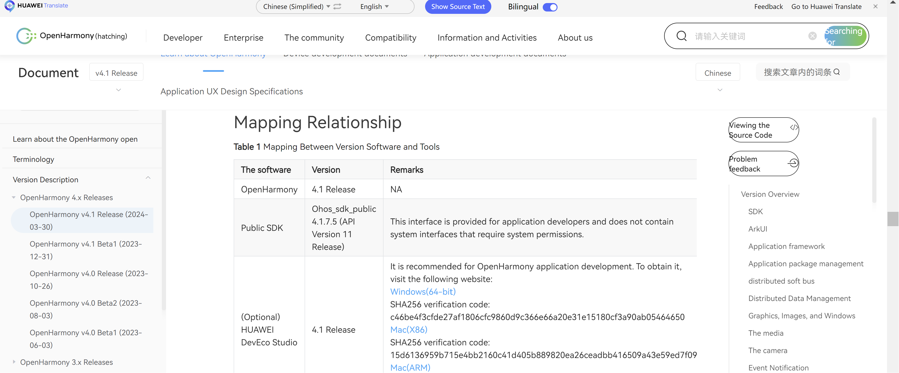

# Getting Started
In this course, we will learn about the OpenHarmony application development domain. We will gradually learn how to create and run a Hello World project using the DevEco Studio development tool.

## Downloading and Installing DevEco Studio

As the saying goes, *"If you want to do well, you must first sharpen your tools."* To develop OpenHarmony applications, you need to complete some preparations to ensure that the necessary DevEco Studio development tool, that is, the one-stop integrated development environment (IDE) of OpenHarmony, is ready.

The following describes how to download, install, and configure the development environment by taking the DevEco Studio tool installed in Windows as an example.

To ensure the proper running of DevEco Studio, it is recommended that the Windows PC meet the following requirements:

-   Operating system: Windows 10 64-bit

-   Memory: 8 GB or above

-   Hard disk: 100 GB or above

-   Resolution: 1280 x 800 pixels or higher

On the HarmonyOS [release notes](https://docs.openharmony.cn/pages/v4.1/zh-cn/release-notes/OpenHarmony-v4.1-release.md) (Chinese -- you would need a translator), you can download DevEco studio 4.1 from the following link:
<https://contentcenter-vali-drcn.dbankcdn.cn/pvt_2/DeveloperAlliance_package_901_9/ee/v3/HqJ-6O2FQny86xtk_dg9HQ/devecostudio-windows-4.1.0.400.zip?HW-CC-KV=V1&HW-CC-Date=20240409T033730Z&HW-CC-Expire=315360000&HW-CC-Sign=BFA444BC43A041331E695AE2CFA9035A957AF107E06C97E793FD3D31D7096A0D>

DevEco Studio provides Windows and Mac versions. You can download DevEco Studio based on the operating system.

After the download is complete, decompress the downloaded package and enter the folder. Double-click the downloaded deveco-studio-xxxx.exe file to enter the DevEco Studio installation wizard. In the displayed dialog box, select the installation path. By default, the installation path is C:\\Program Files. You can also click Browse\... to specify another installation path, and then click `Next`.
>**:** If this is not your first installation make sure to delete the files in the path from the previous installation.

Select DevEco Studio, Add `bin` folder to the PATH, and then click `Next` until the installation is complete.

After the installation is complete, click `Finish`.

## Configuring the Environment

Double-click the shortcut icon of the installed DevEco Studio to go to the configuration page. Select `Agree` and agree to the corresponding terms. The setup wizard is displayed.

Click `OK` to skip the import settings.  

On the DevEco Studio configuration page, perform basic configurations, including setting the installation paths of Node.js and Ohpm, and downloading the Huawei image to a proper path.

Click `Next` to enter the SDK configuration page and set the path to a proper one.

Click `Next`. SDK License Agreement is displayed. Read the agreement and select `Accept`.

Click `Next` to enter the summary page, where you can confirm the configuration items.

Click `Next` to proceed to the next step.

After the configuration is automatically downloaded, click `Finish`. The IDE displays the welcome page, indicating that the development environment is configured.

After the preparation is complete, you will go to DevEco Studio to create and run a project.

## Creating a project

If you\'re opening DevEco Studio for the first time, you\'ll first get to the welcome page.

On the welcome page, click `Create Project`. The project creation page is displayed.

Select `Application` and choose the ability template. Select `[OpenHarmony] Empty Ability` for a project using OpenHarmony OS, and then click `Next`. The project configuration page is displayed.

In the configuration page, the details are as follows:

-   Project name is a project name that can be set by the developer. Change it to your own project name.

-   Bundle name indicates the package name, which is also used by th application ID by default. The ID used when the application is released must be the same.

-   Save location indicates the save path of the project. You are advised to set the save path as required.

-   Compile SDK indicates the compiled API version. API9 is selected by default. (Note: this chooses ArkTS as the development language by default, if your project is going to use Javascript then choose API8 and you'll find a language option where you can choose JS.)

-   Select `Stage` for **Model** and retain the default values for other parameters.

Then, click `Finish` to complete the project creation. Wait until the project synchronization is complete.

> **Note**: You can later change these settings in your project from `File > Project Structure`.

## Understanding the DevEco Studio Interface

After the IDE has launched, let's learn about the basic interface. The IDE interface can be divided into four parts: 
1) Code Editing Area
2) Console
3) Project Directory
4) Previewer

### Code Editing Area

In the middle is the code editing area, where you can modify your code
and switch between the displayed files. Press Ctrl and the mouse
wheel in the meanwhile to zoom in or out the interface.

### Console

At the bottom of the editor, there is a toolbar, which describes common information bars. 
- `Run` is the information bar after running the project
- `Problems` is the information bar for the current project errors and warnings
- `Terminal` is the command line terminal, where you can run commands
- `PreviewerLog` is the log output bar for the previewer
- `Log` is the log output bar when the simulator or real machine are running

### Project Directory

The project directory is displayed on the left, which will be described in following sections.

	

### Preview Area

Click Previewer in the upper right corner to preview in real-time the UI display effect of the corresponding file. If you add or remove UI components during UI code development, you only need to Save (Ctrl+S), and the previewer will immediately refreshes the preview.

The previewer provides some basic functions, including rotating the screen, switching display devices, and multi-device preview. You can click the `Orientation` button to switch between portrait and landscape display.

You can also click the following list button to switch the displayed device type. The `Available Profiles` dialog box is displayed, indicating the available device types.

Enable the `Muti-profile preview` function to preview the devices of multiple sizes in real time.

You can inspect the preview display by clicking the `Inspector`.

In the `Inspector`, you can see the UI Component Tree and you can select a specific component to locate and inspect its corresponding code block.

## Running Hello World

The IDE provides a local simulator for developers. However, this is only available for *HarmonyOS*. For *OpenHarmony*, you would need to connect an OpenHarmony device in order to run your application. 
> In this section, we explain running an application on the HarmonyOS simulator to give an idea of how to run applications.

You need to download and install the local simulator and run the project.

1)  Click `Tools > Device Manager` on the top toolbar.

2)  Select `Local Emulator` and install the simulator.

Set a proper storage address for `Local Emulator Location`, and then click `+New Emulator`.

Select the `Huawei_Phone` mobile phone simulator, and then click `Next`. The page for downloading the simulator system is displayed.

Select the `System Image` of api9 and click `Next`. Wait until the download is complete.

After the download is complete, create a mobile phone simulator and click `Finish`.

After the download is complete, the created mobile phone simulator is displayed on the Local Emulator page. Click `Actions` to start the simulator.

After the simulator is started, click the start button to run the Hello World project on the simulator.

After the IDE is built, you can view the running effect on the simulator. 
(You will observe 'Hello World' text by default)

## Understanding the Basic Project Catalog

### Project-level directories

The project directory structure is as follows:

The details are as follows:

-   The `AppScope` stores resource files required by the global     application.

-   The `entry` is the main module of the application and stores the code     and resources of the OpenHarmony application.

-   `oh_modules` is the dependency package of the project, which stores the source files on which the project depends.

-   The `build-profile.json5` file contains project-level configuration information, including signatures and product configurations.

-   `hvigorfile.ts` is a project-level compilation build task script. Hvigor is a new automatic building tool based on the task management mechanism. It provides core capabilities such as task registration and orchestration, project model management, and configuration management.

-   The `oh-package.json5` file is a project-level dependency
    configuration file, which records the configuration information
    about the import package.

In `AppScope`, you have the `resources` folder and the configuration file
`app.json5`. `AppScope > resources > base` contains two folders: `element`
and `media`.

-   `element` folder: Stores common resources such as character strings and layout files

-   `media` folder: Stores global public multimedia resource files

### Module-level directories

The `entry > src` directory contains the `main` folder, alongside other **module-level** directories and configuration files. These are different from the **project-level** configuration files described previously.

-   In the `main` folder, the `ets` folder is the main development folder used to store the ets code. The `resources` folder is used to store  the multimedia and layout files of the module. And, the `module.json5` file is the configuration file of the module.

-   `ohosTest` is the unit tests directory.

-   The `build-profile.json5` file contains **module-level** configuration information, including compilation and build configuration items.

-   The `hvigorfile.ts` file is a **module-level** build script.

-   `oh-package.json5` is the **module-level** dependency configuration file.

Let's take a closer look at the `src > main` directory:

-   The `ets > entryability` folder stores the `EntryAbility.ts` file, which is used for the current ability application logic and life cycle management.

-   `ets > pages`: stores UI-related code files. An index page is generated by default.

-   Meanwhile the `resources` directory stores the common multimedia, character string, and layout files of the module  . The resources are stored in the `resources > base > element` and `resources > base > media` folders respectively. While the `resources > base > profile > main_pages.json` file contains the [routing](#main_pagesjson) configuration between pages.

### app.json5

`AppScope > app.json5` is the global configuration file of an application, which is used to store common configuration information about the application.

The configuration information is as follows:

-   `bundleName` is the package name.

-   `vendor` is the application vendor.

-   The `versionCode` field is used to differentiate application versions.

-   `versionName` is the version number.

### module.json5

`entry > src > main > module.json5` is the configuration file of the module, which contains the configuration information of the current module.

As mentioned previously, "module" indicates the **module-level** configuration information. A module corresponds to a HAP package. The HAP package is called **HarmonyOS Ability Package**, which contains the Abilities, third-party libraries, resources, and configuration files.
For specific attributes and descriptions, refer to **Table 1** below.

### Table 1 Default configuration attributes and description of module.json5

## Module Configuration Parameters

| Parameter            | Data Type                                       | Description |
|----------------------|------------------------------------------------|-------------|
| `name`               | `String`                                       | This tag identifies the name of the current module. After the module is packaged into a HAP, it indicates the name of the hap. This tag value is a character string (a maximum of 31 bytes) and must be unique in the entire application. |
| `type`               | `String`                                       | Indicates the module type. There are four types:  - **entry**  - **feature**  - **shared**  - **har** |
| `description`        | `String`                                       | Description of the current module. This tag value is a character string (a maximum of 255 bytes) and can be a resource reference. |
| `mainElement`        | `String`                                       | This tag identifies the entry UIAbility name or ExtensionAbility name of the HAP. Only the ability or extension that is set to mainElement can be displayed in the service center. |
| `deviceTypes`        | `String array`                                 | This tag identifies the type of device on which the HAP can run. |
| `deliveryWithInstall`| `Boolean`                                      | Indicates whether the HAP corresponding to the module is installed together with the application.   - **true**: Installed during active installation.   - **false**: Not installed during proactive installation. |
| `installationFree`   | `Boolean`                                      | Indicates whether the module supports the installation-free feature.  - **true**: The installation-free feature is supported and the installation-free constraint is met.  - **false**: The installation-free feature is not supported. |
| `pages`              | `String`                                       | Corresponding to the [main_pages.json](#main_pagesjson) file, which is used to configure the page information used in the ability. |
| `abilities`          | `Object array`                                 | Stores the configuration information about all the UIAbility capabilities in the current module. There can be multiple abilities. |

The description information for each object in the abilities array is as follows:

### Table 2 Default configuration attributes and description of objects in the abilities

| Property              | Data Type | Description|
| :-------------------- | :-------- | :--------- |
| `name`                | `String`   | This label identifies the logical name of the current UIAbility. This name must be unique in the entire application. The label value is a character string with a maximum length of 127 bytes.|
| `srcEntry`           | `String`    | Path of the entry code of the UIAbility.                                                                                                                                                                                  |
| `description`        | `String`    | Description of the UIAbility.                                                                                                                                                                                             |
| `icon`               | `String`    | Icon of the UIAbility. The tag value is the name of the file in the resources folder. This tag can be left blank by default. If **UIAbility** is set to **MainElement**, this tag is mandatory.         |
| `label`              | `String`    | UIAbility label name.                                                                                                                                                                                                     |
| `startWindowIcon`    | `String`    | Icon of the UIAbility startup page.                                                                                                                                                                                               |
| `startWindowBackground` | `String`  | Background color of the UIAbility startup page.                                                                                                                                                                                   |
| `exported`           | `Boolean`   | Indicates whether the UIAbility can be invoked by other applications.  - **true**: indicates that the UIAbility can be invoked by other applications.  - **false**: indicates that the UIAbility cannot be invoked by other applications. |
| `skills`             | `Object array` | Indicates the feature set of **Want** that can be received by the UIAbility or ExtensionAbility component. |
| `entities`           | `String array` | Entities of **Want** that can be received. |
| `actions`            | `String array`  | Actions of **Want** that can be received. It can be predefined or customized. |

### main_pages.json

The `src > main > resources > base > profile > main_pages.json` file stores the page path configuration information. All pages that require routing
redirection must be configured here.

## Chapter Exercises

1)  **DevEco Studio is a one-stop integrated development environment for developing HarmonyOS applications. [True/False]**
    True

2)  **The main_pages.json file stores page path configuration information. [True/False]**
True

3)  **In the stage model, which of the following configuration files belongs to the AppScope folder?**  
A. main_pages.json  
B.  module.json5  
**C.  app.json5**  
D.  package.json  

<!-- -->

4)  **How do I create a new project in DevEco Studio?**  
A.  Create a new file on your computer and name it \"New Harmony OS Project\"  
**B.  If the project is already open, select `file > new > Create Project` from the DevEco Studio menu**  
**C.  If you open DevEco Studio for the first time, click `Create New Project` on the welcome page**  

<!-- -->

5)  **Which of the following information is contained in the module.json5 configuration file?**  
**A.  Ability configuration information**  
**B.  Module name**  
C.  Application version number  
**D.  Module Type**  
