# TypeScript Based Declarative UI Development
## Using the Column & Row Component

### Overview

A rich page requires a lot of components, so how do we arrange these components on the page in an orderly manner? This needs to be achieved with the help of __container__ components.

__Container__ component is a special component, it can contain other components, and according to specific layout rules, help developers to generate beautiful pages. __Container__ components can be placed in addition to basic components. By nesting multi-layer layouts, richer pages can be laid out.

ArkTS provides various container components for page layout. This document describes the attributes and usage of __Column__ and __Row__ components by taking building a login page as an example.

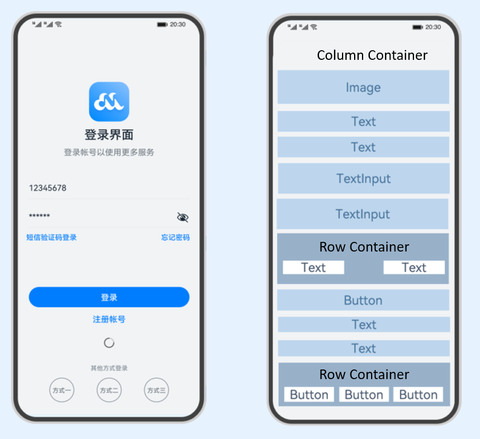

### Component Description

#### Layout Container

A linear layout container indicates a container that arranges subcomponents in a vertical or horizontal direction. ArkTS provides Column and Row containers to implement linear layout.

-   **Column** indicates a container laid out vertically.

-   **Row** indicates a container laid out horizontally.

In the layout container, there are two axes by default, the __main axis__ and the __cross axis__, which are always perpendicular to each other. The direction of the main axis is different in different containers.

**Main axis:** The subcomponents in the Column container are arranged vertically from top to bottom, and the main axis of the components is vertically oriented. Similarly, subcomponents in the Row container are arranged horizontally from left to right, and the main axis of the components is horizontally oriented. The following figure shows the main axis in Column and Row container.

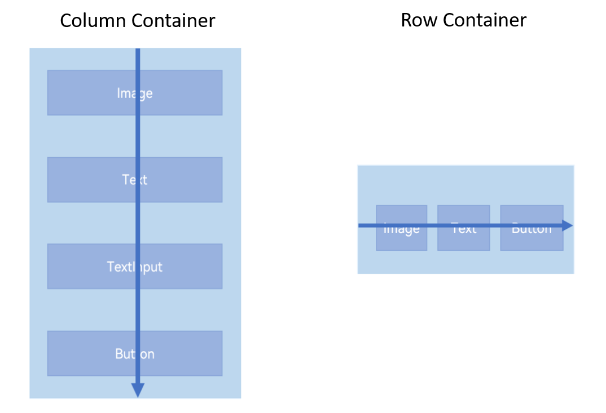

**Cross axis:** The cross axis is perpendicular to the main axis. If the main axis is vertical, the cross axis is horizontal. Conversely, if the main axis is horizontal, the cross axis is vertical. The following figure shows the cross axis in both Column and Row container.

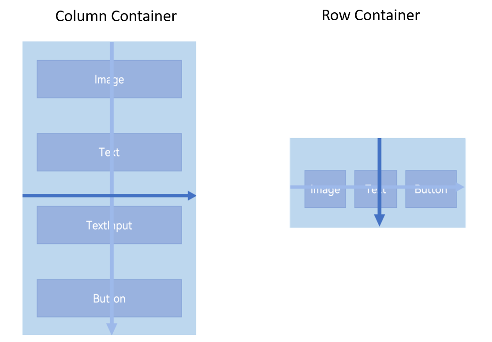

#### Attribute Description

Understanding the main axis and cross axis of the layout container is crucial for understanding the arrangement of subcomponents on the main axis and cross axis. Next, we will explore the two attributes, `justifyContent` and `alignItems`, of the Column and Row containers.

| Attribute Name | Description                                                                |
| :------------- | :------------------------------------------------------------------------- |
| `justifyContent` | Sets the alignment format for the subassembly in the main axis direction.  |
| `alignItems`     | Sets the alignment format for the subassembly in the cross axis direction. |


1.  **Alignment of the main axis (`justifyContent`)**

The alignment of subcomponents in the main axis direction is set using the `justifyContent` property, which uses the [FlexAlign](https://developer.harmonyos.com/cn/docs/documentation/doc-references/ts-appendix-enums-0000001281201130#ZH-CN_TOPIC_0000001281201130__flexalign) parameter.

**A column code example is as follows:**

```typescript
@Entry
@Component
struct Demo {
  build() {
    Column(){
      Text("Text1")
      Text("Text2")
      Text("Text3")
    }
    .height('100%')
    .width('100%')
    .justifyContent(FlexAlign.Start)
  }
}

```

**A row code example is as follows:**

```typescript
@Entry
@Component
struct Demo {
  build() {
    Row(){
      Text("Text1")
      Text("Text2")
      Text("Text3")
    }
    .height('100%')
    .width('100%')
    .justifyContent(FlexAlign.SpaceEvenly)
  }
}

```

`FlexAlign` defines the following types:

-   `Start`: The first element aligns with the start of the axis, and subsequent elements align with the previous one.

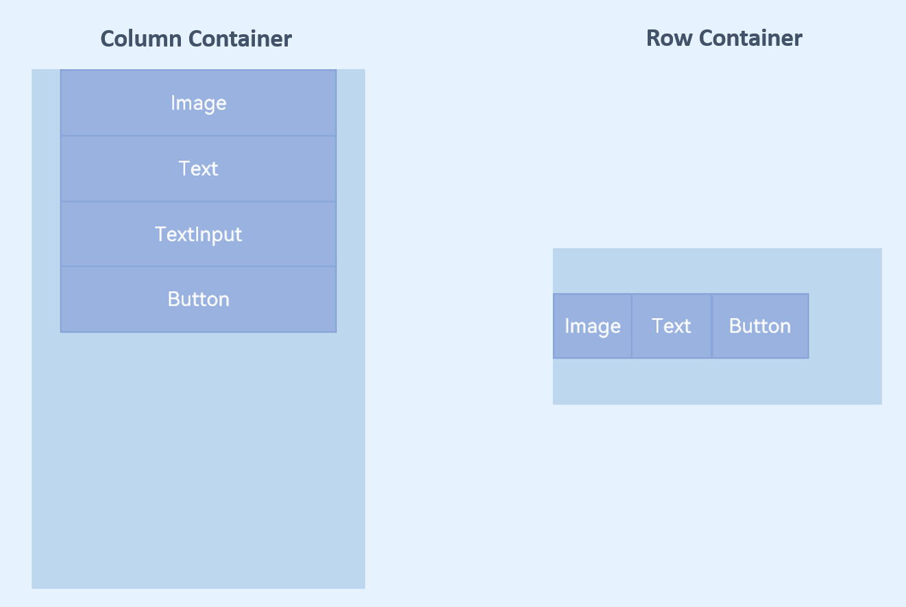

-   `Center`: Elements are centered along the main axis, with equal spacing from the first element to the start and from the last element to the end of the axis.

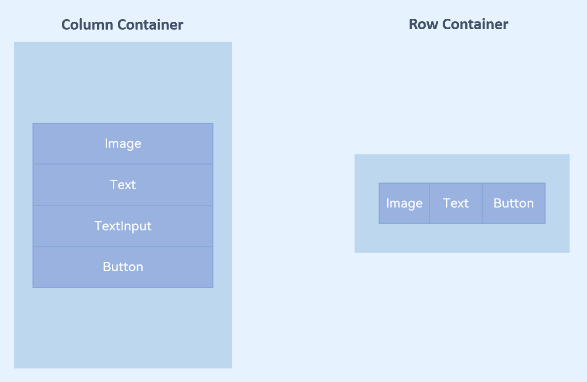

-   `End`: The last element aligns with the end of the axis, and the others align accordingly towards the end.

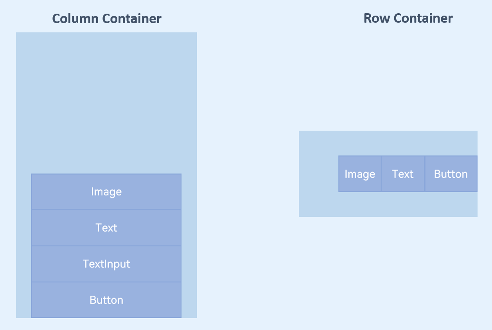

-   `SpaceBetween`: Elastic elements are evenly distributed along the main axis, with equal spacing between adjacent elements. The first element aligns with the start of the axis, and the last element aligns with the end of axis.

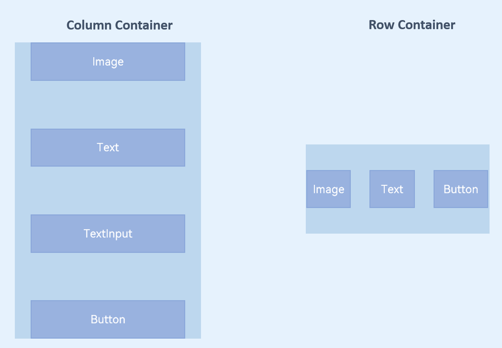

-   `SpaceAround`: Elastic elements are evenly distributed with equal spacing between adjacent elements. The distance from the first and last elements to the axis edges is half the distance between adjacent elements.

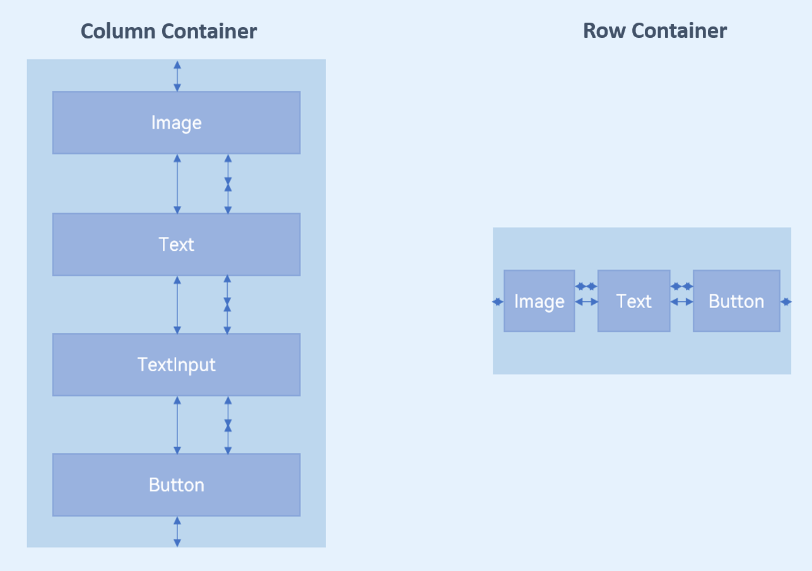
-   `SpaceEvenly`: Elements are spaced equally along the axis, with uniform gaps between adjacent elements and the container's edges.

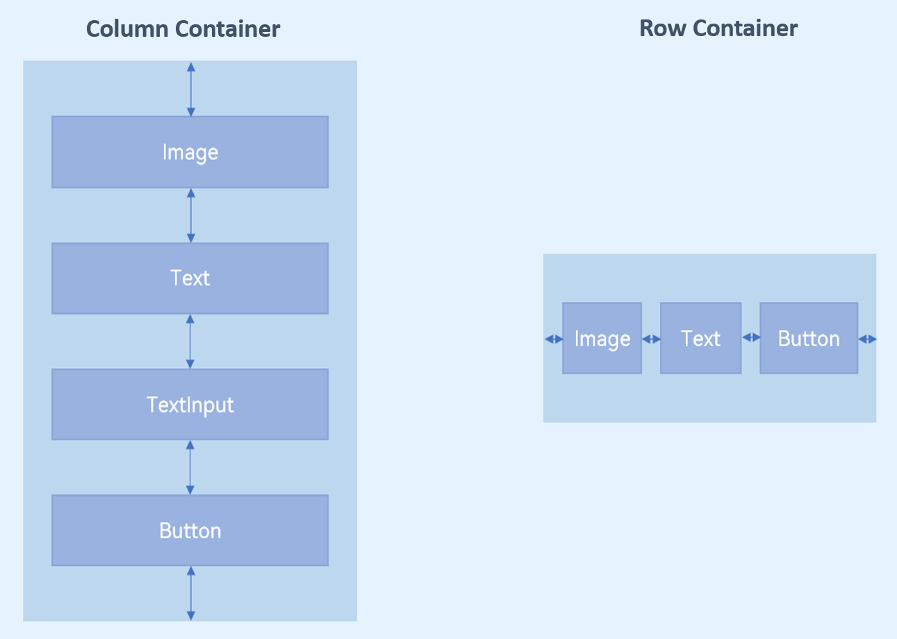

2.  **Alignment of the cross axis direction (`alignItems`)**

The alignment of the subcomponents along the cross axiss controlled by the `alignItems` property.  
The main axis of a __column container__ is vertical, and the cross axis is horizontal. The parameter given in `alignItems` is `VerticalAlign`.

**A column code example is as follows:**

```typescript
@Entry
@Component
struct Demo {
  build() {
    Column(){
      Text("Text1")
      Text("Text2")
      Text("Text3")
    }
    .height('100%')
    .width('100%')
    .justifyContent(FlexAlign.Start)
    .alignItems(HorizontalAlign.End)
  }
}

```

`HorizontalAlign` defines the following types:

-   `Start`: Aligns subcomponents horizontally from the start.

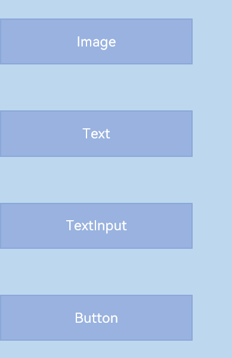

-   `Center` (default value): Aligns the subcomponents horizontally to the center.

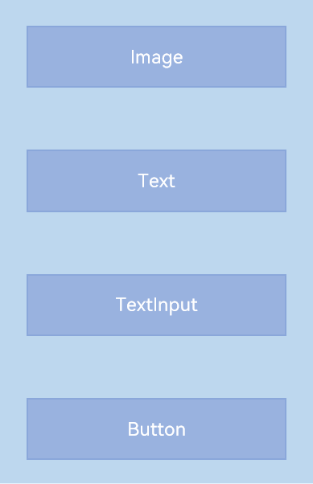

-   `End`: Aligns the subcomponents horizontally from the end.

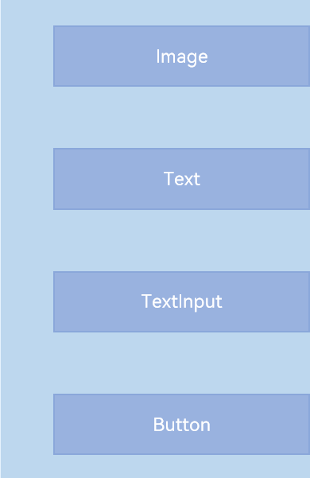

The main axis of a __row container__ is horizontal, and the cross axis is vertical. The parameter given in `alignItems` is `VerticalAlign`.

**A row code example is as follows:**

```typescript
@Entry
@Component
struct Demo {
  build() {
    Row(){
      Text("Text1")
      Text("Text2")
      Text("Text3")
    }
    .height('100%')
    .width('100%')
    .justifyContent(FlexAlign.SpaceEvenly)
    .alignItems(VerticalAlign.Bottom)
  }
}

```

`VerticalAlign` defines the following types:

-   `Top`: Aligns the subcomponents vertically from the top.

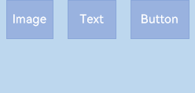

-   `Center` (default value): Aligns the subcomponents vertically to the center.

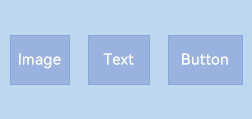

-   `Bottom`: Aligns the subcomponents vertically from the bottom.

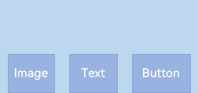

#### Interface Description

Next, let\'s look at the interfaces of the `Column` and `Row` containers.

| Container Assembly | Interface                                |
| :----------------- | :--------------------------------------- |
| Column             | Column(value?:{space?: string \| number}) |
| Row                | Row(value?:{space?: string \| number})    |


The interfaces of the `Column` and `Row` containers have an optional parameter: `space`, indicating the spacing of the subcomponents in the direction of the main axis. The effect is as follows:

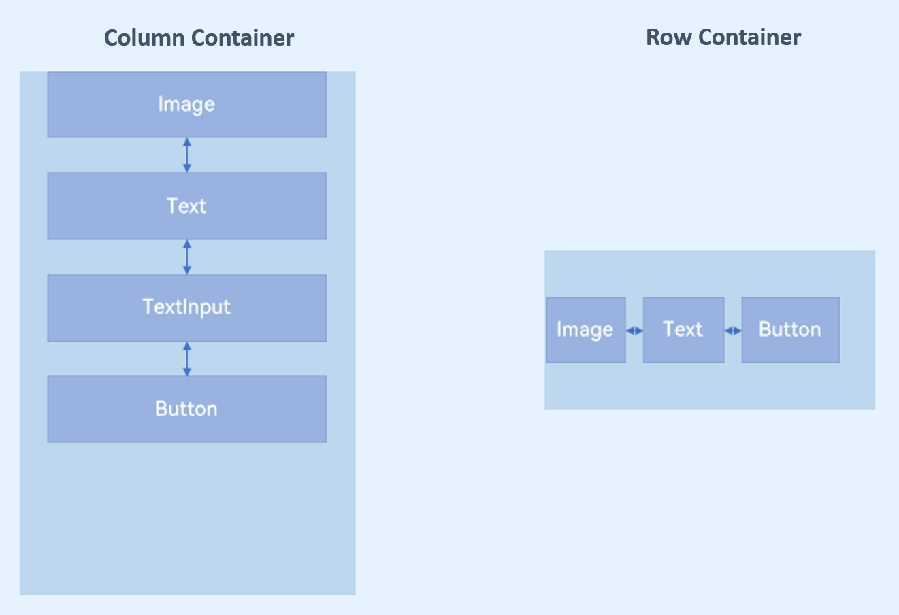


The following is an example of the `Column` interface code. When the `space` is adjusted, the spacing between texts changes.

```typescript
@Entry
@Component
struct Demo {
  build() {
    Column({space:100}){
      Text("Text1")
      Text("Text2")
      Text("Text3")
    }
    .height('100%')
    .width('100%')
    .justifyContent(FlexAlign.Start)
    .alignItems(HorizontalAlign.End)
  }
}

```

The following is an example of the `Row` interface code. When the `space` is adjusted, the spacing between texts changes.

```typescript
@Entry
@Component
struct ImgDemo {
  build() {
    Row({space:30}){
      Text("Text1")
      Text("Text2")
      Text("Text3")
    }
    .height('100%')
    .width('100%')
    .justifyContent(FlexAlign.Start)
    .alignItems(VerticalAlign.Bottom)
  }
}

```

### Case: Login Page Implementation

Let\'s talk about how to efficiently use the `Column` and `Row` container components to build the following login page. When we get a page design drawing from the design classmate, we need to disassemble the page, determining the layout of the page, and then analyze the components used to implement the content on the page.

Let\'s take a closer look at this landing page. In the static layout, the components are laid out from top to bottom, so the page can be built using `Column`. On this basis, we can see that some content consists of several basic components horizontally, for example, the "SMS verification code login" and "Forgot password" in the middle of the page. As well as the "Other ways to login" buttons at the bottom of the page. When constructing these, you can nest the `Row` component in the `Column` component. Then, the horizontal layout is implemented inside the `Row` component.

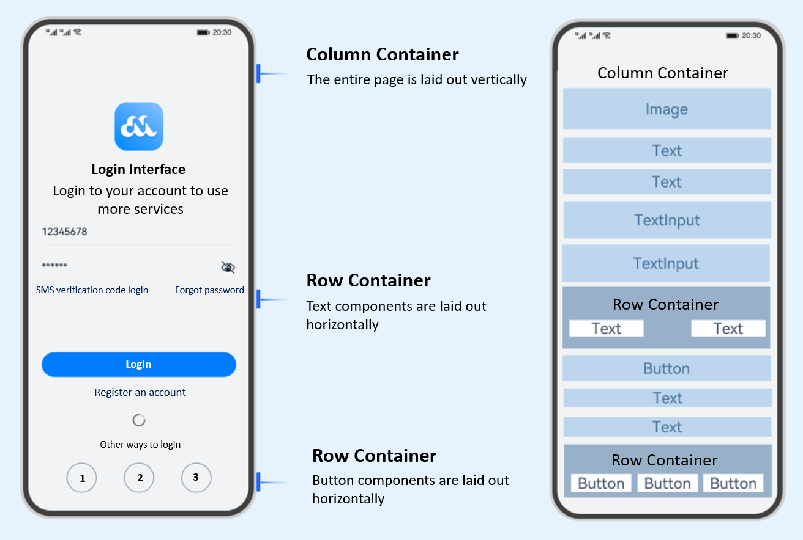


Following this setup, the `Column` container contains basic components such as `Image`, `Text`, `TextInput`, and `Button`. The other two groups of components are implemented by using the `Row` container component. To implement this page, perform the following steps:

1.  **Prepare the pictures**

Put the images [logo.png](ts_ui_development_media/logo.png), [login_method1.png](ts_ui_development_media/login_method1.png), [login_method2.png](ts_ui_development_media/login_method2.png), and [login_method3.png](ts_ui_development_media/login_method3.png) in `src > main > resources > base > media` directory.

2.  **Prepare resource files**

Prepare the `string.json` file in the `src > main > resources > base > element` directory.

```typescript
{
  "string": [
    {
      "name": "module_desc",
      "value": "module description"
    },
    {
      "name": "EntryAbility_desc",
      "value": "description"
    },
    {
      "name": "EntryAbility_label",
      "value": "label"
    },
    {
      "name": "login_page",
      "value": "Login Interface"
    }, {
      "name": "login_more",
      "value": "Login to your account to use more services."
    }, {
      "name": "account",
      "value": "Enter an account."
    }, {
      "name": "password",
      "value": "Enter the password."
    }, {
      "name": "message_login",
      "value": "SMS verification code login"
    }, {
      "name": "forgot_password",
      "value": "Forgot password"
    }, {
      "name": "login",
      "value": "Login"
    }, {
      "name": "register_account",
      "value": "Register Account"
    }, {
      "name": "other_login_method",
      "value": "Other login modes"
    }

  ]
}
```
3.  **Add common constants file**

Create a `CommonConstants` folder at `src > main > ets > pages`, then create the `CommonStants.ets ` file, copy the following code.

```typescript
export default class CommonConstants {
  static INPUT_ACCOUNT_LENGTH = 20; // Maximum length of account input
  static INPUT_PASSWORD_LENGTH = 16; // Maximum length of password input
}
```

4.  **Code the Login Page**

```typescript

import CommonConstants from './CommonConstants';
import prompt from '@ohos.promptAction';

@Entry
@Component
struct Login {
  @State account: string = ''; // Account status variable.
  @State password: string = ''; //Password status variable.
  @State isShowProgress: boolean = true; // Displays the status variable for the progress indicator
  private timeOutId: number = -1; //Variable for controlling timeout

  //Function for creating an image button.
  @Builder
  imageButton(src: Resource) {
    Button({type: ButtonType.Circle, stateEffect: true }) {
      Image(src)
    }
    .height('50') // Image button height
    .width('50') // Image button width
    .backgroundColor('#FFFFF') //Background color

  }

  //Processing function when the page disappears.
  aboutToDisappear() {
    clearTimeout(this.timeOutId); //Clear the timeout timer.
    this.timeOutId = -1;
  }

  //Function for constructing the page layout.
  build() {
    Column() {
      Image($r('app.media.logo')) // Logo image
        .width('100') // Logo width
        .height('100') //Logo height
        .margin({top: '10', bottom: '10'}) // Logo margin
      Text($r('app.string.login_page')) //Login page title
        .fontSize('20') //Title font size
        .fontWeight(FontWeight.Medium) // Title Font Thickness
      Text($r('app.string.login_more')) // "Learn more" text
        .fontSize('15') // Font size
        .margin({bottom:'10', top: '10'}) // Margin

      //Account text box
      TextInput({placeholder: $r('app.string.account')})
        .maxLength(CommonConstants.INPUT_ACCOUNT_LENGTH) //Maximum length of input
        .type(InputType.Number) //The input type is a number.
        .onChange((value: string) => {
          this.account = value; //Update the account status.
        })
        .margin('20') //Top margin
      Divider()

      //Password text box.
      TextInput({placeholder: $r('app.string.password')})
        .maxLength(CommonConstants.INPUT_PASSWORD_LENGTH) //Maximum length of password
        .type(InputType.Password) //The input type is password.
        .onChange((value: string) => {
          this.password = value; // Update the password status.
        })
        .margin('20') //Top margin
      Divider()

      //Text of login and password forgetting.
      Row() {
        Text($r('app.string.message_login')) //"Message Login" text
          .fontColor('#0000FF')
        Text($r('app.string.forgot_password')) //"Forgot password" text
          .fontColor('#0000FF')
      }
      .justifyContent(FlexAlign.SpaceBetween)
      .width('100%') //width is 100% of the parent component.
      .margin('20') //Top margin
      .padding('10')

      //Login button
      Button($r('app.string.login'), {type: ButtonType.Capsule})
        .width('200') //Button width
        .height('50') //Button height
        .fontSize('20') //Font size
        .fontWeight(FontWeight.Medium) //Font Thickness
        .backgroundColor('#0000FF') //Background color
        .onClick(() => {
          prompt.showToast({
            message: "Login succeeded." //Login success prompt
          })
        })

      // Registration account text.
      Text($r('app.string.register_account'))
        .fontColor('#0000FF') //Font color
        .fontSize('15') //Font size
        .fontWeight(FontWeight.Medium) //Font Thickness
        .padding('10')

      //Progress indicator
      if (this.isShowProgress) {
        LoadingProgress() //Load the progress component.
          .color('#808080') // Color
          .width('50') // Width
          .height('50') // Height
          .margin({top: 10}) // Top margin
      }

      //Text of other login modes.
      Text($r('app.string.other_login_method'))
        .fontSize('15') // Font size
        .fontWeight(FontWeight.Medium) //Font Thickness
        .margin({top: '10', bottom: '10'}) //Margin

      //Image button for other login modes.
      Row({space: '50'}) {
        this.imageButton($r('app.media.login_method1')) //Login mode 1
        this.imageButton($r('app.media.login_method2')) //Login mode 2
        this.imageButton($r('app.media.login_method3')) //Login mode 3
      }

    }
    .backgroundColor('#FFFFFF') //Background color
    .height('100%') // height is 100%
    .width('100%') // width is 100%
    .justifyContent(FlexAlign.Center)
    .alignItems(HorizontalAlign.Center)
  }
}

```

The following figure shows the preview of the login page.
<div>
  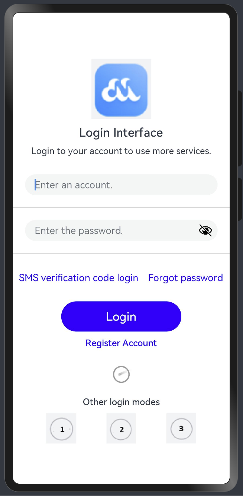
</div>


## List and Grid components

In our common mobile applications, we often see some data lists, such as settings pages, address books, product lists and etc. In the following figure, both pages contain lists, the `Home page` contains two grid layouts, and the `Mall page` contains a list of products.


The list shown in the preceding figure contains a series of list items with the same width. Data of the same type, such as images and text, are displayed in consecutive lines. Common lists are linear lists and grid layouts:

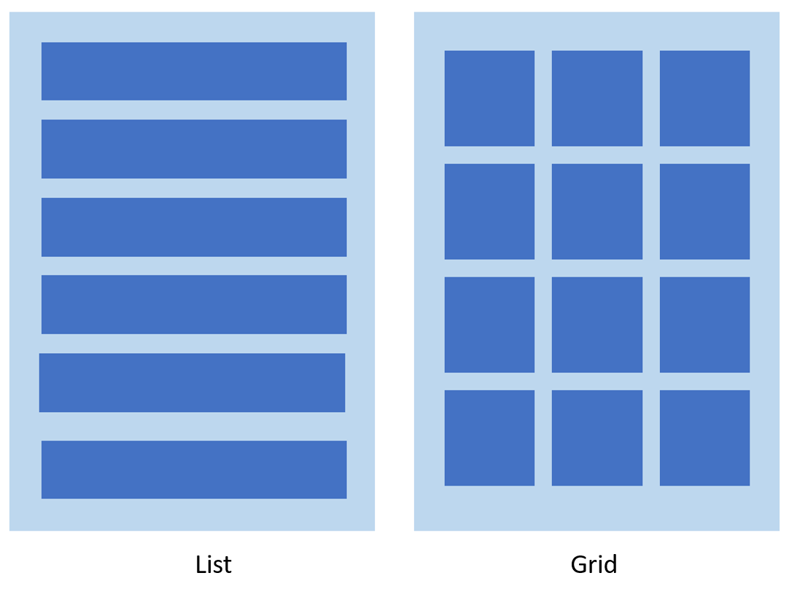

To help developers build applications that contain lists, `ArkTS` provides the `List` and `Grid` components. Developers can use the `List` and `Grid` components to easily complete some list pages.

### List component

`List` is a common scrolling container component. It is usually used together with the subcomponent `ListItem`. Each list item in the `List` corresponds to a `ListItem` component.

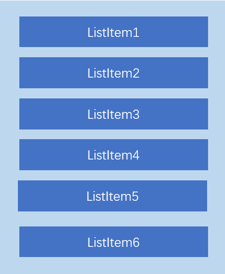

#### Use ForEach to render lists

Lists tend to be made up of multiple list items, so we need to use multiple `ListItem` components in the `List` component to build the list, which leads to code redundancy. To reduce repeated code, you can build a list by traversing arrays through loop rendering (`ForEach`). The sample code is as follows:

```typescript
@Entry
@Component
struct ListDemo {
  private arr: number[] = [0, 1, 2, 3, 4, 5, 6, 7, 8, 9]

  build() {
    Column() {
      List({space: 10}) {
        ForEach(this.arr, (item: number) => {
          ListItem() {
            Text(`${item}`)
              .width('100%')
              .height(100)
              .fontSize(20)
              .fontColor(Color.White)
              .textAlign(TextAlign.Center)
              .borderRadius(10)
              .backgroundColor(0x007DFF)
          }
        }, item => item)
      }
    }
    .padding(12)
    .height('100%')
    .backgroundColor(0xF1F3F5)
  }
}


```

The effect drawing is as follows:

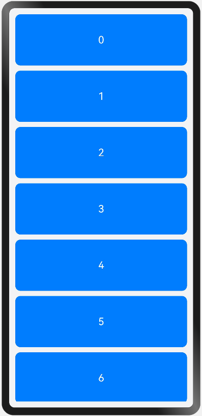

#### Set List Dividers

 By default, there is no separator between the `ListItem` subcomponents. In some scenarios, the separator needs to be set between the `ListItem` subcomponents. In this case, you can use the `divider` attribute of the `List` component. The divider property contains four parameters:

-   `strokeWidth`: Line width of the split line.

-   `color`: Color of the split line.

-   `startMargin`: Distance between the split line and the start of the list side.

-   `endMargin`: Distance between the split line and the end of the list side.

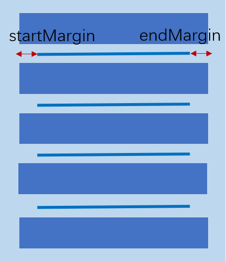


Sample code:

```typescript
@Entry
@Component
struct Index {
  private arr: number[] = [0, 1, 2, 3, 4, 5]

  build() {
    Column() {
      List({space: 10}) {
        ForEach(this.arr, (item: number) => {
          ListItem() {
            Text(`${item}`)
              .width('100%')
              .height(100)
              .fontSize(20)
              .fontColor(Color.White)
              .textAlign(TextAlign.Center)
              .borderRadius(10)
              .backgroundColor(0x007DFF)
          }
        }, item => item)
      }
      .divider({strokeWidth:5, color:Color.Red, startMargin:10, endMargin:10})
    }
    .padding(12)
    .height('100%')
    .backgroundColor(0xF1F3F5)
  }
}

```

The effect drawing is as follows:\
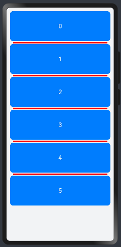

#### List scrolling event listening

The `List` component provides a series of event methods for monitoring the scrolling of a list. You can perform operations by listening to these events as required.

-   `onScroll`: Triggered when a list is swiped. It has two return values: `scrollOffset` and `ScrollState`. The first return value `scrollOffset` indicates the swipe offset. This value is updated during the scrolling process and automatically resets to 0 once the scrolling finishes. Scrolling from top to bottom (or from left to right) results in a positive `scrollOffset` value, while scrolling from bottom to top (or from right to left) results in a negative `scrollOffset` value. The second return value [scrollState](https://developer.huawei.com/consumer/en/doc/harmonyos-references-V2/ts-container-list-0000001477981213-V2#EN-US_TOPIC_0000001574088545__scrollstate) is an integer value `0`, `1`, or `2` which indicating the swipe status is `Idle`, `Scroll`, or `Fling` respectively.

-   `onScrollIndex`: Triggered when a list is swiped. The return values are the index values of the sliding start position and the sliding end position.

-   `onReachStart`: Triggered at the start of the list.

-   `onReachEnd`: Triggered at the end of the list.

-   `onScrollStop`: Triggered when the list sliding stops.

The sample code is as follows:
```typescript
@Entry
@Component
struct Index {
  private arr: number[] = [0, 1, 2, 3, 4, 5, 6, 7, 8, 9, 10]

  build() {
    Column() {
      List({space: 10}) {
        ForEach(this.arr, (item) => {
          ListItem() {
            Text(`${item}`)
              .width('100%')
              .height(100)
              .fontSize(20)
              .fontColor(Color.White)
              .textAlign(TextAlign.Center)
              .borderRadius(10)
              .backgroundColor(0x007DFF)
          }
        }, item => item)
      }
      .onScrollIndex((firstIndex: number, lastIndex: number) => {
        console.info ('Sliding start position index value ' + firstIndex)
        console.info ('Sliding end position index value ' + lastIndex)
      })
      .onScroll((scrollOffset: number, scrollState: ScrollState) => {
        console.info('Sliding Offset ' + scrollOffset)
        console.info('Current Sliding Status ' + scrollState)
      })
      .onReachStart(() => {
        console.info('List Start Reach')
      })
      .onReachEnd(() => {
        console.info('End of List Reaches')
      })
      .onScrollStop(() => {
        console.info('List Slide Stop')
      })
    }
    .padding(12)
    .height('100%')
    .backgroundColor(0xF1F3F5)
  }
}


```

After the preceding code is compiled, you can drag the list up and down with the mouse to view different printing results under the `Log` tab.

#### Set the list arrangement direction

The list items in the `List` component are arranged vertically by default. If you want the list to be arranged horizontally, you can set the `listDirection` property of the List component to `Axis.Horizontal`.

The sample code is as follows:

```typescript
@Entry
@Component
struct ListDemo {
  private arr: number[] = [0, 1, 2, 3, 4, 5, 6, 7, 8, 9, 10]

  build() {
    Column() {
      List({space: 10}) {
        ForEach(this.arr, (item) => {
          ListItem() {
            Text(`${item}`)
              .width('10%')
              .height(100)
              .fontSize(20)
              .fontColor(Color.White)
              .textAlign(TextAlign.Center)
              .borderRadius(10)
              .backgroundColor(0x007DFF)
          }
        }, item => item)
      }
      .listDirection(Axis.Horizontal)// Setting the Horizontal Layout
      .onScrollIndex((firstIndex: number, lastIndex: number) => {
        console.info ('Sliding start position index value' + firstIndex)
        console.info ('Sliding End Position Index' + lastIndex)
      })
      .onScroll((scrollOffset: number, scrollState: ScrollState) => {
        console.info('Sliding Offset' + scrollOffset)
        console.info('Current Sliding Status' + scrollState)
      })
      .onReachStart(() => {
        console.info('List Start Reach')
      })
      .onReachEnd(() => {
        console.info('End of List Reaches')
      })
      .onScrollStop(() => {
        console.info('List Slide Stop')
      })
    }
    .padding(12)
    .height('100%')
    .backgroundColor(0xF1F3F5)
  }
}

```

The effect drawing is as follows:

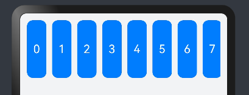

The `listDirection` parameter type is [Axis](https://developer.harmonyos.com/cn/docs/documentation/doc-references-V3/ts-appendix-enums-0000001478061741-V3?catalogVersion=V3#ZH-CN_TOPIC_0000001478061741__axis), defines the following two types:

-   `Vertical` (default value): The subcomponent `ListItem` is arranged vertically in the List container component.

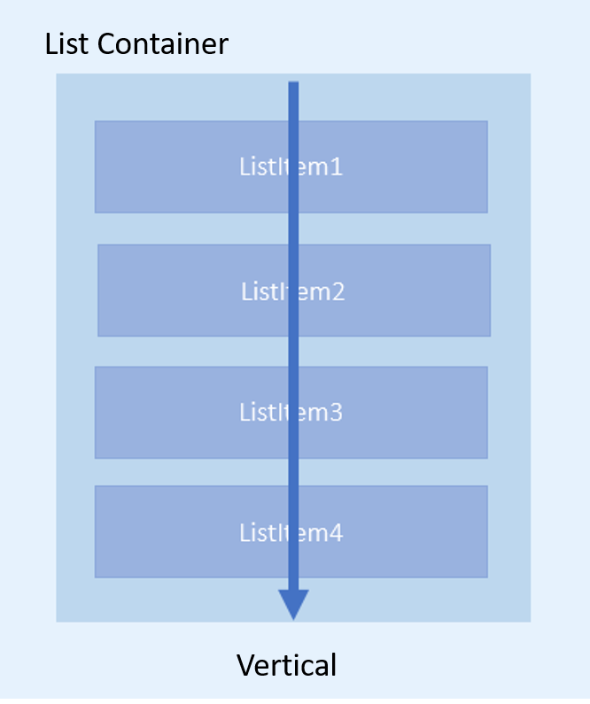

-   `Horizontal`: The subcomponent `ListItem` is arranged horizontally in the List container component.

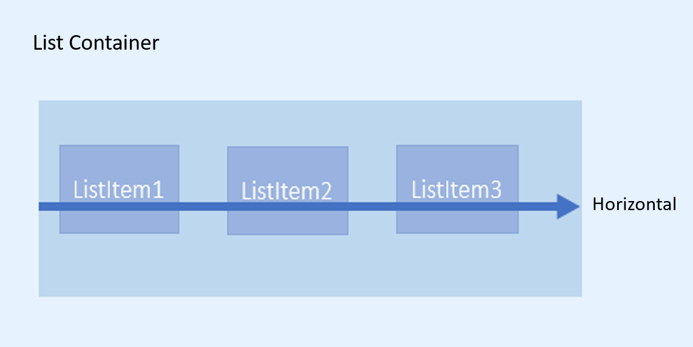

### Grid component

The `Grid` component is a grid container. It is a grid list that consists of cells separated by rows and columns. Various layouts are made by specifying the cells where the project is located. Generally, the `Grid` component is used together with the `GridItem` subcomponent. Each entry in the `Grid` list corresponds to a `GridItem` component.

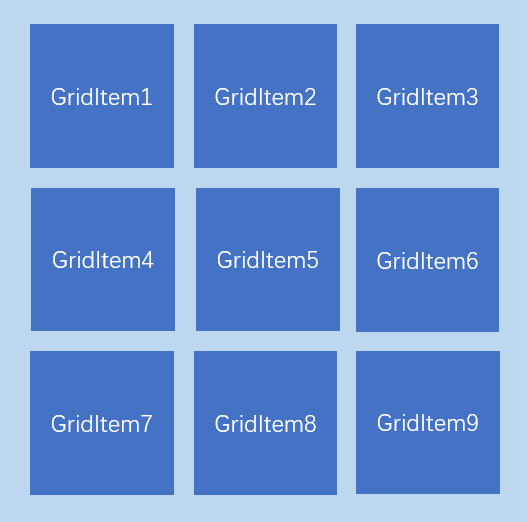

#### Rendering a Grid Layout with Foreach

Like the `List` component, the `Grid` component can also use `ForEach` to render multiple list items `GridItem`. The following sample code shows how to use the `Grid` component.

```typescript
@Entry //Indicates the entry component.
@Component // Indicates that the component is a component.
struct GridExample {
  //Define a string array with a length of 16 to store items in the grid.
  private arr: string[] = new Array(16).fill('') .map((_, index) => `item ${index}`);

  build() {
    Column() {//Create a column layout.
      Grid() {//Create a grid layout.
        // Traverse each element in the array and create a grid item for each element.
        ForEach(this.arr, (item: string) => {
          GridItem() {//Create a single item in the grid
          Text(item) //Display the text.
          .fontSize(16) //Set the font size to 16.
          .fontColor(Color.White) //Set the font color to white.
          .backgroundColor(0x007DFF) // Setting the background color
          .width('100%') //Set the width to 100% of the container.
          .height('100%') //Set the container height to 100%.
          .textAlign(TextAlign.Center) // Set Text Centering
          }
        }, item => item)
      }
      .columnsTemplate('1fr 1fr 1fr 1fr') //Set the column template of the grid, with four columns and the proportions of each column being the same.
      .rowsTemplate('1fr 1fr 1fr 1fr') //Set the row template of the grid, with four rows and the proportions of each row being the same.
      .columnsGap(10) //Set the gap between columns to 10.
      .rowsGap(10) //Set the gap between rows to 10.
      .height(300) //Set the height of the grid to 300.
    }
    .width('100%') //Set the width of the column layout to 100%.
    .padding(12) //Set the inner margin of the column layout to 12.
    .backgroundColor(0xF1F3F5) // Set the background color for the column layout
  }
}

```

In the sample code, 16 `GridItem` are created. 
- Set `columnsTemplate` to\'`1fr 1fr 1fr 1fr`\', indicating that the grid has four columns. Divide the allowed width of the grid into four equal parts, and each column occupies one part.
- The value of `rowsTemplate` is \'`1fr 1fr 1fr 1fr`\', indicating that the grid has four rows. The allowed height of the grid is divided into four equal parts, and each row occupies one part.  

This makes a grid list of four rows and four columns, and then uses `columnsGap` to set the column spacing to `10vp`, and `rowsGap` to set the row spacing to `10vp`. The following figure shows the sample code.

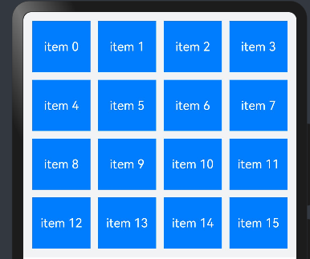

The grid layout built above uses a fixed number of rows and columns, so the grid is not scrollable. However, sometimes when we have a lot of content, if we want to display more content by scrolling, we can use the scrollable grid layout. You only need to set either `rowsTemplate` or `columnsTemplate`.

Set the height of `GridItem` in the sample code to a fixed value, for example, 100. You can scroll the Grid list by setting the `columnsTemplate` property instead of the `rowsTemplate` property.

```typescript
@Entry //Indicates the entry component.
@Component // Indicates that the component is a component.
struct GridExample {
  //Define a string array with a length of 16 to store items in the grid.
  private arr: string[] = new Array(16).fill('') .map((_, index) => `item ${index}`);

  build() {
    Column() {//Create a column layout.
      Grid() {//Create a grid layout.
        // Traverse each element in the array and create a grid item for each element.
        ForEach(this.arr, (item: string) => {
          GridItem() {//Create a single item in the grid
          Text(item) //Display the text.
          .fontSize(16) //Set the font size to 16.
          .fontColor(Color.White) //Set the font color to white.
          .backgroundColor(0x007DFF) // Setting the background color
          .width('100%') //Set the width to 100% of the container.
          .height('100') //Set the height to 100.
          .textAlign(TextAlign.Center) // Set Text Centering
          }
        }, item => item)
      }
      .columnsTemplate('1fr 1fr 1fr 1fr') //Set the column template of the grid, with four columns and the proportions of each column being the same.
      .columnsGap(10) //Set the gap between columns to 10.
      .rowsGap(10) //Set the gap between rows to 10.
      .height(300) //Set the height of the grid to 300.
    }
    .width('100%') //Set the width of the column layout to 100%.
    .padding(12) //Set the inner margin of the column layout to 12.
    .backgroundColor(0xF1F3F5) // Set the background color for the column layout
  }
}

```

The effect drawing is as follows:

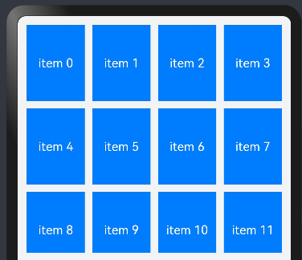

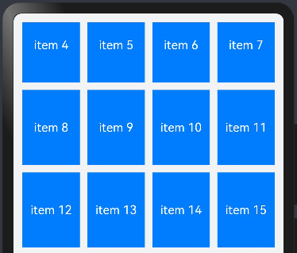

In addition, `Grid`, like `List`, can use `onScrollIndex` to monitor the scrolling of the list as well.

### My Page Case - List Component Implementation

The following uses the `List` component to implement the following **My Page**:\
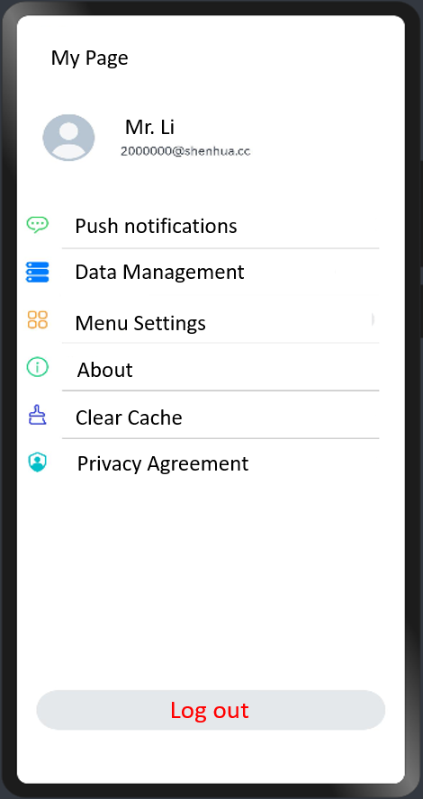

1.  **Preparing Pictures**

Put the 7 icons' images [account.png](ts_ui_development_media/account.png), [notifications.png](ts_ui_development_media/notifications.png), [data.png](ts_ui_development_media/data.png), [menu.png](ts_ui_development_media/menu.png), [about.png](ts_ui_development_media/about.png), [cache.png](ts_ui_development_media/cache.png), and [privacy.png](ts_ui_development_media/privacy.png) in the `src > main > resources > base > media` directory of the project.

2.  **Creating the ItemData Class**

For cleanliness we extract the `ItemData` to create combinations of images and text on the **My Page**.

```typescript
//List item data entity.

export default class ItemData {
  //Text of the list item.
  title: string;
  //Image of the list item.
  img: Resource;

  constructor(title: string, img: Resource) {
    this.title = title;
    this.img = img;
  }
}

```

3.  **Creating a MainViewModel**

The preceding page consists of a list. The resources used by the page are defined in the `MainViewModel.ets` file.

```typescript
//Import the ItemData class.
import ItemData from './ItemData';

export class MainViewModel {


  getSettingListData(): Array<ItemData> {
    let settingListData: ItemData[] = [
      new ItemData('Push Notifications', $r('app.media.notifications')),
      new ItemData('Data Management', $r('app.media.data')),
      new ItemData('Menu Settings', $r('app.media.menu')),
      new ItemData('About', $r('app.media.about')),
      new ItemData('Clear Cache', $r('app.media.cache')),
      new ItemData('Privacy Agreement', $r('app.media.privacy'))
    ];
    return settingListData;
  }


}

//Export a new instance of MainViewModel.
export default new MainViewModel();

```

4.  **Code the page**

```typescript
import ItemData from './ItemData'
import mainViewModel from './MainViewModel';

@Entry //Indicates the entry component.
@Component //Indicates that this is a component.
export default struct Index {
  //Construct the function for setting cells and receive an item of the ItemData type as a parameter.
  @Builder settingCell(item: ItemData) {
    Row() {//Create a row layout.
      Row({space: '10'}) {// Creates a spaced, inline row layout
        Image(item.img) //Display the image.
          .width('30') // Set the width of the image.
          .height('30') // Set the image height.
        Text(item.title) //Display the text.
          .fontSize('20') //Set the font size of the text.
      }
    }
    .justifyContent(FlexAlign.SpaceBetween) // Sets the alignment mode of the content in the axis direction to both ends alignment.
    .width('100%') // Set the width to 100% of the parent container.
    .padding({//Set the inner margin.
      left: 10,
      right: 10
    })
  }

  //Construction function of the component, which defines the layout and style of the component.
  build() {
    Scroll() {//Create a scrollable container.
      Column({space: '10'}) {// Creating a Spacing

        Column(){//Create an embedded column layout.
          Text('My Page') //Display the text.
          .fontWeight(FontWeight.Medium) // Setting Font Weights
          .fontSize('25') //Set the font size.
          .margin({top: 20}) //Set the outer margin.
          .padding({left: 20}) //Set the inner margin.
        }
        .width('100%') // Set the width to 100% of the parent container.
        .alignItems(HorizontalAlign.Start) // Set the alignment mode of the subitem on the cross axes to start alignment.

        //The next step is the layout of the account information.
        Row() {
          Image($r('app.media.account')) //Display the account image.
            .width('50') //Set the image width.
            .height('50') //Set the image height.
          Column() {
            Text('Mr. Li') //Display the account name.
              .fontSize('20') //Set the font size.
            Text('200000@shenhua.cc') //Display the account email address.
              .fontSize('15') //Set the font size.
              .margin({top: '5'}) //Set the outer margin.
          }
          .alignItems(HorizontalAlign.Start) // Set the alignment mode of the subitem on the cross axes to start alignment.
          .margin({left: 20}) //Set the outer margin.
        }
        .margin({top: 20}) //Set the margin.
        .alignItems(VerticalAlign.Center) // Set the alignment mode of the subitem on the cross axes to center alignment.
        .width('100%') // Set the width to 100% of the parent container.
        .height('50') // Set the height
        .backgroundColor(Color.White) //Set the background color to white.
        .padding({left: 10}) //Set the inner margin
        .borderRadius('10') // Set the corner radius.


        //Set the layout of the list.
        List() {
          //Traverse the setting list data and create a list item for each data item.
          ForEach(mainViewModel.getSettingListData(), (item: ItemData) => {
            ListItem() {
              this.settingCell(item) //Invoke the settingCell method to build each list item.
            }
            .height('50') //Set the height of the list item.
          }, (item:ItemData) => JSON.stringify(item)) //Uses JSON.stringify to generate the key of the list item.
        }
        .backgroundColor(Color.White) //Set the background color to white.
        .width('100%') // Set the width to 100% of the parent container.
        .height('500') // Set Height
        .divider({//Set the separator between list items.
          strokeWidth: 2, //Set the width of the split line.
          color: Color.Grey, //Set the color of the split line to gray.
          startMargin: '10', //Set the start margin of the split line.
          endMargin: '10' //Set the end margin of the split line.
        })
        .borderRadius('10') // Set the corner radius.
        .padding({top: 10, bottom: 10}) //Set the inner margin

        Blank() //Blank placeholder

        // Layout of the exit button.
        Button('Log out', {type: ButtonType.Capsule}) // Create a button
          .width('300') // Set Button Width
          .height('50') //Set the button height.
          .fontSize('30') //Set the font size.
          .fontColor('#FF0000') //Set the font color.
          .fontWeight(FontWeight.Medium) // Setting Font Weights
          .backgroundColor('#e4e8eb') //Set the background color.
          .margin({bottom: 20}) //Set the outer margin.
      }
      .height('100%') //Set the height to 100% of the parent container.
    }
  }
}


```

The preview result is as follows:

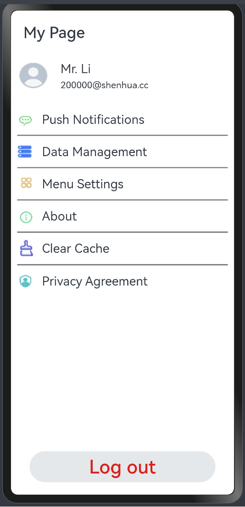

### Home Page Case - Grid Component Implementation

We use `Grid` component to implement the following Home page:

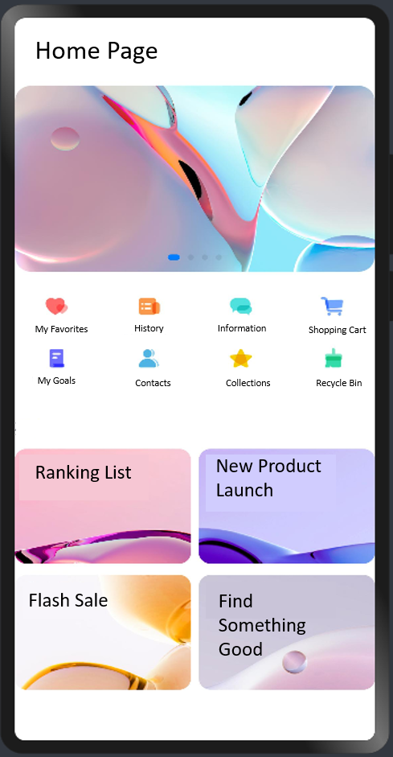

1.  **Preparing Pictures and Configuration Files**  

Put the 8 icons' images [favorites.png](ts_ui_development_media/favorites.png), [history.png](ts_ui_development_media/history.png), [information.png](ts_ui_development_media/information.png), [shoppingCart.png](ts_ui_development_media/shoppingCart.png), [goals.png](ts_ui_development_media/goals.png), [contacts.png](ts_ui_development_media/contacts.png), [collections.png](ts_ui_development_media/collections.png), and [recycleBin.png](ts_ui_development_media/recycleBin.png) in the `src > main > resources > base > media` directory of the project.
Then, take snippets of the 4 background images in the second grid layout and save them under `b1`, `b2`, `b3` and `b4` and try to obscure the titles written above.

1.  **Creating the ItemData Class**

The `ItemData` class is extracted because there are multiple combinations of images and text on the Home Page.

```typescript
//List item data entity.

export default class ItemData {
  //Text of the list item.
  title: string;
  //Image of the list item.
  img: Resource;

  constructor(title: string, img: Resource) {
    this.title = title;
    this.img = img;
  }
}

```

2.  **Creating a MainViewModel**

The preceding page consists of a swiper and two grids. The resources used by the page are defined in the` MainViewModel.ets` file.

```typescript
//Import the ItemData class.
import ItemData from './ItemData';

//Binds data to components and provides interfaces.

export class MainViewModel {

  getSwiperImages(): Array<Resource>
  {
    let swiperImages: Resource[] = [$r('app.media.b1'), $r('app.media.b2'), $r('app.media.b3'), $r('app.media.b4')]
    return swiperImages;
  }

  getFirstGridData(): Array<ItemData> {
    let firstGridData: ItemData[] = [
      new ItemData('My Favorites', $r('app.media.favorites')),
      new ItemData('History', $r('app.media.history')),
      new ItemData('Information', $r('app.media.information')),
      new ItemData('Shopping Cart', $r('app.media.shoppingCart')),
      new ItemData('My Goals', $r('app.media.goals')),
      new ItemData('Contacts', $r('app.media.contacts')),
      new ItemData('Collections', $r('app.media.collections')),
      new ItemData('Recycle Bin', $r('app.media.recycleBin')),
    ];
    return firstGridData;
  }

  getSecondGridData(): Array<ItemData> {
    let secondGridData: ItemData[] = [
      new ItemData('Ranking List', $r('app.media.b1')),
      new ItemData('New Product Launch', $r('app.media.b2')),
      new ItemData('Flash Sale', $r('app.media.b3')),
      new ItemData('Find Something Good', $r('app.media.b4')),
    ];
    return secondGridData;
  }

}

//Export a new instance of MainViewModel.
export default new MainViewModel();

```

3.  **Code the page**

```typescript
//Import the public constant, ItemData class, and mainViewModel instance.
import ItemData from './ItemData';
import mainViewModel from './MainViewModel';
//Content of the home page label

@Entry // Marked as an entry component.
@Component // Marked as a component.
export default struct Home {
  //Private attribute, which is the NVOD controller instance.
  private swiperController: SwiperController = new SwiperController();

  //Build a function to define the layout and style of the component.
  build() {
    Scroll() {//Create a scrollable container.
      Column({space: 10}) {// Create a column layout with spacing

        Column() {//Create a subcolumn layout.
          Text('Home Page') //Display the text of the home page.
          .fontWeight(FontWeight.Medium) // Set the text word weight to medium
          .fontSize('25') //Set the text font size.
          .margin({top: 20}) //Set the top margin of the text.
          .padding({left: 20}) //Set the left margin of the text.
        }
        .width('100%') // Set the column width to 100% of the parent container.
        .alignItems(HorizontalAlign.Start) // The horizontal alignment of the child element is start.

        Swiper(this.swiperController) {// Creating the NVOD Component with the Controller as the SwiperController
          ForEach(mainViewModel.getSwiperImages(), (img: Resource) => {// Traversing Carousel Image Resources
          Image(img) //Display the image.
          .borderRadius('10') // Set the image corner radius.
          }, (img: Resource) => JSON.stringify(img.id)) // Use the image ID as the key.
        }
        .margin({top: '10', left:'10', right:'10'}) //Set the top margin of the NVOD component.
        .autoPlay(true) // Set the NVOD component to play automatically.

        Grid() {
          //Create a grid layout.
          ForEach(mainViewModel.getFirstGridData(), (item: ItemData) => {// Traverse the first set of grid data
            GridItem() {//Create a grid item.
              Column() {//Create a column layout.
                Image(item.img) //Display the image.
                  .width('25') //Set the image width.
                  .height('25') //Set the image height.
                Text(item.title) //Display the text title.
                  .fontSize('10') //Set the font size of the text.
                  .margin({top: 10}) //Set the top margin of the text.
              }
            }
          }, (item: ItemData) => JSON.stringify(item)) // uses the stringization of the item as the key.
        }
        .columnsTemplate('1fr 1fr 1fr 1fr') //Set the column template of the grid. Each column divides the space equally.
        .rowsTemplate('1fr 1fr') //Set the row template of the grid. Each row divides the space equally.
        .columnsGap('10') //Set the spacing between columns.
        .rowsGap('5') //Set the interval between lines.
        .padding({top: 20, bottom: 20}) // Set the inner margin of the grid
        .height('200') // Set the grid height
        .backgroundColor(Color.White) //Set the grid background color to white.
        .borderRadius('10') //Set the radius of the mesh.


        Grid() {//Create the second grid layout.
          ForEach(mainViewModel.getSecondGridData(), (secondItem: ItemData) => {// Traverse the second set of grid data
            GridItem() {//Create a grid item.
              Column() {//Create a column layout.
                Text(secondItem.title) //Display the title text.
                .fontSize('20') //Set the text font size.
                .fontWeight(FontWeight.Medium) // Setting the Text Weight
              }
              .alignItems(HorizontalAlign.Start) //The horizontal alignment of the child element is start.
            }
            .padding({top: 10, left: 10}) // Set the inner margin of the grid item
            .borderRadius('10') // Set the corner radius of the mesh item.
            .align(Alignment.TopStart) //Set the alignment mode of the grid item to the top.
            .backgroundImage(secondItem.img) // Set Grid Item Background Image
            .backgroundImageSize(ImageSize.Cover) // Set the background image size mode to Overwrite.
            .width('100%') // Set the mesh item width to 100% of the parent container
            .height('100%') // Set the height of the mesh item to 100% of the parent container
          }, (secondItem: ItemData) => JSON.stringify(secondItem)) // Use the stringization of the item as the key.
        }
        .width('100%') // Set the mesh width to 100% of the parent container
        .height('225') //Set the grid height.
        .columnsTemplate('1fr 1fr') //Set the column template of the grid. Each column divides the space equally.
        .rowsTemplate('1fr 1fr') //Set the row template of the grid. Each row divides the space equally.
        .columnsGap('10') //Set the spacing between columns.
        .rowsGap('10') //Set the interval between lines.
      }
      .margin({top:10, left:10, right:10}) // Set the outside margin at the bottom of the grid
      .height('100%')
    }
    .height('100%') // Set the height of the scroll view to 100% of the parent container
  }
}

```

The preview result is as follows:

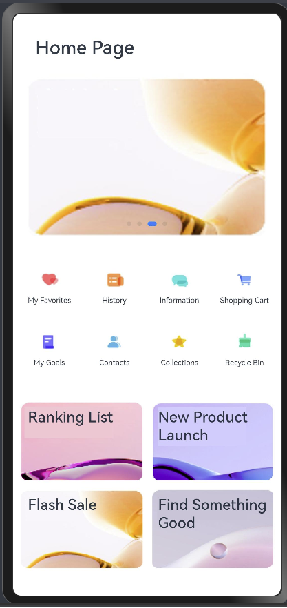

