# UIAbility

### Introduction to UIAbility

UIAbility is an application component that contains a user interface and  is used for users interactions with applications. There are three types of interfaces for  opening/interacting with applications.

1.  **Touch the desktop icon to access the application.**

For example, click the gallery icon on the desktop to start the gallery  application. The gallery application displayed is an application  instance implemented based on UIAbility.

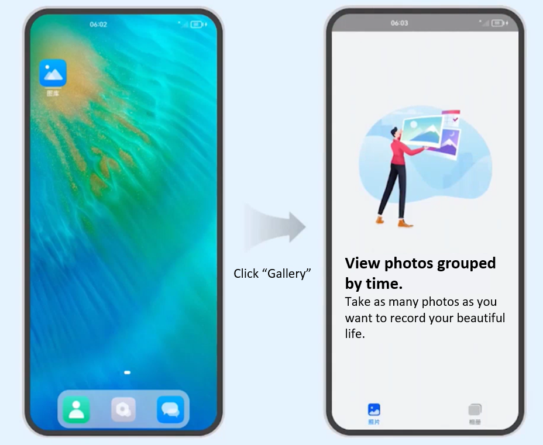

2.  **One application starts another application.**

You can also open an application by jumping between applications.  For example, you can enter the memo application by clicking "share" on a picture in  the gallery application, and choosing to save the shared picture in the memo application. The gallery  application and memo application are both application instances implemented based on UIAbility.

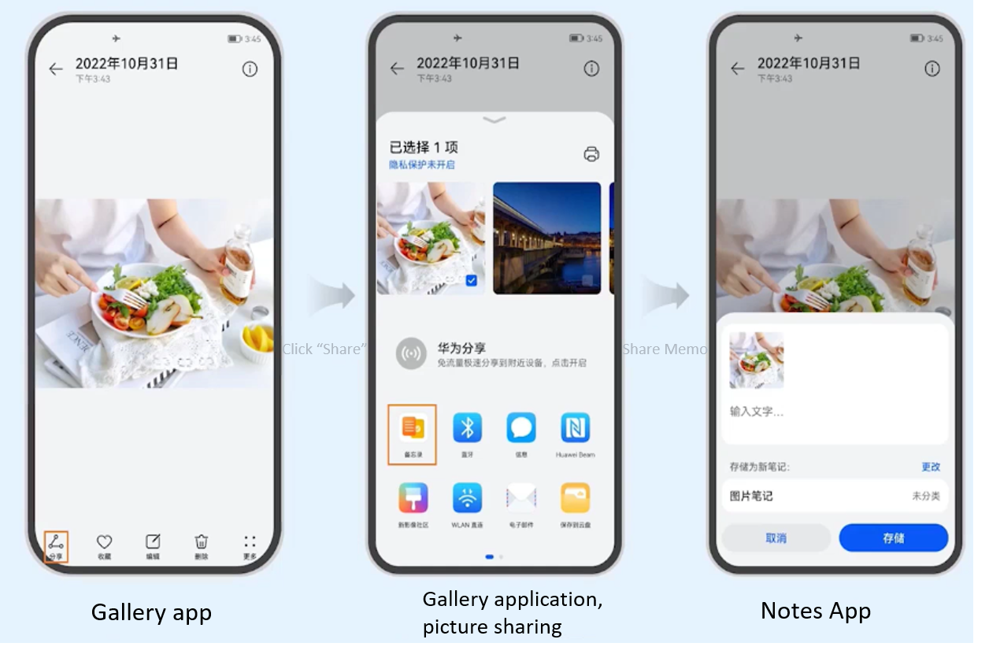

3.  **Switch the recent task list back to the application.**

You can also find the application in the recent task list and enter the  application again. The application tasks in the task list are also  application instances implemented based on UIAbility.

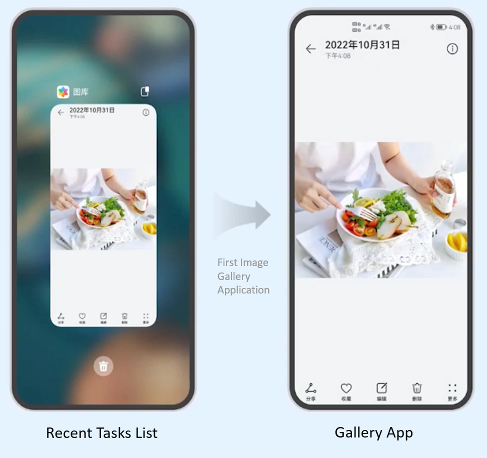

Each UIAbility instance above corresponds to a task in the recent task  list. UIAbility, as a system scheduling unit, provides windows for GUI  drawing. An application can have one UIAbility or multiple UIAbilities, as shown in the following figure. 
For example, the browser application can search and browse content within a _single UIAbility_ that just combines multiple pages. On the other hand, in a scenario where a "take-out function" is added  to a chatting application, the content of the "take-out function" in the chat application may be an independent UIAability. This is an example of an application with _multiple UIAbilities_. When the user clicks on  the "take-out function" of the chat application and views the details of the take-out order, a new window is opened. And, they can switch back to the chat window from the recent task list to continue the  chat conversation.

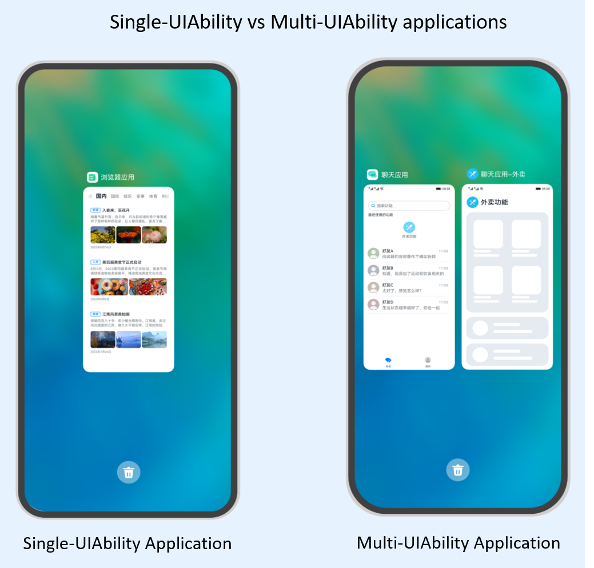

It is usually recommended that a module serving a specific function be placed in a single UIAbility and be displayed as multiple pages.

### Create page within UIAbility

UIAbility routing includes page redirection and data transfer within a single UIAbility and between UIAbilities. This section describes page redirection and data transfer within UIAbility.

Let\'s create a new project to create a page in UIAbility.

#### Creating a project

Open DevEco Studio, select an Empty Ability project template, and create a project, for example, MyApplication.

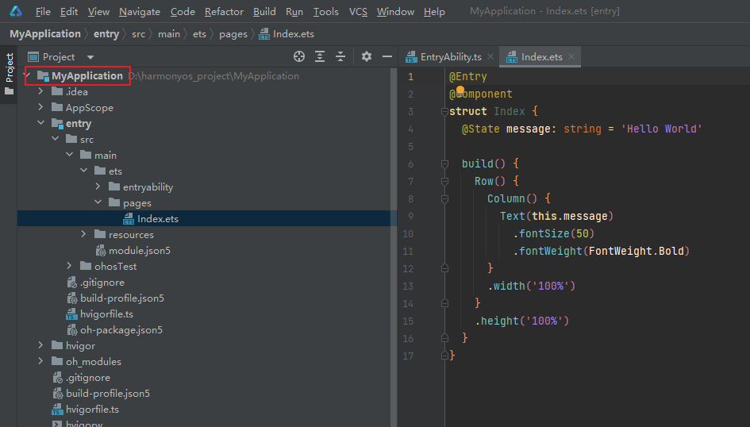

In the `src > main > ets > entryability` directory, a UIAbility file `EntryAbility.ets` is initially generated. The UIAbility life cycle callback content can be implemented in the EntryAbility.ts file based on service requirements.

In the `src > main > ets > pages` directory, an `Index.ets` page is generated. This is also the entry page for applications based on UIAbility. The function of the entry page can be implemented on the Index page based on service requirements.

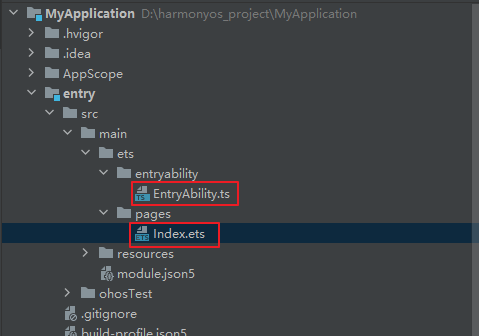

#### Creating a redirection page

In the `src > main > ets > pages` directory, right-click New and choose Page from the shortcut menu to create a second page for redirection and data transfer between pages.

Generally, an application has multiple pages. To implement page redirection and data transfer, you need to create a page: for example, `second.ets`, based on the original `index.ets` page.

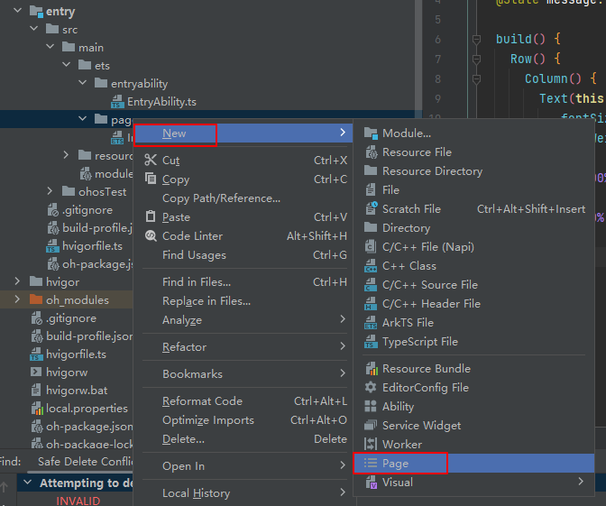

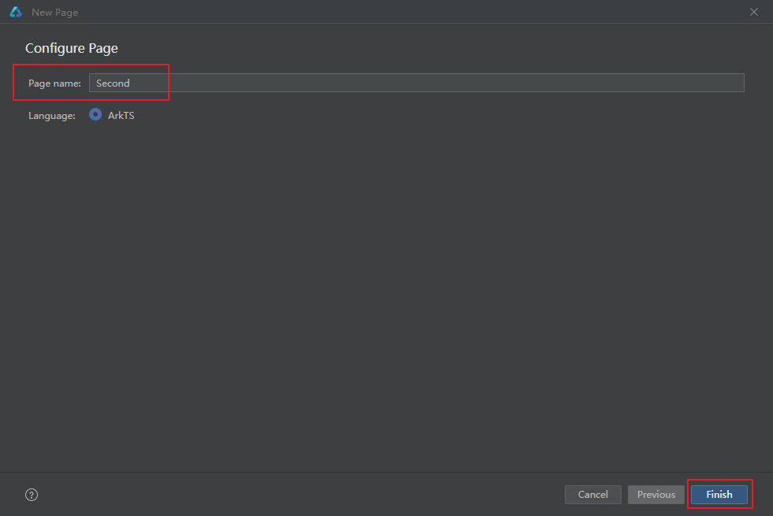

You will find its path automatically added in the `src > main > resources > base > profile > main_pages.json` file.

#### Page redirection and parameter receiving

Navigation between pages can be implemented by the page routing [router module](https://developer.huawei.com/consumer/cn/doc/harmonyos-references-V2/js-apis-router-0000001478061893-V2#ZH-CN_TOPIC_0000001523808578__routerpushurl9). The page routing module finds the target page based on the page URL and implements redirection. Through the page routing module you could:  
1) Jump to a specified page in the UIAbility and pass data between pages
2) Replace the current page with another one in the UIAbility
3) Return to the previous page or a specified page.

Before using page routing, you need to import the router module, as shown in the following code:

 ```typescript
 import router from '@ohos.router';
 ```

The `router` module provides two jump modes: `router.pushUrl()` and the `router.replaceUrl()`. These two modes determine whether the target page replaces the current page.

Consider that there is a stack of page urls:
- `router.pushUrl()`: The target page does not replace the current page, but pushes it into the page stack. This preserves the state of the current page, and you can use the return key or call `router.back()` method to return to the current page.
- `router.replaceUrl()`: Replaces the current page with the target page, destroying the current page and freeing its resources. Once replaced, the current page is no longer accessible, and navigation back to it is not possible.

In addition, for API9 or later the Router module provides two instance modes: `router.RouterMode.Standard` and `router.RouterMode.Single` which are passed as *parameters* to the `pushUrl()` and `replaceUrl()` methods:

- `router.RouterMode.Standard`: Standard instance mode, which is also the default instance mode. Each time this method is called, a *new target page* is created and pushed to the top of the stack.
- `router.RouterMode.Single`: Single instance mode, if the URL of the target page already has a page with the same URL in the page stack, the page with the same URL closest to the top of the stack is moved to the top of the stack and *reloaded*. If the URL of the target page does not exist in the page stack, then the page is created as in standard mode.


**Method 1:** `router.pushUrl()` method. 
- In the standard-instance mode, the number of pages in the page stack always increases by one.
- In single-instance mode, if the stack has a page with the same URL as the target page, the number of elements in the page stack remains unchanged. If the URL of the target page does not exist in the page stack, the number of elements in the page stack increases by 1.

> **Note**: When the number of elements in the page stack is large or exceeds 32, you can call the `router.clear()` method to clear all historical pages in the page stack and retain only the current page as the top page.

```typescript
router.pushUrl({
            url: 'pages/Second',
            params: {
              src:'Data from the Index page',
            }
          }, router.RouterMode.Single)
```

**Method 2:** `router.replaceUrl()` method. 
- In the standard-instance mode, the number of pages in the page stack remains unchanged as one page replaces the other on top.
- In the single-instance mode, if the stack has a page with the same URL as  the target page, the number of pages in the stack *decreases* by 1 as one page is destroyed. If the URL of the target page does not exist in the page stack, the number of pages remains the same as one is created and one is destroyed.

```typescript
router.replaceUrl({
            url: 'pages/Second',
            params: {
              src:'Data from the Index page',
            }
          }, router.RouterMode.Single)
```

On the Index page, import the `router` routing module, add some basic styles, add a `<Button>`, and add an `onClick` event. In the `onClick` event, invoke the `router.pushUrl()` method to specify the redirect URL to be the path of the second page. You can also pass parameters to the Second page as an object. The code on the Index page is as follows:

```typescript
import router from '@ohos.router'; //Import the routing module, which is used for navigation between pages.

@Entry //Mark the component as the entry point of the application.
@Component // Mark the structure as a component for UI construction.
struct Index {
  @State message: string ='Index Page'; //Define a status variable message. The initial value is Index Page.

  build() {
    Row() {//Create a container with a horizontal layout.
      Column() {//Create a container for a vertical layout in the horizontal layout.
        Text(this.message) //Create a text component whose content is the value of the message variable.
          .fontSize('38') //Set the font size of the text to 38.
          .fontWeight(FontWeight.Bold) // Set text to bold
        Blank() //Insert a blank component for spacing.
        Button('Next') //Create a button labeled Next.
          .fontSize(16) //Set the font size of the button to 16.
          .width(296) //Set the width of the button to 296.
          .height(40) //Set the button height to 40.
          .backgroundColor("#007DFF") // Set the background color of the button
          .onClick(() => {//Add a click event processing function for the button.
            router.pushUrl({//Use the pushUrl method of the router to perform page redirection.
              url: 'pages/Second', //URL of the target page
              params: {
                src:'Data transferred from the Index page' //Parameters transferred to the target page
              }
            });//The value transferred in pushUrl is an object.
          })
      }
      .width('100%') //Set the width of the vertical layout container to 100%.
      .height(140) //Set the height of the vertical layout container to 140.
    }
    .height('100%') //Set the height of the horizontal layout container to 100%.
    .backgroundColor("#F1F3F5") // Setting the background color of the horizontal layout container
  }
}

```

Next, on the Second page how do you receive parameters from the Index page? Invoke the `router.getParams()` method to obtain the customized parameters transferred from the Index page, as shown below:

```typescript
import router from '@ohos.router'; //Import the routing module of the Harmony operating system for navigation between pages.

@Entry //Mark the component as the entry point of the application.
@Component // Mark the structure as a component for UI construction.
struct SecondPage {
  @State message: string ='Second Page'; //Define a status variable message. The initial value is Second Page.
  @State src: string = (router.getParams() as Record<string, string>)['src']; //Obtain the value of the'src' parameter from the routing parameter and store it in the status variable src.

  build() {
    Row() {//Create a container with a horizontal layout.
      Column() {//Create a container for a vertical layout in the horizontal layout.
        Text(this.message) //Create a text component with the value of the message variable.
          .fontSize(38) //Set the font size of the text to 38.
          .fontWeight(FontWeight.Bold) // Set text to bold
        Text(this.src) //Create another text component to display the value of the src parameter transferred from the previous page.
          .fontSize(20) //Set the font size of the text to 20.
          .opacity(0.6) //Set the transparency of the text to 0.6.
        Blank() //Insert a blank component for spacing.
        // Button("Back") //Create a button labeled Back.
        //   .fontSize(16) //Set the font size of the button to 16.
        //   .width(296) //Set the button width to 296.
        //   .height(40) //Set the button height to 40.
        //   .backgroundColor("#007DFF") // Set the background color of the button
        //   .onClick(() => {//Add a click event processing function for the button.
        //     router.back(); //Use the back method of the router to return to the previous page.
        //   })
      }
      .width('100%') //Set the width of the vertical layout container to 100%.
      .height(140) //Set the height of the vertical layout container to 140.
    }
    .height('100%') //Set the height of the horizontal layout container to 100%.
    .backgroundColor("#F1F3F5") // Setting the background color of the horizontal layout container
  }
}

```


The following is a preview of the page that jumps from the Index page to the Second page.

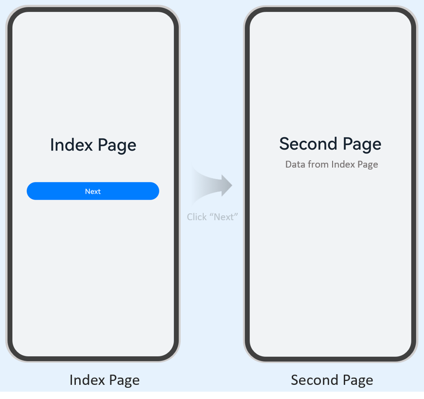

#### Page Return and Parameter Receiving

On the Second page, after some functional operations are completed, we want to return to the Index page. How do we implement this?

For example, on the Index page you call the `router.pushUrl()` method to go to the Second page. On the Second page, you can call the `router.back()` method to return to the previous page, or add the aimed path url as a parameter to the `router.back()` method to return to a specified page.

##### Pay attention to the following point:

-   The target page which returned by invoking `router.back()` must exist in the page stack.

> **Note**: If all historical pages in the page stack are cleared by calling the `router.clear()` method and only the current page is retained, the previous page cannot be returned by calling the  `router.back()` method.

**Return to the previous page code example:**

```typescript
router.back()
```

**Return to the specified page code example:**
```typescript
router.back({url:'pages/Index'})
```

Now we can uncomment the above commented `Button()` component code, the following figure shows the effect. On the Second page, click Back to return to the Index page.

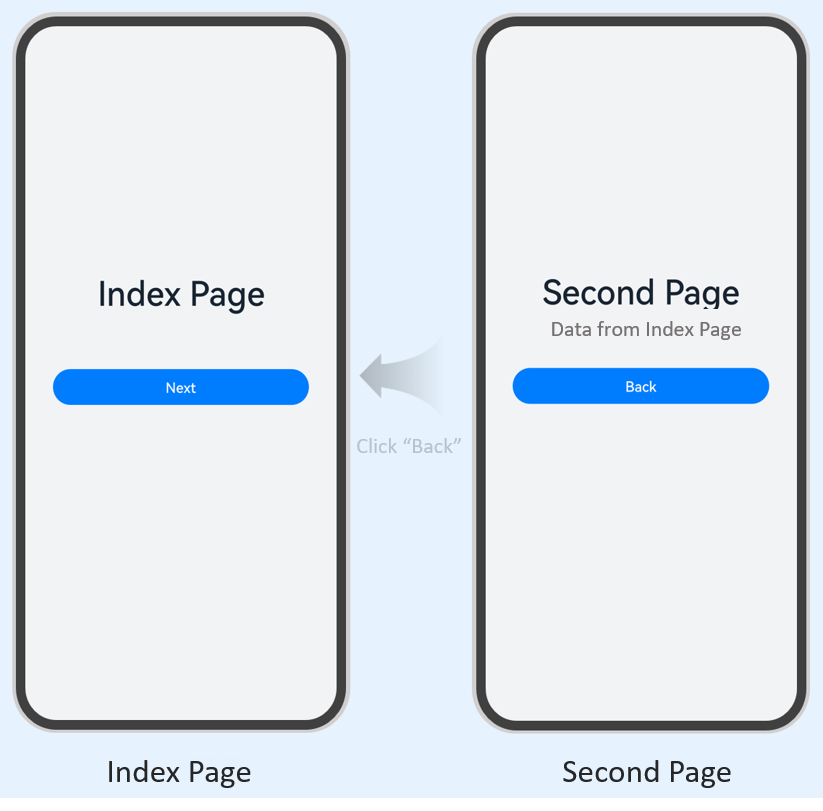

#### Adding Confirmation Dialog Before Page Return

A query dialog box can be added based on the service requirements. That is, prompt the user to confirm before calling the `router.back()` method, you can call the `router.showAlertBeforeBackPage()` method to enable the query dialog box.

Modify the following code on the second page:

```typescript
....
Button("Back") //Create a button labeled Back.
          .fontSize(16) //Set the font size of the button to 16.
          .width(296) //Set the width of the button to 296.
          .height(40) //Set the button height to 40.
          .backgroundColor("#007DFF") // Set the background color of the button.
          .onClick(() => {//Add a click event processing function for the button.
            router.showAlertBeforeBackPage ({message:'Are you sure you want to return to the previous page?'});
            router.back(); //Use the back method of the router to return to the previous page.
          })
....
```

The following figure shows the pop-up window.

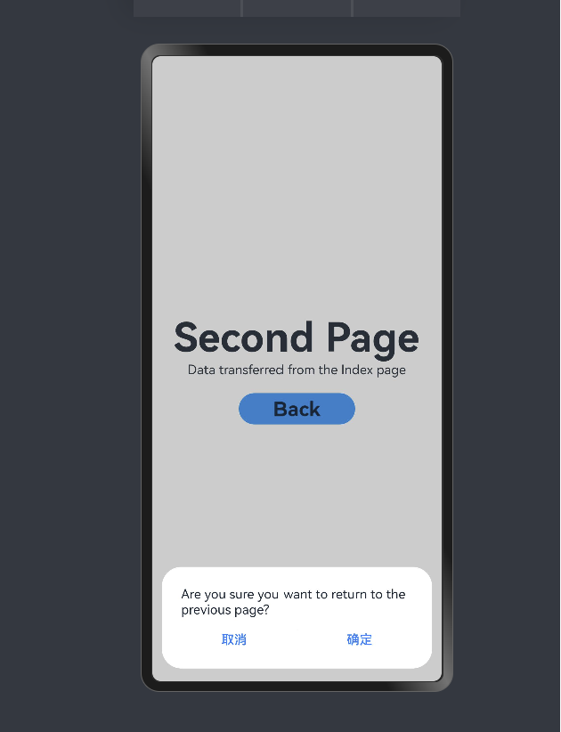

On the Second page, when the `router.back()` method is invoked to return to the previous page or a specified page, you can also add some customized parameters.

The code on the Second page is modified as follows:

```typescript
Button("Back") //Create a button labeled Back.
          .fontSize(16) //Set the font size of the button to 16.
          .width(296) //Set the button width to 296.
          .height(40) //Set the button height to 40.
          .backgroundColor("#007DFF") // Set the background color of the button.
          .onClick(() => {//Add a click event processing function for the button.
            router.showAlertBeforeBackPage ({message:'Are you sure you want to return to the previous page?'});
            router.back({
              url: 'pages/Index',
              params: {
                src:'Data from the Second page',
              }
            }); //Use the back method of the router to return to the previous page.
          })
```

>**Note**: If the `router.back()` method is invoked, no new page is created and the original page is returned. In the original page, variables declared by `@State` will not be repeatedly declared, and the `aboutToAppear()` lifecycle callback of the page will not be triggered as well. Therefore, the custom parameters transferred by `router.back()` cannot be received and parsed directly in `@State` or `aboutToAppear()` lifecycle callback of the page.

How do we receive the parameters transferred from the Second page on the Index page?  
The parameters can be parsed in the `onPageShow()` lifecycle callback. Add the following content to the Index code to receive parameters transferred from the Second page:

```typescript
...
@State src: string = '';

onPageShow() {
    if(router.getParams())
        this.src = (router.getParams() as Record<string, string>)['src'];
}
...
```


In addition, the following Text component is added to the build component on the Index page to display the data returned by the Second page:
```typescript
...
Text(this.src) //Create another text component to display the value of the src parameter transferred from the previous page.
    .fontSize(20) //Set the font size of the text to 20.
    .opacity(0.6) //Set the transparency of the text to 0.6.
...
```

After the code is modified, the preview is as follows:

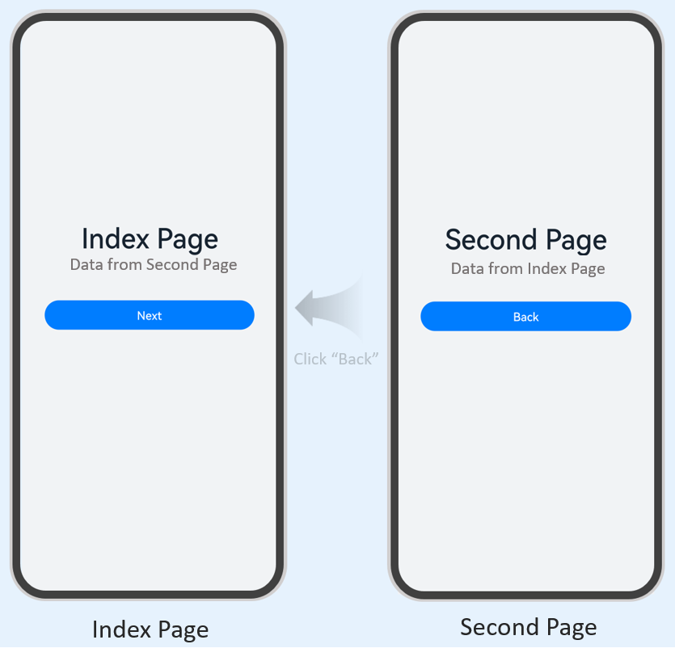

### UIAbility Component Lifecycle

When the user browses, switches, and returns to the corresponding  application, the UIAbility instance in the application transitions  between different states in its life cycle. The UIAbility class provides  many callbacks. Through these callbacks, you can know that a certain  status of the current UIAbility has changed, for example, the UIAbility  is created and destroyed, or the UIAbility is switched between the foreground and background.

For example, from clicking the gallery application icon on the desktop  to starting the gallery application, the application status changes from  creation to foreground display as shown in the following figure:

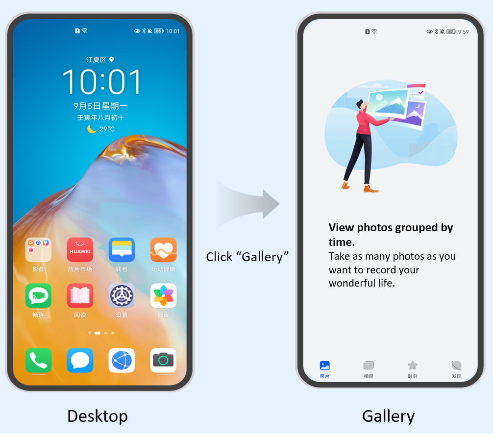

Return to the desktop. Then, switch from the recent task list to the gallery application and the application status changes from the background to  the foreground as shown in the following figure:

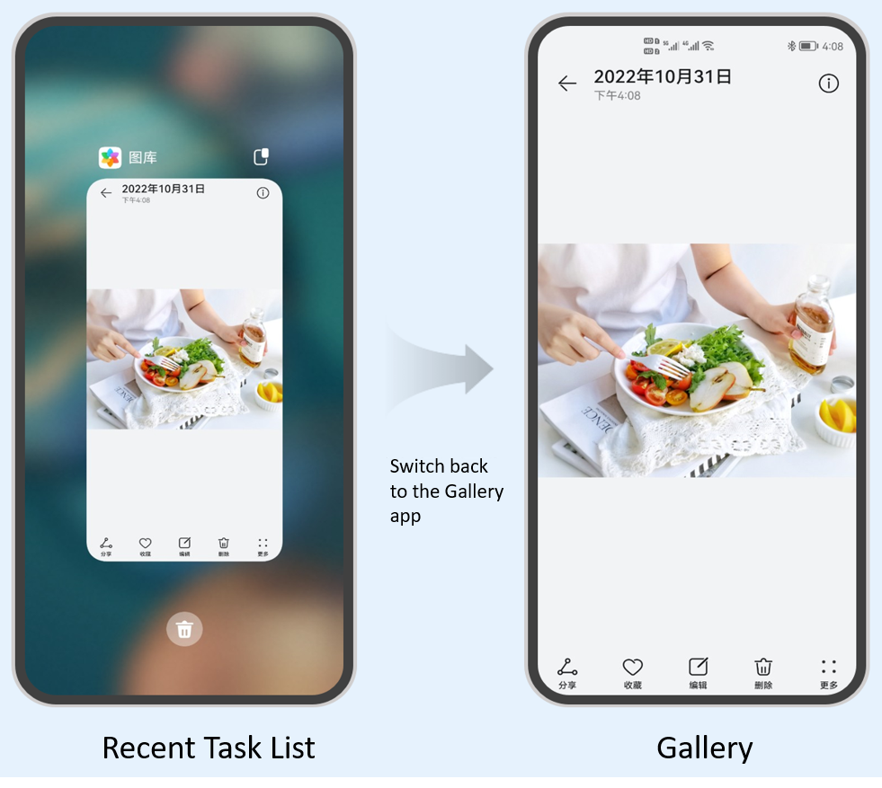

There are multiple life cycle states in the UIAbility. Mastering the  life cycle of UIAbility is important for application development.

In order to tailor for multiple device forms and scale for multiple windows, the system decouples component management and window management. The life cycle of UIAbility includes  four states: 
1) Create
2) Foreground
3) Background
4) Destroy

`WindowStageCreate` and `WindowStageDestroy` are two life cycle callbacks  for the _window manager_ to manage UI functions in UIAbility. Thus, the  weak coupling between the UIAbility and the window is achieved. See the  following figure:

<div>
  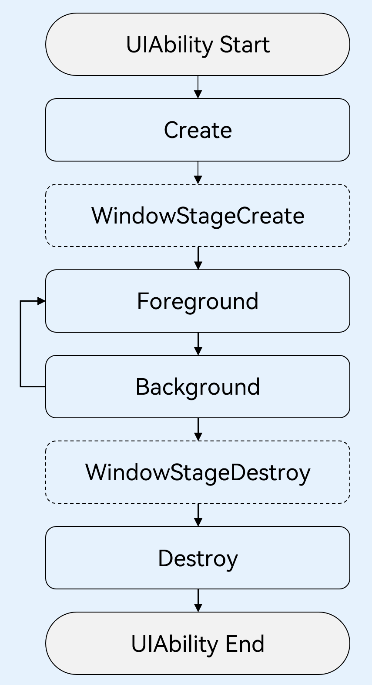
</div>


The callback functions for each of the above life cycle states can be found in the `src > main > ets > entryability > Entryability.ets` file.

-  **Create State**

This function is triggered when a UIAbility instance is created. The  system invokes the `onCreate()` callback function. You can perform  initialization operations in the `onCreate()` callback.

```typescript
import UIAbility from '@ohos.app.ability.UIAbility';
import window from '@ohos.window';

export default class EntryAbility extends UIAbility {
  onCreate(want: Want, launchParam: AbilityConstant.LaunchParam): void {
    ...
  }
  ...
}
```

For example, when a user opens a battery management application, the  user can read the current system battery level in the `onCreate()` callback  before the UI page is visible during the application loading process,  and the current system battery level is used for subsequent UI page display.

> **Note**: `Want` is used to transfer information between application components as the carrier.

-   **WindowStageCreate**

After the UIAbility instance is created, the system creates a `WindowStage` and triggers `OnWindowStageCreate()` callback before entering the Foreground. Each UIAbility instance has a corresponding `WindowStage` instance.  

`WindowStage` is a local window manager used to manage window-related content, for example, interface-related focusing/out-of-focus,  visible/invisible. You can set UI page loading and `WindowStage` event subscription in the `onWindowStageCreate` callback. In `onWindowStageCreate(windowStage)`, set the page to be loaded by using the `loadContent` function as follows:

```typescript
import UIAbility from '@ohos.app.ability.UIAbility';
import window from '@ohos.window';

export default class EntryAbility extends UIAbility {
    ...
    onWindowStageCreate(windowStage: window.WindowStage): void {
        //Configure UI page loading.
        //Configure the event subscription for WindowStage. (Focus/Out of Focus, Visible/Invisible)

        windowStage.loadContent('pages/Index', (err, data) => {
            ...
        });
    }
    ...
}
```

For example, when the user opens a game application, and is playing a  game, there is a message notification. When the user opens the message,  the message pops up on the top of the game application in a form of a  pop-up window. In this case, the game application is switched from the  **focused** state to the **out-of-focus** state, and the message application is  switched to the **focused** state. For message applications, the  `onWindowStageCreate` callback function triggers the event callback for  focusing. You can set the highlight and background color of the message applications.

-   **Foreground and Background States**

The Foreground and Background states are triggered when the UIAbility  switches to the foreground or background, respectively. These states correspond to  the `onForeground` callback and `onBackground` callbacks, respectively.

The `onForeground` callback is triggered right before the UI page of UIAbility is  visible, that is, when UIAbility is switched to the foreground. You can  apply for the resources required by the system in the `onForeground`  callback, or apply for the resources that were released in the `onBackground`  callback.

The `onBackground` callback is triggered when the UIAbility UI is completely  invisible, that is, when the UIAbility switches to the background. In  the `onBackground` callback, you can release useless resources when the UI  page is invisible, or perform time-consuming operations, such as state  saving.

```typescript
import UIAbility from '@ohos.app.ability.UIAbility';
import window from '@ohos.window';

export default class EntryAbility extends UIAbility {
    ...
    onForeground() {
    //Apply for the resources required by the system or apply for the resources released in the onBackground.
    ...
    }

    onBackground() {
    //Release useless resources when the UI page is invisible, or perform time-consuming operations in this callback.
    //For example, the status is saved.
    ...
    }

    ...
}
```

For example, when the user opens the map application to view the current  geographical location, it is assumed that the map application has  obtained the location permission authorization of the user. Before the  UI is displayed, you can enable the location function in the  `onForeground` callback function to obtain the current location  information.

When the map application switches to the background state, you can  disable the location function in the `onBackground` callback to save  system resource consumption.

-   **WindowStageDestroy**

We have learned about the functions of the `onWindowStageCreate` callback  function during UIAbility instance creation.

Similarly to the `onWindowStageCreate` callback, before the UIAbility  instance is destroyed the `onWindowStageDestroy` callback is invoked. In  this callback, UI page resources can be released.

```typescript
import UIAbility from '@ohos.app.ability.UIAbility';
import window from '@ohos.window';

export default class EntryAbility extends UIAbility {
    ...
    onWindowStageDestroy() {
        //Release UI page resources.
        ...
    }
}
```

-   **Destroy Status**

The Destroy state is triggered when the UIAbility is destroyed. You can  release system resources and save data in the `onDestroy` callback.

```typescript
import UIAbility from '@ohos.app.ability.UIAbility';
import window from '@ohos.window';

export default class EntryAbility extends UIAbility {
    ...
    onDestroy() {
        //Release system resources and save data.
        ...
    }
}
```

For example, when a user uses the program exit function of an  application, the `terminalSelf()` method of UIAbilityContext is invoked to  destroy UIAbility. Alternatively, the UIAbility instance is destroyed  when the user closes the UIAbility instance using the recent task list.


### UIAbility Component Launch Type

UIAbility supports three launch modes:
- `singleton` 
- `multiton`
- `specified`

The three launch modes correspond to the following three  scenarios:

-   For an application such as a browser or a news application, after     the user opens the application, browses and accesses related     content, the user returns to the desktop, and opens the application     again, and the interface currently accessed by the user is still     displayed.

-   For the split-screen operation of the application, the user expects to split screens between two different applications (for example, the memo app and the gallery app), and the user may also open two separate instances of the same application (for example, the memo application and itself) to split screens.

-   For the document application, the user opens document A. Then, he opens the document application again, and opens document B. The user wants document B to be opened in a new instance. Then, he go back and open document A again, but here the user want the same instance he opened before of document A to be in the foreground.

The following describes the three startup modes in detail.

1. **Singleton Mode**  

In this mode, a single instance of the UIAbility is reused. For example, when a user opens an application (such as a browser or a news app), browses through content, returns to the home screen, and reopens the app, the previously viewed interface remains displayed. This mode ensures that only one instance of the UIAbility exists.

In this case, you can set UIAbility to `singleton`. Each time the `startAbility()` method is invoked, if the UIAbility instance of this type already exists in the application process, the UIAbility instance in the system is reused. Only one UIAbility instance exists in the system.

That is, only one UIAbility instance of this type exists in the recent task list.

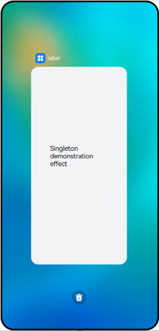

Singleton boot mode is also the default boot mode.

Set the launchType field in the `module.json5` file to `singleton`.

```typescript
{
  "module": {
    ...
    "abilities": [
      {
        "launchType": "singleton",
        ...
      }
    ]
  }
}

```

2. **Multiton Mode**  

 This mode allows multiple instances of the same UIAbility to be created. It is useful for scenarios like split-screen operations. For instance, a user may open two separate instances of the same application (e.g., a memo app) to simultaneously display different content. This enables users to interact with multiple independent instances of the same app.

In this case, you can set UIAbility to `multiton` (multi-instance mode). Each time the `startAbility()` method is called, a new UIAbility instance of this type is created.

That is, you can see multiple UIAbility instances of this type in the recent task list.

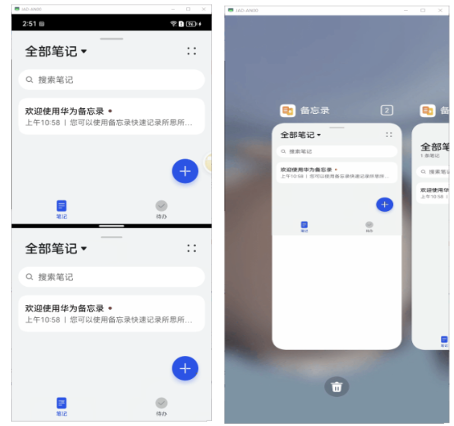

To use the `multiton` startup mode, set the launchType field in the module.json5 file to `multiton`.

```typescript
{
  "module": {
    ...
    "abilities": [
      {
        "launchType": "multiton",
        ...
      }
    ]
  }
}

```

3. **Specified Mode**

 In this mode, the user can manage different instances based on specific conditions. For example, in a document editor, the user might open Document A, and later, open Document B in a new instance. When the user switches back to Document A, the system brings the previous instance of Document A to the foreground. This allows the user to handle different documents as separate instances while ensuring that returning to a document brings back the same instance used before.

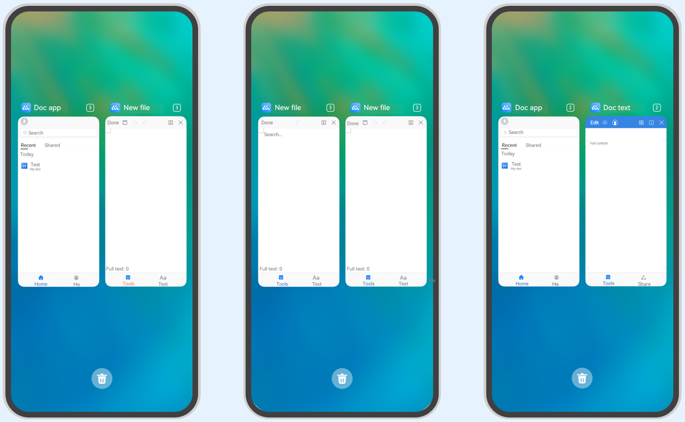

One way of doing this is by assigning an "instance key" specific to the document as you open it. Then, when we open a document again we check. If its instance key is already opened we bring it to the foreground. If not then we create a new instance.

To implement this, we will have two UIAbilities: `EntryAbility` and `SpecifiedAbility`. The idea is essentially to open `SpecifiedAbility` from `EntryAbility` using [startAbility](https://developer.huawei.com/consumer/en/doc/harmonyos-references-V2/js-apis-inner-application-uiabilitycontext-0000001478341321-V2#EN-US_TOPIC_0000001523648914__uiabilitycontextstartability) and to pass it an instance key through the [Want](https://developer.huawei.com/consumer/en/doc/harmonyos-guides-V2/want-overview-0000001478340877-V2) paramenter. Then, the `SpecifiedAbility` parses the `Want` parameter in the `onCreate()` callback function [described previously](#uiability-component-lifecycle). We would then need a method of checking each instance key for the `SpecifiedAbility` to determine whether to create a new instance or reopen an old one.

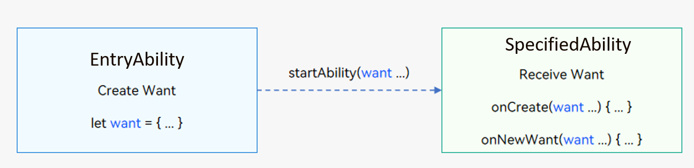

This is done in 3 stages:
##### 1. Create the SpecifiedAbility with launchType specified
Create a new directory `src > main > ets > specifiedability` and inside create the file `SpecifiedAbility.ets`. Copy the code from `src > main > ets > entryability > EntryAbility.ets` and change the class title to:
```typescript
export default class SpecifiedAbility extends UIAbility {
  ...
}
```
Then add the `SpecifiedAbility` to the list of `abilities` in `src > main > module.json5` and set the `launchType` to `specified`:
```typescript
"abilities":
[
  ...
  ,{
    "name": "SpecifiedAbility",
    "launchType": "specified",
    "srcEntry": "./ets/specifiedability/SpecifiedAbility.ets",
    "description": "$string:EntryAbility_desc",
    "icon": "$media:icon",
    "label": "$string:EntryAbility_label",
    "startWindowIcon": "$media:startIcon",
    "startWindowBackground": "$color:start_window_background",
    "exported": true,
    "skills": [
      {
        "entities": [
          "entity.system.home"
        ],
        "actions": [
          "action.system.home"
        ]
      }
    ]
  }
]
```
>**Note**: We're describing the process in snippets. If you want to implement the example yourself, you would then need to create a page (eg. Document.ets) to be the start page for the `SpecifiedAbility` and change the url in `windowStage.loadContent` to `'pages/Document'`:
```typescript
export default class SpecifiedAbility extends UIAbility {
  ...
  onWindowStageCreate(windowStage: window.WindowStage): void {
    // Main window is created, set main page for this ability
    hilog.info(0x0000, 'testTag', '%{public}s', 'Ability onWindowStageCreate');

    windowStage.loadContent('pages/Document', (err) => {
      if (err.code) {
        hilog.error(0x0000, 'testTag', 'Failed to load the content. Cause: %{public}s', JSON.stringify(err) ?? '');
        return;
      }
      hilog.info(0x0000, 'testTag', 'Succeeded in loading the content.');
    });
  }
}
```
##### 2. Start the SpecifiedAbility from within EntryAbility with a custom Want
Open the main page `Index.ets`. First, create a function called `getInstance` that returns a new instance key string for the UIAbility (eg. the path to the document). Then, create an asynchronous method `explicitStartAbility` for opening the `SpecifiedAbility`. In this method, create your custom `Want` with a parameter `instanceKey` that calls the `getInstance` method. Finally, you would need to obtain access to the UIAbility through the `common.UIAbilityContext` class which is necessary to call `startAbility` with the created `want`.

```typescript
import common from '@ohos.app.ability.common';
import Want from '@ohos.app.ability.Want';
struct Index {
  ...
  // Configure an independent key for each UIAbility instance.
  // For example, in the document usage scenario, use the document path as the key.
  getInstance()
  {
    ...
    const doucmentPath: string = 'pages/Document';
    return doucmentPath;
  }

  async explicitStartAbility() {
    try {
      // Explicit want with abilityName specified.
      let want: Want = {
        deviceId: '', // An empty deviceId indicates the local device.
        bundleName: 'com.example.myapplication',
        abilityName: 'SpecifiedAbility',
        parameters: {// Custom information.
          instanceKey: this.getInstance(),
        },
      };
      let context = getContext(this) as common.UIAbilityContext;
      await context.startAbility(want);
      console.info(`explicit start ability succeed`);
    } catch (error) {
      console.info(`explicit start ability failed with ${error.code}`);
    }
  }
}
```
##### 3. Create the AbilityStage Component Container

Before `SpecifiedAbility` is started, the `onAcceptWant()` callback of the corresponding `AbilityStage` instance is invoked to:  
1) Parse the input `want` parameter
2) Obtain the custom parameter `instanceKey`
3) Return a key for the UIAbility.  

During running, the internal service of UIAbility checks if the returned key corresponds to a started UIAbility instance, that UIAbility instance is switched to the foreground. Otherwise, a new instance is created and started.

`AbilityStage` is not automatically generated in the default project of DevEco Studio. To create it we need to create another directory `src > main > ets > myabilitystage` and inside create the file `MyAbilityStage.ets` with the following code:
```typescript
import AbilityStage from '@ohos.app.ability.AbilityStage';
import Want from '@ohos.app.ability.Want';

export default class MyAbilityStage extends AbilityStage {
  onCreate() {
    // When the HAP of the application is loaded for the first time, initialize the module.
  }
  onAcceptWant(want: Want) {
    // In the AbilityStage instance of the callee, a key value corresponding to a UIAbility instance is returned for UIAbility whose launch type is specified.
    // In this example, SpecifiedAbility of is returned.
    if (want.abilityName === 'SpecifiedAbility') {
      // The returned string key is a custom string.
      return `SpecifiedAbilityInstance_${want.parameters?.instanceKey}`;
    }

    return '';
  }
}
```
Finally, in the `module.json5` file, add `srcEntry` to specify the code path of the module as the entry for loading the HAP.

```typescript
{
  "module": {
      "name": "entry",
      "type": "entry",
      "srcEntry": "./ets/myabilitystage/MyAbilityStage.ets",
      ...
  }
}
```
